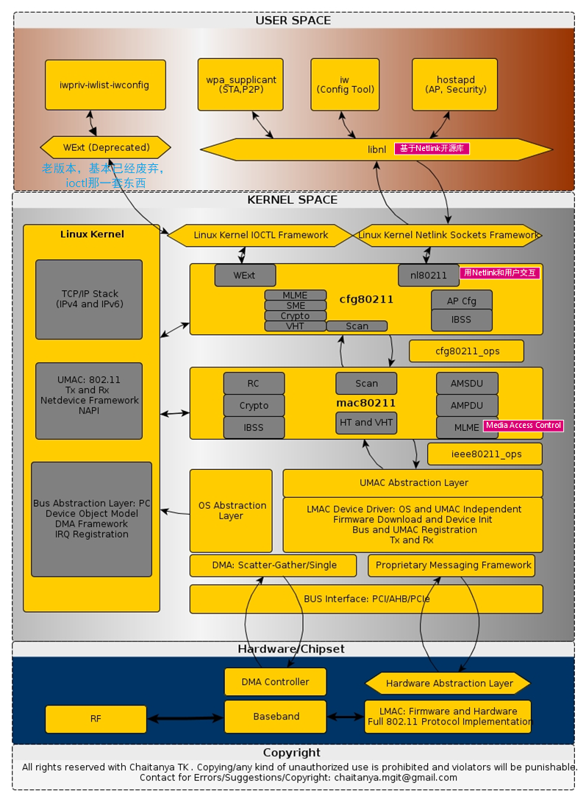
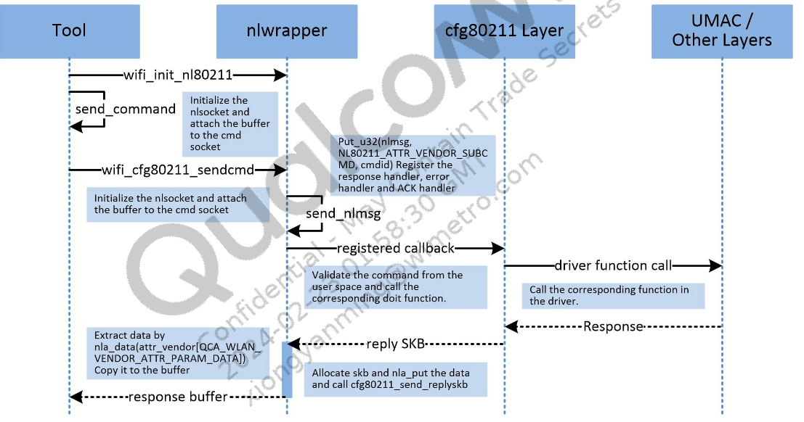
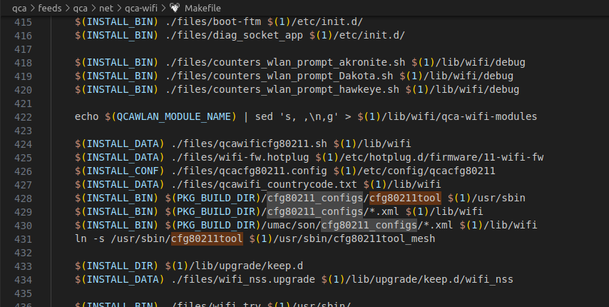
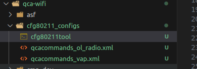
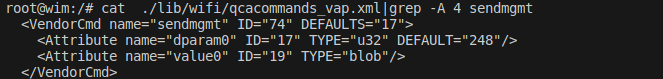
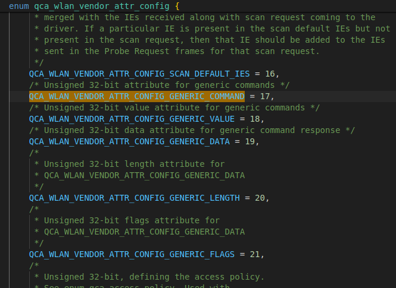
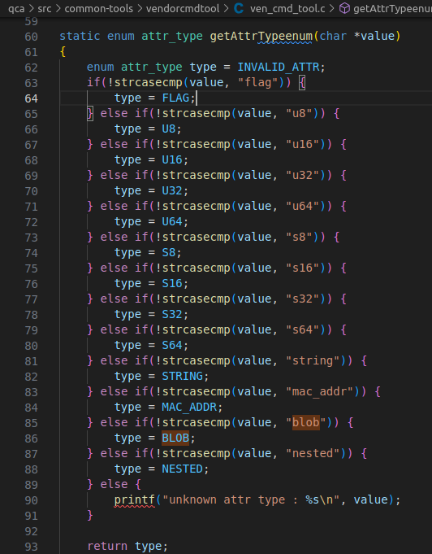

# 高通QSDK nl80211框架

该文章介绍了应用层通过NL80211的libnl库，和底层驱动交互的过程。并以高通wifitool和cfg80211tool 运行机制进行举例说明。

## NL80211机制

应用层使用nl消息发送NL80211_CMD_xx到驱动层，驱动根据NL80211_CMD_xx，找到对应的ops调用。在高通QSDK中，像wifitool、cfg80211tool、wpa_supplicant等很多工具都是基于nl消息。如下图所示：



套路如下

1. 创建socket和内核联系

   ```c
   #define WIFI_NL80211_CMD_SOCK_ID    DEFAULT_NL80211_CMD_SOCK_ID //777
   #define WIFI_NL80211_EVENT_SOCK_ID  DEFAULT_NL80211_EVENT_SOCK_ID //778
   
   struct socket_context sock_ctx;
   sock_ctx.cfg80211 = 1;
   init_socket_context(&sock_ctx, WIFI_NL80211_CMD_SOCK_ID, WIFI_NL80211_EVENT_SOCK_ID);
   ```

   

2. 首先创建nl消息，携带NL80211_CMD_xx，默认的命令如下`qca/src/linux-4.4/user_headers/include/linux/nl80211.h/enum nl80211_commands`

   ```c
   enum nl80211_commands {
   /* don't change the order or add anything between, this is ABI! */
   	NL80211_CMD_UNSPEC,
   
   	NL80211_CMD_GET_WIPHY,		/* can dump */
   	NL80211_CMD_SET_WIPHY,
   	NL80211_CMD_NEW_WIPHY,
   	NL80211_CMD_DEL_WIPHY,
   
   	NL80211_CMD_GET_INTERFACE,	/* can dump */
   	NL80211_CMD_SET_INTERFACE,
   	NL80211_CMD_NEW_INTERFACE,
   	NL80211_CMD_DEL_INTERFACE,
   
   	NL80211_CMD_GET_KEY,
   	NL80211_CMD_SET_KEY,
   	NL80211_CMD_NEW_KEY,
   	NL80211_CMD_DEL_KEY,
   
   	NL80211_CMD_GET_BEACON,
   	NL80211_CMD_SET_BEACON,
   	NL80211_CMD_START_AP,
   	NL80211_CMD_NEW_BEACON = NL80211_CMD_START_AP,
   	NL80211_CMD_STOP_AP,
   	NL80211_CMD_DEL_BEACON = NL80211_CMD_STOP_AP,
   
   	NL80211_CMD_GET_STATION,
   	NL80211_CMD_SET_STATION,
   	NL80211_CMD_NEW_STATION,
   	NL80211_CMD_DEL_STATION,
   
   	NL80211_CMD_GET_MPATH,
   	NL80211_CMD_SET_MPATH,
   	NL80211_CMD_NEW_MPATH,
   	NL80211_CMD_DEL_MPATH,
   
   	NL80211_CMD_SET_BSS,
   
   	NL80211_CMD_SET_REG,
   	NL80211_CMD_REQ_SET_REG,
   
   	NL80211_CMD_GET_MESH_CONFIG,
   	NL80211_CMD_SET_MESH_CONFIG,
   
   	NL80211_CMD_SET_MGMT_EXTRA_IE /* reserved; not used */,
   
   	NL80211_CMD_GET_REG,
   
   	NL80211_CMD_GET_SCAN,
   	NL80211_CMD_TRIGGER_SCAN,
   	NL80211_CMD_NEW_SCAN_RESULTS,
   	NL80211_CMD_SCAN_ABORTED,
   
   	NL80211_CMD_REG_CHANGE,
   
   	NL80211_CMD_AUTHENTICATE,
   	NL80211_CMD_ASSOCIATE,
   	NL80211_CMD_DEAUTHENTICATE,
   	NL80211_CMD_DISASSOCIATE,
   
   	NL80211_CMD_MICHAEL_MIC_FAILURE,
   
   	NL80211_CMD_REG_BEACON_HINT,
   
   	NL80211_CMD_JOIN_IBSS,
   	NL80211_CMD_LEAVE_IBSS,
   
   	NL80211_CMD_TESTMODE,
   
   	NL80211_CMD_CONNECT,
   	NL80211_CMD_ROAM,
   	NL80211_CMD_DISCONNECT,
   
   	NL80211_CMD_SET_WIPHY_NETNS,
   
   	NL80211_CMD_GET_SURVEY,
   	NL80211_CMD_NEW_SURVEY_RESULTS,
   
   	NL80211_CMD_SET_PMKSA,
   	NL80211_CMD_DEL_PMKSA,
   	NL80211_CMD_FLUSH_PMKSA,
   
   	NL80211_CMD_REMAIN_ON_CHANNEL,
   	NL80211_CMD_CANCEL_REMAIN_ON_CHANNEL,
   
   	NL80211_CMD_SET_TX_BITRATE_MASK,
   
   	NL80211_CMD_REGISTER_FRAME,
   	NL80211_CMD_REGISTER_ACTION = NL80211_CMD_REGISTER_FRAME,
   	NL80211_CMD_FRAME,
   	NL80211_CMD_ACTION = NL80211_CMD_FRAME,
   	NL80211_CMD_FRAME_TX_STATUS,
   	NL80211_CMD_ACTION_TX_STATUS = NL80211_CMD_FRAME_TX_STATUS,
   
   	NL80211_CMD_SET_POWER_SAVE,
   	NL80211_CMD_GET_POWER_SAVE,
   
   	NL80211_CMD_SET_CQM,
   	NL80211_CMD_NOTIFY_CQM,
   
   	NL80211_CMD_SET_CHANNEL,
   	NL80211_CMD_SET_WDS_PEER,
   
   	NL80211_CMD_FRAME_WAIT_CANCEL,
   
   	NL80211_CMD_JOIN_MESH,
   	NL80211_CMD_LEAVE_MESH,
   
   	NL80211_CMD_UNPROT_DEAUTHENTICATE,
   	NL80211_CMD_UNPROT_DISASSOCIATE,
   
   	NL80211_CMD_NEW_PEER_CANDIDATE,
   
   	NL80211_CMD_GET_WOWLAN,
   	NL80211_CMD_SET_WOWLAN,
   
   	NL80211_CMD_START_SCHED_SCAN,
   	NL80211_CMD_STOP_SCHED_SCAN,
   	NL80211_CMD_SCHED_SCAN_RESULTS,
   	NL80211_CMD_SCHED_SCAN_STOPPED,
   
   	NL80211_CMD_SET_REKEY_OFFLOAD,
   
   	NL80211_CMD_PMKSA_CANDIDATE,
   
   	NL80211_CMD_TDLS_OPER,
   	NL80211_CMD_TDLS_MGMT,
   
   	NL80211_CMD_UNEXPECTED_FRAME,
   
   	NL80211_CMD_PROBE_CLIENT,
   
   	NL80211_CMD_REGISTER_BEACONS,
   
   	NL80211_CMD_UNEXPECTED_4ADDR_FRAME,
   
   	NL80211_CMD_SET_NOACK_MAP,
   
   	NL80211_CMD_CH_SWITCH_NOTIFY,
   
   	NL80211_CMD_START_P2P_DEVICE,
   	NL80211_CMD_STOP_P2P_DEVICE,
   
   	NL80211_CMD_CONN_FAILED,
   
   	NL80211_CMD_SET_MCAST_RATE,
   
   	NL80211_CMD_SET_MAC_ACL,
   
   	NL80211_CMD_RADAR_DETECT,
   
   	NL80211_CMD_GET_PROTOCOL_FEATURES,
   
   	NL80211_CMD_UPDATE_FT_IES,
   	NL80211_CMD_FT_EVENT,
   
   	NL80211_CMD_CRIT_PROTOCOL_START,
   	NL80211_CMD_CRIT_PROTOCOL_STOP,
   
   	NL80211_CMD_GET_COALESCE,
   	NL80211_CMD_SET_COALESCE,
   
   	NL80211_CMD_CHANNEL_SWITCH,
   
   	NL80211_CMD_VENDOR,
   
   	NL80211_CMD_SET_QOS_MAP,
   
   	NL80211_CMD_ADD_TX_TS,
   	NL80211_CMD_DEL_TX_TS,
   
   	NL80211_CMD_GET_MPP,
   
   	NL80211_CMD_JOIN_OCB,
   	NL80211_CMD_LEAVE_OCB,
   
   	NL80211_CMD_CH_SWITCH_STARTED_NOTIFY,
   
   	NL80211_CMD_TDLS_CHANNEL_SWITCH,
   	NL80211_CMD_TDLS_CANCEL_CHANNEL_SWITCH,
   
   	NL80211_CMD_WIPHY_REG_CHANGE,
   
   	NL80211_CMD_ABORT_SCAN,
   
   	NL80211_CMD_START_NAN,
   	NL80211_CMD_STOP_NAN,
   	NL80211_CMD_ADD_NAN_FUNCTION,
   	NL80211_CMD_DEL_NAN_FUNCTION,
   	NL80211_CMD_CHANGE_NAN_CONFIG,
   	NL80211_CMD_NAN_MATCH,
   
   	NL80211_CMD_SET_MULTICAST_TO_UNICAST,
   
   	NL80211_CMD_UPDATE_CONNECT_PARAMS,
   
   	NL80211_CMD_SET_PMK,
   	NL80211_CMD_DEL_PMK,
   
   	NL80211_CMD_PORT_AUTHORIZED,
   
   	NL80211_CMD_RELOAD_REGDB,
   
   	NL80211_CMD_EXTERNAL_AUTH,
   
   	NL80211_CMD_STA_OPMODE_CHANGED,
   
   	NL80211_CMD_CONTROL_PORT_FRAME,
   
   	NL80211_CMD_GET_FTM_RESPONDER_STATS,
   
   	NL80211_CMD_PEER_MEASUREMENT_START,
   	NL80211_CMD_PEER_MEASUREMENT_RESULT,
   	NL80211_CMD_PEER_MEASUREMENT_COMPLETE,
   
   	NL80211_CMD_NOTIFY_RADAR,
   
   	NL80211_CMD_UPDATE_OWE_INFO,
   
   	NL80211_CMD_PROBE_MESH_LINK,
   
   	NL80211_CMD_SET_FILS_AAD,
   
   	/* add new commands above here */
   
   	/* used to define NL80211_CMD_MAX below */
   	__NL80211_CMD_AFTER_LAST,
   	NL80211_CMD_MAX = __NL80211_CMD_AFTER_LAST - 1
   };
   
   ```

   这些命令对应的ops如下`qca/src/linux-4.4/net/wireless/nl80211.c/`：

   ```c
   static const struct genl_ops nl80211_ops[] = {
   	{
   		.cmd = NL80211_CMD_GET_WIPHY,
   		.doit = nl80211_get_wiphy,
   		.dumpit = nl80211_dump_wiphy,
   		.done = nl80211_dump_wiphy_done,
   		.policy = nl80211_policy,
   		/* can be retrieved by unprivileged users */
   		.internal_flags = NL80211_FLAG_NEED_WIPHY |
   				  NL80211_FLAG_NEED_RTNL,
   	},
   	{
   		.cmd = NL80211_CMD_SET_WIPHY,
   		.doit = nl80211_set_wiphy,
   		.policy = nl80211_policy,
   		.flags = GENL_ADMIN_PERM,
   		.internal_flags = NL80211_FLAG_NEED_RTNL,
   	},
   	{
   		.cmd = NL80211_CMD_GET_INTERFACE,
   		.doit = nl80211_get_interface,
   		.dumpit = nl80211_dump_interface,
   		.policy = nl80211_policy,
   		/* can be retrieved by unprivileged users */
   		.internal_flags = NL80211_FLAG_NEED_WDEV |
   				  NL80211_FLAG_NEED_RTNL,
   	},
   	{
   		.cmd = NL80211_CMD_SET_INTERFACE,
   		.doit = nl80211_set_interface,
   		.policy = nl80211_policy,
   		.flags = GENL_ADMIN_PERM,
   		.internal_flags = NL80211_FLAG_NEED_NETDEV |
   				  NL80211_FLAG_NEED_RTNL,
   	},
   	{
   		.cmd = NL80211_CMD_NEW_INTERFACE,
   		.doit = nl80211_new_interface,
   		.policy = nl80211_policy,
   		.flags = GENL_ADMIN_PERM,
   		.internal_flags = NL80211_FLAG_NEED_WIPHY |
   				  NL80211_FLAG_NEED_RTNL,
   	},
   	{
   		.cmd = NL80211_CMD_DEL_INTERFACE,
   		.doit = nl80211_del_interface,
   		.policy = nl80211_policy,
   		.flags = GENL_ADMIN_PERM,
   		.internal_flags = NL80211_FLAG_NEED_WDEV |
   				  NL80211_FLAG_NEED_RTNL,
   	},
   	{
   		.cmd = NL80211_CMD_GET_KEY,
   		.doit = nl80211_get_key,
   		.policy = nl80211_policy,
   		.flags = GENL_ADMIN_PERM,
   		.internal_flags = NL80211_FLAG_NEED_NETDEV_UP |
   				  NL80211_FLAG_NEED_RTNL,
   	},
   	{
   		.cmd = NL80211_CMD_SET_KEY,
   		.doit = nl80211_set_key,
   		.policy = nl80211_policy,
   		.flags = GENL_ADMIN_PERM,
   		.internal_flags = NL80211_FLAG_NEED_NETDEV_UP |
   				  NL80211_FLAG_NEED_RTNL |
   				  NL80211_FLAG_CLEAR_SKB,
   	},
   	{
   		.cmd = NL80211_CMD_NEW_KEY,
   		.doit = nl80211_new_key,
   		.policy = nl80211_policy,
   		.flags = GENL_ADMIN_PERM,
   		.internal_flags = NL80211_FLAG_NEED_NETDEV_UP |
   				  NL80211_FLAG_NEED_RTNL |
   				  NL80211_FLAG_CLEAR_SKB,
   	},
   	{
   		.cmd = NL80211_CMD_DEL_KEY,
   		.doit = nl80211_del_key,
   		.policy = nl80211_policy,
   		.flags = GENL_ADMIN_PERM,
   		.internal_flags = NL80211_FLAG_NEED_NETDEV_UP |
   				  NL80211_FLAG_NEED_RTNL,
   	},
   	{
   		.cmd = NL80211_CMD_SET_BEACON,
   		.policy = nl80211_policy,
   		.flags = GENL_ADMIN_PERM,
   		.doit = nl80211_set_beacon,
   		.internal_flags = NL80211_FLAG_NEED_NETDEV_UP |
   				  NL80211_FLAG_NEED_RTNL,
   	},
   	{
   		.cmd = NL80211_CMD_START_AP,
   		.policy = nl80211_policy,
   		.flags = GENL_ADMIN_PERM,
   		.doit = nl80211_start_ap,
   		.internal_flags = NL80211_FLAG_NEED_NETDEV_UP |
   				  NL80211_FLAG_NEED_RTNL,
   	},
   	{
   		.cmd = NL80211_CMD_STOP_AP,
   		.policy = nl80211_policy,
   		.flags = GENL_ADMIN_PERM,
   		.doit = nl80211_stop_ap,
   		.internal_flags = NL80211_FLAG_NEED_NETDEV_UP |
   				  NL80211_FLAG_NEED_RTNL,
   	},
   	{
   		.cmd = NL80211_CMD_GET_STATION,
   		.doit = nl80211_get_station,
   		.dumpit = nl80211_dump_station,
   		.policy = nl80211_policy,
   		.internal_flags = NL80211_FLAG_NEED_NETDEV |
   				  NL80211_FLAG_NEED_RTNL,
   	},
   	{
   		.cmd = NL80211_CMD_SET_STATION,
   		.doit = nl80211_set_station,
   		.policy = nl80211_policy,
   		.flags = GENL_ADMIN_PERM,
   		.internal_flags = NL80211_FLAG_NEED_NETDEV_UP |
   				  NL80211_FLAG_NEED_RTNL,
   	},
   	{
   		.cmd = NL80211_CMD_NEW_STATION,
   		.doit = nl80211_new_station,
   		.policy = nl80211_policy,
   		.flags = GENL_ADMIN_PERM,
   		.internal_flags = NL80211_FLAG_NEED_NETDEV_UP |
   				  NL80211_FLAG_NEED_RTNL,
   	},
   	{
   		.cmd = NL80211_CMD_DEL_STATION,
   		.doit = nl80211_del_station,
   		.policy = nl80211_policy,
   		.flags = GENL_ADMIN_PERM,
   		.internal_flags = NL80211_FLAG_NEED_NETDEV_UP |
   				  NL80211_FLAG_NEED_RTNL,
   	},
   	{
   		.cmd = NL80211_CMD_GET_MPATH,
   		.doit = nl80211_get_mpath,
   		.dumpit = nl80211_dump_mpath,
   		.policy = nl80211_policy,
   		.flags = GENL_ADMIN_PERM,
   		.internal_flags = NL80211_FLAG_NEED_NETDEV_UP |
   				  NL80211_FLAG_NEED_RTNL,
   	},
   	{
   		.cmd = NL80211_CMD_GET_MPP,
   		.doit = nl80211_get_mpp,
   		.dumpit = nl80211_dump_mpp,
   		.policy = nl80211_policy,
   		.flags = GENL_ADMIN_PERM,
   		.internal_flags = NL80211_FLAG_NEED_NETDEV_UP |
   				  NL80211_FLAG_NEED_RTNL,
   	},
   	{
   		.cmd = NL80211_CMD_SET_MPATH,
   		.doit = nl80211_set_mpath,
   		.policy = nl80211_policy,
   		.flags = GENL_ADMIN_PERM,
   		.internal_flags = NL80211_FLAG_NEED_NETDEV_UP |
   				  NL80211_FLAG_NEED_RTNL,
   	},
   	{
   		.cmd = NL80211_CMD_NEW_MPATH,
   		.doit = nl80211_new_mpath,
   		.policy = nl80211_policy,
   		.flags = GENL_ADMIN_PERM,
   		.internal_flags = NL80211_FLAG_NEED_NETDEV_UP |
   				  NL80211_FLAG_NEED_RTNL,
   	},
   	{
   		.cmd = NL80211_CMD_DEL_MPATH,
   		.doit = nl80211_del_mpath,
   		.policy = nl80211_policy,
   		.flags = GENL_ADMIN_PERM,
   		.internal_flags = NL80211_FLAG_NEED_NETDEV_UP |
   				  NL80211_FLAG_NEED_RTNL,
   	},
   	{
   		.cmd = NL80211_CMD_SET_BSS,
   		.doit = nl80211_set_bss,
   		.policy = nl80211_policy,
   		.flags = GENL_ADMIN_PERM,
   		.internal_flags = NL80211_FLAG_NEED_NETDEV_UP |
   				  NL80211_FLAG_NEED_RTNL,
   	},
   	{
   		.cmd = NL80211_CMD_GET_REG,
   		.doit = nl80211_get_reg_do,
   		.dumpit = nl80211_get_reg_dump,
   		.policy = nl80211_policy,
   		.internal_flags = NL80211_FLAG_NEED_RTNL,
   		/* can be retrieved by unprivileged users */
   	},
   #ifdef CONFIG_CFG80211_CRDA_SUPPORT
   	{
   		.cmd = NL80211_CMD_SET_REG,
   		.doit = nl80211_set_reg,
   		.policy = nl80211_policy,
   		.flags = GENL_ADMIN_PERM,
   		.internal_flags = NL80211_FLAG_NEED_RTNL,
   	},
   #endif
   	{
   		.cmd = NL80211_CMD_REQ_SET_REG,
   		.doit = nl80211_req_set_reg,
   		.policy = nl80211_policy,
   		.flags = GENL_ADMIN_PERM,
   	},
   	{
   		.cmd = NL80211_CMD_GET_MESH_CONFIG,
   		.doit = nl80211_get_mesh_config,
   		.policy = nl80211_policy,
   		/* can be retrieved by unprivileged users */
   		.internal_flags = NL80211_FLAG_NEED_NETDEV_UP |
   				  NL80211_FLAG_NEED_RTNL,
   	},
   	{
   		.cmd = NL80211_CMD_SET_MESH_CONFIG,
   		.doit = nl80211_update_mesh_config,
   		.policy = nl80211_policy,
   		.flags = GENL_ADMIN_PERM,
   		.internal_flags = NL80211_FLAG_NEED_NETDEV_UP |
   				  NL80211_FLAG_NEED_RTNL,
   	},
   	{
   		.cmd = NL80211_CMD_TRIGGER_SCAN,
   		.doit = nl80211_trigger_scan,
   		.policy = nl80211_policy,
   		.flags = GENL_ADMIN_PERM,
   		.internal_flags = NL80211_FLAG_NEED_WDEV_UP |
   				  NL80211_FLAG_NEED_RTNL,
   	},
   	{
   		.cmd = NL80211_CMD_ABORT_SCAN,
   		.doit = nl80211_abort_scan,
   		.policy = nl80211_policy,
   		.flags = GENL_ADMIN_PERM,
   		.internal_flags = NL80211_FLAG_NEED_WDEV_UP |
   				  NL80211_FLAG_NEED_RTNL,
   	},
   	{
   		.cmd = NL80211_CMD_GET_SCAN,
   		.policy = nl80211_policy,
   		.dumpit = nl80211_dump_scan,
   	},
   	{
   		.cmd = NL80211_CMD_START_SCHED_SCAN,
   		.doit = nl80211_start_sched_scan,
   		.policy = nl80211_policy,
   		.flags = GENL_ADMIN_PERM,
   		.internal_flags = NL80211_FLAG_NEED_NETDEV_UP |
   				  NL80211_FLAG_NEED_RTNL,
   	},
   	{
   		.cmd = NL80211_CMD_STOP_SCHED_SCAN,
   		.doit = nl80211_stop_sched_scan,
   		.policy = nl80211_policy,
   		.flags = GENL_ADMIN_PERM,
   		.internal_flags = NL80211_FLAG_NEED_NETDEV_UP |
   				  NL80211_FLAG_NEED_RTNL,
   	},
   	{
   		.cmd = NL80211_CMD_AUTHENTICATE,
   		.doit = nl80211_authenticate,
   		.policy = nl80211_policy,
   		.flags = GENL_ADMIN_PERM,
   		.internal_flags = NL80211_FLAG_NEED_NETDEV_UP |
   				  NL80211_FLAG_NEED_RTNL |
   				  NL80211_FLAG_CLEAR_SKB,
   	},
   	{
   		.cmd = NL80211_CMD_ASSOCIATE,
   		.doit = nl80211_associate,
   		.policy = nl80211_policy,
   		.flags = GENL_ADMIN_PERM,
   		.internal_flags = NL80211_FLAG_NEED_NETDEV_UP |
   				  NL80211_FLAG_NEED_RTNL,
   	},
   	{
   		.cmd = NL80211_CMD_DEAUTHENTICATE,
   		.doit = nl80211_deauthenticate,
   		.policy = nl80211_policy,
   		.flags = GENL_ADMIN_PERM,
   		.internal_flags = NL80211_FLAG_NEED_NETDEV_UP |
   				  NL80211_FLAG_NEED_RTNL,
   	},
   	{
   		.cmd = NL80211_CMD_DISASSOCIATE,
   		.doit = nl80211_disassociate,
   		.policy = nl80211_policy,
   		.flags = GENL_ADMIN_PERM,
   		.internal_flags = NL80211_FLAG_NEED_NETDEV_UP |
   				  NL80211_FLAG_NEED_RTNL,
   	},
   	{
   		.cmd = NL80211_CMD_JOIN_IBSS,
   		.doit = nl80211_join_ibss,
   		.policy = nl80211_policy,
   		.flags = GENL_ADMIN_PERM,
   		.internal_flags = NL80211_FLAG_NEED_NETDEV_UP |
   				  NL80211_FLAG_NEED_RTNL,
   	},
   	{
   		.cmd = NL80211_CMD_LEAVE_IBSS,
   		.doit = nl80211_leave_ibss,
   		.policy = nl80211_policy,
   		.flags = GENL_ADMIN_PERM,
   		.internal_flags = NL80211_FLAG_NEED_NETDEV_UP |
   				  NL80211_FLAG_NEED_RTNL,
   	},
   #ifdef CONFIG_NL80211_TESTMODE
   	{
   		.cmd = NL80211_CMD_TESTMODE,
   		.doit = nl80211_testmode_do,
   		.dumpit = nl80211_testmode_dump,
   		.policy = nl80211_policy,
   		.flags = GENL_ADMIN_PERM,
   		.internal_flags = NL80211_FLAG_NEED_WIPHY |
   				  NL80211_FLAG_NEED_RTNL,
   	},
   #endif
   	{
   		.cmd = NL80211_CMD_CONNECT,
   		.doit = nl80211_connect,
   		.policy = nl80211_policy,
   		.flags = GENL_ADMIN_PERM,
   		.internal_flags = NL80211_FLAG_NEED_NETDEV_UP |
   				  NL80211_FLAG_NEED_RTNL,
   	},
   	{
   		.cmd = NL80211_CMD_DISCONNECT,
   		.doit = nl80211_disconnect,
   		.policy = nl80211_policy,
   		.flags = GENL_ADMIN_PERM,
   		.internal_flags = NL80211_FLAG_NEED_NETDEV_UP |
   				  NL80211_FLAG_NEED_RTNL,
   	},
   	{
   		.cmd = NL80211_CMD_SET_WIPHY_NETNS,
   		.doit = nl80211_wiphy_netns,
   		.policy = nl80211_policy,
   		.flags = GENL_ADMIN_PERM,
   		.internal_flags = NL80211_FLAG_NEED_WIPHY |
   				  NL80211_FLAG_NEED_RTNL,
   	},
   	{
   		.cmd = NL80211_CMD_GET_SURVEY,
   		.policy = nl80211_policy,
   		.dumpit = nl80211_dump_survey,
   	},
   	{
   		.cmd = NL80211_CMD_SET_PMKSA,
   		.doit = nl80211_setdel_pmksa,
   		.policy = nl80211_policy,
   		.flags = GENL_ADMIN_PERM,
   		.internal_flags = NL80211_FLAG_NEED_NETDEV_UP |
   				  NL80211_FLAG_NEED_RTNL,
   	},
   	{
   		.cmd = NL80211_CMD_DEL_PMKSA,
   		.doit = nl80211_setdel_pmksa,
   		.policy = nl80211_policy,
   		.flags = GENL_ADMIN_PERM,
   		.internal_flags = NL80211_FLAG_NEED_NETDEV_UP |
   				  NL80211_FLAG_NEED_RTNL,
   	},
   	{
   		.cmd = NL80211_CMD_FLUSH_PMKSA,
   		.doit = nl80211_flush_pmksa,
   		.policy = nl80211_policy,
   		.flags = GENL_ADMIN_PERM,
   		.internal_flags = NL80211_FLAG_NEED_NETDEV_UP |
   				  NL80211_FLAG_NEED_RTNL,
   	},
   	{
   		.cmd = NL80211_CMD_REMAIN_ON_CHANNEL,
   		.doit = nl80211_remain_on_channel,
   		.policy = nl80211_policy,
   		.flags = GENL_ADMIN_PERM,
   		.internal_flags = NL80211_FLAG_NEED_WDEV_UP |
   				  NL80211_FLAG_NEED_RTNL,
   	},
   	{
   		.cmd = NL80211_CMD_CANCEL_REMAIN_ON_CHANNEL,
   		.doit = nl80211_cancel_remain_on_channel,
   		.policy = nl80211_policy,
   		.flags = GENL_ADMIN_PERM,
   		.internal_flags = NL80211_FLAG_NEED_WDEV_UP |
   				  NL80211_FLAG_NEED_RTNL,
   	},
   	{
   		.cmd = NL80211_CMD_SET_TX_BITRATE_MASK,
   		.doit = nl80211_set_tx_bitrate_mask,
   		.policy = nl80211_policy,
   		.flags = GENL_ADMIN_PERM,
   		.internal_flags = NL80211_FLAG_NEED_NETDEV |
   				  NL80211_FLAG_NEED_RTNL,
   	},
   	{
   		.cmd = NL80211_CMD_REGISTER_FRAME,
   		.doit = nl80211_register_mgmt,
   		.policy = nl80211_policy,
   		.flags = GENL_ADMIN_PERM,
   		.internal_flags = NL80211_FLAG_NEED_WDEV |
   				  NL80211_FLAG_NEED_RTNL,
   	},
   	{
   		.cmd = NL80211_CMD_FRAME,
   		.doit = nl80211_tx_mgmt,
   		.policy = nl80211_policy,
   		.flags = GENL_ADMIN_PERM,
   		.internal_flags = NL80211_FLAG_NEED_WDEV_UP |
   				  NL80211_FLAG_NEED_RTNL,
   	},
   	{
   		.cmd = NL80211_CMD_FRAME_WAIT_CANCEL,
   		.doit = nl80211_tx_mgmt_cancel_wait,
   		.policy = nl80211_policy,
   		.flags = GENL_ADMIN_PERM,
   		.internal_flags = NL80211_FLAG_NEED_WDEV_UP |
   				  NL80211_FLAG_NEED_RTNL,
   	},
   	{
   		.cmd = NL80211_CMD_SET_POWER_SAVE,
   		.doit = nl80211_set_power_save,
   		.policy = nl80211_policy,
   		.flags = GENL_ADMIN_PERM,
   		.internal_flags = NL80211_FLAG_NEED_NETDEV |
   				  NL80211_FLAG_NEED_RTNL,
   	},
   	{
   		.cmd = NL80211_CMD_GET_POWER_SAVE,
   		.doit = nl80211_get_power_save,
   		.policy = nl80211_policy,
   		/* can be retrieved by unprivileged users */
   		.internal_flags = NL80211_FLAG_NEED_NETDEV |
   				  NL80211_FLAG_NEED_RTNL,
   	},
   	{
   		.cmd = NL80211_CMD_SET_CQM,
   		.doit = nl80211_set_cqm,
   		.policy = nl80211_policy,
   		.flags = GENL_ADMIN_PERM,
   		.internal_flags = NL80211_FLAG_NEED_NETDEV |
   				  NL80211_FLAG_NEED_RTNL,
   	},
   	{
   		.cmd = NL80211_CMD_SET_CHANNEL,
   		.doit = nl80211_set_channel,
   		.policy = nl80211_policy,
   		.flags = GENL_ADMIN_PERM,
   		.internal_flags = NL80211_FLAG_NEED_NETDEV |
   				  NL80211_FLAG_NEED_RTNL,
   	},
   	{
   		.cmd = NL80211_CMD_SET_WDS_PEER,
   		.doit = nl80211_set_wds_peer,
   		.policy = nl80211_policy,
   		.flags = GENL_ADMIN_PERM,
   		.internal_flags = NL80211_FLAG_NEED_NETDEV |
   				  NL80211_FLAG_NEED_RTNL,
   	},
   	{
   		.cmd = NL80211_CMD_JOIN_MESH,
   		.doit = nl80211_join_mesh,
   		.policy = nl80211_policy,
   		.flags = GENL_ADMIN_PERM,
   		.internal_flags = NL80211_FLAG_NEED_NETDEV_UP |
   				  NL80211_FLAG_NEED_RTNL,
   	},
   	{
   		.cmd = NL80211_CMD_LEAVE_MESH,
   		.doit = nl80211_leave_mesh,
   		.policy = nl80211_policy,
   		.flags = GENL_ADMIN_PERM,
   		.internal_flags = NL80211_FLAG_NEED_NETDEV_UP |
   				  NL80211_FLAG_NEED_RTNL,
   	},
   	{
   		.cmd = NL80211_CMD_JOIN_OCB,
   		.doit = nl80211_join_ocb,
   		.policy = nl80211_policy,
   		.flags = GENL_ADMIN_PERM,
   		.internal_flags = NL80211_FLAG_NEED_NETDEV_UP |
   				  NL80211_FLAG_NEED_RTNL,
   	},
   	{
   		.cmd = NL80211_CMD_LEAVE_OCB,
   		.doit = nl80211_leave_ocb,
   		.policy = nl80211_policy,
   		.flags = GENL_ADMIN_PERM,
   		.internal_flags = NL80211_FLAG_NEED_NETDEV_UP |
   				  NL80211_FLAG_NEED_RTNL,
   	},
   #ifdef CONFIG_PM
   	{
   		.cmd = NL80211_CMD_GET_WOWLAN,
   		.doit = nl80211_get_wowlan,
   		.policy = nl80211_policy,
   		/* can be retrieved by unprivileged users */
   		.internal_flags = NL80211_FLAG_NEED_WIPHY |
   				  NL80211_FLAG_NEED_RTNL,
   	},
   	{
   		.cmd = NL80211_CMD_SET_WOWLAN,
   		.doit = nl80211_set_wowlan,
   		.policy = nl80211_policy,
   		.flags = GENL_ADMIN_PERM,
   		.internal_flags = NL80211_FLAG_NEED_WIPHY |
   				  NL80211_FLAG_NEED_RTNL,
   	},
   #endif
   	{
   		.cmd = NL80211_CMD_SET_REKEY_OFFLOAD,
   		.doit = nl80211_set_rekey_data,
   		.policy = nl80211_policy,
   		.flags = GENL_ADMIN_PERM,
   		.internal_flags = NL80211_FLAG_NEED_NETDEV_UP |
   				  NL80211_FLAG_NEED_RTNL |
   				  NL80211_FLAG_CLEAR_SKB,
   	},
   	{
   		.cmd = NL80211_CMD_TDLS_MGMT,
   		.doit = nl80211_tdls_mgmt,
   		.policy = nl80211_policy,
   		.flags = GENL_ADMIN_PERM,
   		.internal_flags = NL80211_FLAG_NEED_NETDEV_UP |
   				  NL80211_FLAG_NEED_RTNL,
   	},
   	{
   		.cmd = NL80211_CMD_TDLS_OPER,
   		.doit = nl80211_tdls_oper,
   		.policy = nl80211_policy,
   		.flags = GENL_ADMIN_PERM,
   		.internal_flags = NL80211_FLAG_NEED_NETDEV_UP |
   				  NL80211_FLAG_NEED_RTNL,
   	},
   	{
   		.cmd = NL80211_CMD_UNEXPECTED_FRAME,
   		.doit = nl80211_register_unexpected_frame,
   		.policy = nl80211_policy,
   		.flags = GENL_ADMIN_PERM,
   		.internal_flags = NL80211_FLAG_NEED_NETDEV |
   				  NL80211_FLAG_NEED_RTNL,
   	},
   	{
   		.cmd = NL80211_CMD_PROBE_CLIENT,
   		.doit = nl80211_probe_client,
   		.policy = nl80211_policy,
   		.flags = GENL_ADMIN_PERM,
   		.internal_flags = NL80211_FLAG_NEED_NETDEV_UP |
   				  NL80211_FLAG_NEED_RTNL,
   	},
   	{
   		.cmd = NL80211_CMD_REGISTER_BEACONS,
   		.doit = nl80211_register_beacons,
   		.policy = nl80211_policy,
   		.flags = GENL_ADMIN_PERM,
   		.internal_flags = NL80211_FLAG_NEED_WIPHY |
   				  NL80211_FLAG_NEED_RTNL,
   	},
   	{
   		.cmd = NL80211_CMD_SET_NOACK_MAP,
   		.doit = nl80211_set_noack_map,
   		.policy = nl80211_policy,
   		.flags = GENL_ADMIN_PERM,
   		.internal_flags = NL80211_FLAG_NEED_NETDEV |
   				  NL80211_FLAG_NEED_RTNL,
   	},
   	{
   		.cmd = NL80211_CMD_START_P2P_DEVICE,
   		.doit = nl80211_start_p2p_device,
   		.policy = nl80211_policy,
   		.flags = GENL_ADMIN_PERM,
   		.internal_flags = NL80211_FLAG_NEED_WDEV |
   				  NL80211_FLAG_NEED_RTNL,
   	},
   	{
   		.cmd = NL80211_CMD_STOP_P2P_DEVICE,
   		.doit = nl80211_stop_p2p_device,
   		.policy = nl80211_policy,
   		.flags = GENL_ADMIN_PERM,
   		.internal_flags = NL80211_FLAG_NEED_WDEV_UP |
   				  NL80211_FLAG_NEED_RTNL,
   	},
   	{
   		.cmd = NL80211_CMD_SET_MCAST_RATE,
   		.doit = nl80211_set_mcast_rate,
   		.policy = nl80211_policy,
   		.flags = GENL_ADMIN_PERM,
   		.internal_flags = NL80211_FLAG_NEED_NETDEV |
   				  NL80211_FLAG_NEED_RTNL,
   	},
   	{
   		.cmd = NL80211_CMD_SET_MAC_ACL,
   		.doit = nl80211_set_mac_acl,
   		.policy = nl80211_policy,
   		.flags = GENL_ADMIN_PERM,
   		.internal_flags = NL80211_FLAG_NEED_NETDEV |
   				  NL80211_FLAG_NEED_RTNL,
   	},
   	{
   		.cmd = NL80211_CMD_RADAR_DETECT,
   		.doit = nl80211_start_radar_detection,
   		.policy = nl80211_policy,
   		.flags = GENL_ADMIN_PERM,
   		.internal_flags = NL80211_FLAG_NEED_NETDEV_UP |
   				  NL80211_FLAG_NEED_RTNL,
   	},
   	{
   		.cmd = NL80211_CMD_GET_PROTOCOL_FEATURES,
   		.doit = nl80211_get_protocol_features,
   		.policy = nl80211_policy,
   	},
   	{
   		.cmd = NL80211_CMD_UPDATE_FT_IES,
   		.doit = nl80211_update_ft_ies,
   		.policy = nl80211_policy,
   		.flags = GENL_ADMIN_PERM,
   		.internal_flags = NL80211_FLAG_NEED_NETDEV_UP |
   				  NL80211_FLAG_NEED_RTNL,
   	},
   	{
   		.cmd = NL80211_CMD_CRIT_PROTOCOL_START,
   		.doit = nl80211_crit_protocol_start,
   		.policy = nl80211_policy,
   		.flags = GENL_ADMIN_PERM,
   		.internal_flags = NL80211_FLAG_NEED_WDEV_UP |
   				  NL80211_FLAG_NEED_RTNL,
   	},
   	{
   		.cmd = NL80211_CMD_CRIT_PROTOCOL_STOP,
   		.doit = nl80211_crit_protocol_stop,
   		.policy = nl80211_policy,
   		.flags = GENL_ADMIN_PERM,
   		.internal_flags = NL80211_FLAG_NEED_WDEV_UP |
   				  NL80211_FLAG_NEED_RTNL,
   	},
   	{
   		.cmd = NL80211_CMD_GET_COALESCE,
   		.doit = nl80211_get_coalesce,
   		.policy = nl80211_policy,
   		.internal_flags = NL80211_FLAG_NEED_WIPHY |
   				  NL80211_FLAG_NEED_RTNL,
   	},
   	{
   		.cmd = NL80211_CMD_SET_COALESCE,
   		.doit = nl80211_set_coalesce,
   		.policy = nl80211_policy,
   		.flags = GENL_ADMIN_PERM,
   		.internal_flags = NL80211_FLAG_NEED_WIPHY |
   				  NL80211_FLAG_NEED_RTNL,
   	},
   	{
   		.cmd = NL80211_CMD_CHANNEL_SWITCH,
   		.doit = nl80211_channel_switch,
   		.policy = nl80211_policy,
   		.flags = GENL_ADMIN_PERM,
   		.internal_flags = NL80211_FLAG_NEED_NETDEV_UP |
   				  NL80211_FLAG_NEED_RTNL,
   	},
   	{
   		.cmd = NL80211_CMD_VENDOR,
   		.doit = nl80211_vendor_cmd,
   		.dumpit = nl80211_vendor_cmd_dump,
   		.policy = nl80211_policy,
   		.flags = GENL_ADMIN_PERM,
   		.internal_flags = NL80211_FLAG_NEED_WIPHY |
   				  NL80211_FLAG_NEED_RTNL,
   	},
   	{
   		.cmd = NL80211_CMD_SET_QOS_MAP,
   		.doit = nl80211_set_qos_map,
   		.policy = nl80211_policy,
   		.flags = GENL_ADMIN_PERM,
   		.internal_flags = NL80211_FLAG_NEED_NETDEV_UP |
   				  NL80211_FLAG_NEED_RTNL,
   	},
   	{
   		.cmd = NL80211_CMD_ADD_TX_TS,
   		.doit = nl80211_add_tx_ts,
   		.policy = nl80211_policy,
   		.flags = GENL_ADMIN_PERM,
   		.internal_flags = NL80211_FLAG_NEED_NETDEV_UP |
   				  NL80211_FLAG_NEED_RTNL,
   	},
   	{
   		.cmd = NL80211_CMD_DEL_TX_TS,
   		.doit = nl80211_del_tx_ts,
   		.policy = nl80211_policy,
   		.flags = GENL_ADMIN_PERM,
   		.internal_flags = NL80211_FLAG_NEED_NETDEV_UP |
   				  NL80211_FLAG_NEED_RTNL,
   	},
   	{
   		.cmd = NL80211_CMD_TDLS_CHANNEL_SWITCH,
   		.doit = nl80211_tdls_channel_switch,
   		.policy = nl80211_policy,
   		.flags = GENL_ADMIN_PERM,
   		.internal_flags = NL80211_FLAG_NEED_NETDEV_UP |
   				  NL80211_FLAG_NEED_RTNL,
   	},
   	{
   		.cmd = NL80211_CMD_TDLS_CANCEL_CHANNEL_SWITCH,
   		.doit = nl80211_tdls_cancel_channel_switch,
   		.policy = nl80211_policy,
   		.flags = GENL_ADMIN_PERM,
   		.internal_flags = NL80211_FLAG_NEED_NETDEV_UP |
   				  NL80211_FLAG_NEED_RTNL,
   	},
   	{
   		.cmd = NL80211_CMD_EXTERNAL_AUTH,
   		.doit = nl80211_external_auth,
   		.policy = nl80211_policy,
   		.flags = GENL_ADMIN_PERM,
   		.internal_flags = NL80211_FLAG_NEED_NETDEV_UP |
   				  NL80211_FLAG_NEED_RTNL,
   	},
   	{
   		.cmd = NL80211_CMD_SET_FILS_AAD,
   		.doit = nl80211_set_fils_aad,
   		.policy = nl80211_policy,
   		.flags = GENL_ADMIN_PERM,
   		.internal_flags = NL80211_FLAG_NEED_NETDEV_UP |
   				  NL80211_FLAG_NEED_RTNL,
   	},
   };
   ```

   

3. 当内核收到这些nl消息的时候就会调用该NL80211_CMD_xx对应的`.doit`函数；

4. `qca-wifi-g431c69b42e38-dirty/os/linux/tools/qcatools_lib.cqcatools_lib.c`就是对该过程的封装，编译成libqca_tools.so，提供api函数方便用户使用。

5. 下面以wifitool和cfg80211tool为例说明


## wifitool

### 基本数据结构

1. wifi_cfg80211_context结构体

   在cfg80211_nlwrapper_api.h文件中定义

   ```c
   typedef struct wifi_cfg80211_t {
   	/* command socket object */
   	struct nl_sock *cmd_sock;
   	struct nl_sock *event_sock;
   	/* private command socket ids*/
   	int pvt_cmd_sock_id;
   	int pvt_event_sock_id;
   	/* family id for 80211 driver */
   	int nl80211_family_id;
   	void (*event_callback)(char *ifname, uint32_t subcmd, uint8_t *data,size_t len);
       pthread_t event_thread_handle;
   	volatile int event_thread_running;
   } wifi_cfg80211_context;
   
   struct cfg80211_data {
   
   	void *data; /* data pointer */
   	void *nl_vendordata; /* vendor data */
   	unsigned int nl_vendordata_len; /* vendor data length */
   	unsigned int length; /* data length */
   	unsigned int flags; /* flags for data */
   	unsigned int parse_data; /* 1 - data parsed by caller 0- data parsed by wrapper */
   	/* callback that needs to be called when data recevied from driver */
   	void (*callback) (struct cfg80211_data *);
   };
   ```

   

2. `struct socket_context`结构体

   在`qca-wifi-g431c69b42e38-dirty/os/linux/tools/qcatools_lib.h`

   ```c
   struct socket_context {
       u_int8_t cfg80211;                                                /* cfg80211 使能 flag */
   #if UMAC_SUPPORT_CFG80211
       wifi_cfg80211_context cfg80211_ctxt;         /* cfg80211 context */  // 参见上面解释的
   #endif
       int sock_fd;                                                             /* wext socket file descriptor */
   };
   ```

   

3. todo

### 应用层连接内核nl sock 分析

```
main
    init_socket_context
        wifi_init_nl80211
            wifi_create_nl_socket
                wifi_socket_set_local_port
                nl_connect
```

在`qca-wifi-g431c69b42e38-dirty/os/linux/tools/wifitool.c`中，main函数中创建socket和内核连接

```c
//定义全局 sock_ctx 是qca封装了一层
struct socket_context sock_ctx;

int main(int argc, char *argv[])
{
    const char *ifname, *cmd;

    /*
     * Based on driver config mode (cfg80211/wext), application also runs
     * in same mode (wext?cfg80211)
     * 这里是cfg80211 故而sock_ctx.cfg80211=1
     */
    sock_ctx.cfg80211 = get_config_mode_type();

    // 参数检查并偏移地址
    if(streq(argv[argc-1],"-cfg80211") ||
            streq(argv[argc-1],"--cfg80211")) {
        --argc;
        if (!sock_ctx.cfg80211){
            fprintf(stderr, "Invalid tag 'cfg80211' for current mode.\n");
            return -EINVAL;
        }
        sock_ctx.cfg80211 = 1;
    }
    
    // 得到 athx  和cmd
    ifname = argv[1];
    cmd = argv[2];

    // 下面这个先不管
#if UMAC_SUPPORT_CFG80211
    if (sock_ctx.cfg80211 && streq(cmd, "setUnitTestCmdEvent")) {
        sock_ctx.cfg80211_ctxt.event_callback = cfg80211_event_callback;
    }
#endif

    // 这个队列也是 libqca_tools.so提供，暂时先不解析
    q_init(&event_q);
    // 初始化socket 和内核联系，这个函数下面分析
    init_socket_context(&sock_ctx, WIFI_NL80211_CMD_SOCK_ID, WIFI_NL80211_EVENT_SOCK_ID);
  
    // 识别用户输入的字符串命令 调用对应的函数，这里肯定发送nl消息了 后面分析
    if (streq(cmd, "rrmstats")) {
        get_rrmstats(ifname, argc, argv);
    } else if (streq(cmd, "get_rrmutil")) {
        get_rrmutil(ifname, argc, argv);
    }
    // 摧毁sock 释放资源
      destroy_socket_context(&sock_ctx);

      return 0;
}
```

#### init_socket_context

在`qca-wifi-g431c69b42e38-dirty/os/linux/tools/qcatools_lib.c`里面init_socket_context函数原型如下：

```c
int init_socket_context (struct socket_context *sock_ctx,
        int cmd_sock_id, int event_sock_id)
{
    int err = 0;
#if UMAC_SUPPORT_CFG80211
    if (sock_ctx->cfg80211) {
        // 记录用户传进来的私有id
        sock_ctx->cfg80211_ctxt.pvt_cmd_sock_id = cmd_sock_id;
        sock_ctx->cfg80211_ctxt.pvt_event_sock_id = event_sock_id;
       // 该函数位于qca-cfg80211-g431c69b42e38-dirty/qca_nl80211_lib/cfg80211_nlwrapper_api.c
        err = wifi_init_nl80211(&(sock_ctx->cfg80211_ctxt));
    } 
#endif
    return 0;
}
```

##### wifi_init_nl80211

`qca-cfg80211-g431c69b42e38-dirty/qca_nl80211_lib/cfg80211_nlwrapper_api.c`下的wifi_init_nl80211函数原型如下

```c
int wifi_init_nl80211(wifi_cfg80211_context *ctx)
{
	struct nl_sock *cmd_sock = NULL;
	nl80211_ctx = ctx;

    // 创建 nl_sock
	cmd_sock = wifi_create_nl_socket(ctx->pvt_cmd_sock_id, NETLINK_GENERIC);

    #define ALLOC_SIZE (256*1024)
	/* Set the socket buffer size */
	nl_socket_set_buffer_size(cmd_sock, (ALLOC_SIZE), 0) ;
	
    // 保存sock句柄，和 nl80211_family_id 到这里才是 nl socket的 api 前面都是高通自己封装的
	ctx->cmd_sock = cmd_sock;
	ctx->nl80211_family_id = genl_ctrl_resolve(cmd_sock, "nl80211");

    if (setup_event_mechanism(ctx)) {
		goto cleanup;
	}
	return 0;
cleanup:
	ctx->cmd_sock = NULL;
	nl_socket_free(cmd_sock);
	return -EIO;
}
```

###### wifi_create_nl_socket

`qca-cfg80211-g431c69b42e38-dirty/qca_nl80211_lib/cfg80211_nlwrapper_api.c`下的wifi_create_nl_socket函数原型如下：

```c
struct nl_sock *wifi_create_nl_socket(int port, int protocol)
{
	struct nl_sock *sock = nl_socket_alloc();
   // 设置sock 参数，该函数也在cfg80211_nlwrapper_api.c里面
	wifi_socket_set_local_port(sock, port);

    // 连接sock
	if (nl_connect(sock, protocol)) {
		fprintf(stderr, "Could not connect handle\n");
		nl_socket_free(sock);
		return NULL;
	}

	return sock;
}
```

`wifi_socket_set_local_port`函数

```c
void wifi_socket_set_local_port(struct nl_sock *sock, uint32_t port)
{
#define PID_MASK 0x3FFFFF
#define PORT_SHITF_VAL 22
	uint32_t pid;
	pid = getpid() & PID_MASK;

	if (port == 0) {
		sock->s_flags &= ~NL_OWN_PORT;
	} else {
		sock->s_flags |= NL_OWN_PORT;
	}

	sock->s_local.nl_pid = pid + (port << PORT_SHITF_VAL);
#undef PID_MASK
#undef PORT_SHITF_VAL
}
```

自此，wifitool的nl socket和 内核连接起来了下面分析如何发送nl消息。

上面我们提到在main函数中，会根据用户输入的参数进行匹配，然后调用对应的处理函数发送nl消息，我们以`get_rssi函数`为例说明，nl消息到达内核的哪个层面

### 应用层发送nl消息

get_rssi函数原型如下：

```c

static int get_rssi(const char *ifname, int argc, char *argv[])
{
    struct ieee80211req_athdbg req = {0};

    req.cmd = IEEE80211_DBGREQ_GETRRSSI;
    req.needs_reply = DBGREQ_REPLY_IS_NOT_REQUIRED;
    memset(req.dstmac,0x00,QDF_MAC_ADDR_SIZE);

    
    // 上面的req 就是缓存，里面格式怎么样 用户自己定义，到驱动层方便赋值而已，无需特别关注
    // 需要注意下面函数的 QCA_NL80211_VENDOR_SUBCMD_DBGREQ  参数
    //
    send_command(&sock_ctx, ifname, &req, sizeof(req), NULL, QCA_NL80211_VENDOR_SUBCMD_DBGREQ, IEEE80211_IOCTL_DBGREQ);

    return 0;
}

```

#### send_command

```c
int send_command (struct socket_context *sock_ctx, const char *ifname, void *buf,
        size_t buflen, void (*callback) (struct cfg80211_data *arg), int cmd, int ioctl_cmd)
{

#if UMAC_SUPPORT_CFG80211
    int msg;
    struct cfg80211_data buffer;
#endif
    if (sock_ctx->cfg80211) {
#if UMAC_SUPPORT_CFG80211
        buffer.data = buf;
        buffer.length = buflen;
        buffer.callback = callback;
        buffer.parse_data = 0;
        // 该函数用于创建nl消息，且QCA_NL80211_VENDOR_SUBCMD_SET_WIFI_CONFIGURATION 和 cmd=QCA_NL80211_VENDOR_SUBCMD_DBGREQ
        msg = wifi_cfg80211_send_generic_command(&(sock_ctx->cfg80211_ctxt),
                QCA_NL80211_VENDOR_SUBCMD_SET_WIFI_CONFIGURATION,
                cmd, ifname, (char *)&buffer, buflen);
        if (msg < 0) {
            printf("Could not send NL command\n");
            return -1;
        }
        return buffer.length;
#endif
    } 
    return 0;
}
```

##### wifi_cfg80211_send_generic_command 

```c
int wifi_cfg80211_send_generic_command(wifi_cfg80211_context *ctx, int vendor_command, int cmdid, const char *ifname, char *buffer, int len)
{
    // 此时的 vendor_command =  QCA_NL80211_VENDOR_SUBCMD_SET_WIFI_CONFIGURATION
   // cmdid = QCA_NL80211_VENDOR_SUBCMD_DBGREQ
   struct nl_msg *nlmsg = NULL;
	int res = -EIO;
	struct nlattr *nl_venData = NULL;
	struct cfg80211_data *cfgdata = (struct cfg80211_data *) buffer;
   // 这个函数会为 nl msg 分配空间 下面会分析
	nlmsg = wifi_cfg80211_prepare_command(ctx, vendor_command, ifname);  // vendor_command=QCA_NL80211_VENDOR_SUBCMD_SET_WIFI_CONFIGURATION

	/* Prepare Actual Payload
	   1. nla_put - command ID.
	   2. nla_put - data
	   3. nla_put length
	   QCA_WLAN_VENDOR_ATTR_CONFIG_GENERIC_COMMAND,
	   QCA_WLAN_VENDOR_ATTR_CONFIG_GENERIC_VALUE,
	   QCA_WLAN_VENDOR_ATTR_CONFIG_GENERIC_DATA,
	   QCA_WLAN_VENDOR_ATTR_CONFIG_GENERIC_LENGTH,
	   QCA_WLAN_VENDOR_ATTR_CONFIG_GENERIC_FLAGS,
	 */
	if (nlmsg) {
		nl_venData = (struct nlattr *)start_vendor_data(nlmsg);
		if (!nl_venData) {
			fprintf(stderr, "failed to start vendor data\n");
			nlmsg_free(nlmsg);
			return -EIO;
		}
       // 继续放数据
		if (nla_put_u32(nlmsg, QCA_WLAN_VENDOR_ATTR_CONFIG_GENERIC_LENGTH, len)) {
			fprintf(stderr, "\n Failed nla_put_u32, \n");
			nlmsg_free(nlmsg);
			return -EIO;
		}
		if (nla_put_u32(nlmsg, QCA_WLAN_VENDOR_ATTR_CONFIG_GENERIC_COMMAND, cmdid)) {  //QCA_NL80211_VENDOR_SUBCMD_DBGREQ
			nlmsg_free(nlmsg);
			return -EIO;
		}
		if (nla_put_u32(nlmsg, QCA_WLAN_VENDOR_ATTR_CONFIG_GENERIC_FLAGS, cfgdata->flags)) {
			nlmsg_free(nlmsg);
			return -EIO;
		}
		if (nla_put(nlmsg, QCA_WLAN_VENDOR_ATTR_CONFIG_GENERIC_DATA,
			cfgdata->length, cfgdata->data)) {
			nlmsg_free(nlmsg);
			return -EIO;
		} else {
			if (nl_venData) {
				end_vendor_data(nlmsg, nl_venData);
			}
            
            // 发送消息 自此 结束
			res = send_nlmsg(ctx, nlmsg, buffer);

			if (res < 0) {
				return res;
			}
			return res;
		}

	} else {
		return -EIO;
	}
	return res;
}    
```

###### wifi_cfg80211_prepare_command

该函数会创建struct nl_msg消息命令为`NL80211_CMD_VENDOR`，并放入两个元素

- NL80211_ATTR_VENDOR_ID  = QCA_VENDOR_OUI
- NL80211_ATTR_VENDOR_SUBCMD = QCA_NL80211_VENDOR_SUBCMD_SET_WIFI_CONFIGURATION =72

这里终于看到NL80211_CMD_VENDOR了。

```c
struct nl_msg *wifi_cfg80211_prepare_command(wifi_cfg80211_context *ctx, int cmdid, const char *ifname)
{
	int res;
    // 分配空间
	struct nl_msg *nlmsg = nlmsg_alloc();
	genlmsg_put(nlmsg, 0, 0, ctx->nl80211_family_id,0, 0, NL80211_CMD_VENDOR, 0);
    // 放入 NL80211_ATTR_VENDOR_ID = QCA_VENDOR_OUI
	res = put_u32(nlmsg, NL80211_ATTR_VENDOR_ID, QCA_VENDOR_OUI);
 
    // 放入 NL80211_ATTR_VENDOR_SUBCMD  = cmdid = QCA_NL80211_VENDOR_SUBCMD_SET_WIFI_CONFIGURATION = 72
	/* SET_WIFI_CONFIGURATION = 72 */
	res = put_u32(nlmsg, NL80211_ATTR_VENDOR_SUBCMD, cmdid);
 
	set_iface_id(nlmsg, ifname);

	return nlmsg;
}
```

**注意**：自此：经过上面的调用，我们得到nl消息里面存放内容如下：相当重要，后面驱动层会一点点取出来用

- NL80211_CMD_VENDOR
- NL80211_ATTR_VENDOR_ID                                                         QCA_VENDOR_OUI
- NL80211_ATTR_VENDOR_SUBCMD                                             QCA_NL80211_VENDOR_SUBCMD_SET_WIFI_CONFIGURATION
- 下面这几个也是QCA 驱动层解析策略里面规定的 所有我们应用层都给填充了内容
- QCA_WLAN_VENDOR_ATTR_CONFIG_GENERIC_LENGTH        用户传入buflen
- QCA_WLAN_VENDOR_ATTR_CONFIG_GENERIC_COMMAND  QCA_NL80211_VENDOR_SUBCMD_DBGREQ
- QCA_WLAN_VENDOR_ATTR_CONFIG_GENERIC_FLAGS            cfgdata->flags
- QCA_WLAN_VENDOR_ATTR_CONFIG_GENERIC_DATA             cfgdata->data=上面我们创建的struct cfg80211_data  cfgdata->length=其长度

重要的事情说三遍，这些nl 里面有什么内容，下面驱动层要用的。

#### 综上所述

应用层发送nl消息，命令为 NL80211_CMD_VENDOR 且子命令为 NL80211_ATTR_VENDOR_SUBCMD=QCA_NL80211_VENDOR_SUBCMD_SET_WIFI_CONFIGURATION

根据章节[NL80211机制](#NL80211机制)介绍，NL80211_CMD_VENDOR命令对应 nl80211_vendor_cmd函数ops回调，在往下 就到了驱动层了

```c
static const struct genl_ops nl80211_ops[] = {
    // 此处省略了些，具体请看代码
	{
		.cmd = NL80211_CMD_VENDOR,
		.doit = nl80211_vendor_cmd,
		.dumpit = nl80211_vendor_cmd_dump,
		.policy = nl80211_policy,
		.flags = GENL_ADMIN_PERM,
		.internal_flags = NL80211_FLAG_NEED_WIPHY |
				  NL80211_FLAG_NEED_RTNL,
	},
	};
```

### 驱动层处理nl消息

#### nl80211_vendor_cmd函数解析


```c
static int nl80211_vendor_cmd(struct sk_buff *skb, struct genl_info *info)
{
	struct cfg80211_registered_device *rdev = info->user_ptr[0];
	struct wireless_dev *wdev =
		__cfg80211_wdev_from_attrs(genl_info_net(info), info->attrs);
	int i, err;
	u32 vid, subcmd;

   // 取出 vid和  subcmd
	vid = nla_get_u32(info->attrs[NL80211_ATTR_VENDOR_ID]);                          //=QCA_VENDOR_OUI  注意这里的vid概念 下面会判断，如果不是这个vid 依然不会往下走
	subcmd = nla_get_u32(info->attrs[NL80211_ATTR_VENDOR_SUBCMD]); // 注意这里 是应用层传过来的QCA_NL80211_VENDOR_SUBCMD_SET_WIFI_CONFIGURATION
	for (i = 0; i < rdev->wiphy.n_vendor_commands; i++) {
		const struct wiphy_vendor_command *vcmd;
		void *data = NULL;
		int len = 0;
		// 该结构体注册的地方等下分析
		vcmd = &rdev->wiphy.vendor_commands[i];

        // 下面是合法性判断，先不用理会
	     //这里删掉了
        
        // for循环 找到 nl 中的vid 和 subcmd 都和 注册的vcmd 里面匹配项，就可以往下执行，
        if (vcmd->info.vendor_id != vid || vcmd->info.subcmd != subcmd)
			continue;
        
        
        
		// 能到这里说明肯定找到了 下面 取出nl消息的data内容
		if (info->attrs[NL80211_ATTR_VENDOR_DATA]) {
			data = nla_data(info->attrs[NL80211_ATTR_VENDOR_DATA]); // 此时就是用户传进来的空间
			len = nla_len(info->attrs[NL80211_ATTR_VENDOR_DATA]);
		}

		rdev->cur_cmd_info = info;
        //  执行nl消息 的doit 钩子函数 此时对应的  
		err = rdev->wiphy.vendor_commands[i].doit(&rdev->wiphy, wdev,
							  data, len);
		rdev->cur_cmd_info = NULL;
		return err;
	}

	return -EOPNOTSUPP;
}

```

- 上述代码提到的`rdev->wiphy.vendor_commands`注册地方`qca-wifi-g431c69b42e38-dirty/offload/os/linux/ol_ath_linux.c/ol_ath_ifce_setup`函数

  ```c
  void ol_ath_ifce_setup(struct ol_ath_softc_net80211 *scn,
                         ifce_status ifce_up)
  {
  #if UMAC_SUPPORT_CFG80211
      /* attach/detach both vap and radio specific handlers */
      if (ic->ic_cfg80211_config) {
          if (ifce_up) {
              wlan_cfg80211_register_vendor_cmd_event_handlers(ic);// 在该函数中注册
          } else {
              wlan_cfg80211_unregister_vendor_cmd_event_handlers(ic);
          }
      }
  #endif
  }
  ```

  ```c
  void wlan_cfg80211_register_vendor_cmd_event_handlers(struct ieee80211com *ic)
  {
      ic->ic_wiphy->n_vendor_commands =
              ARRAY_SIZE(wlan_cfg80211_vendor_commands);
      ic->ic_wiphy->n_vendor_events   =
              ARRAY_SIZE(wlan_cfg80211_vendor_events);
      ic->ic_wiphy->vendor_commands   = wlan_cfg80211_vendor_commands;  // 赋值的地方
      ic->ic_wiphy->vendor_events     = wlan_cfg80211_vendor_events;                   // 赋值的地方
  }
  ```

  

- `qca-wifi-g431c69b42e38-dirty/os/linux/src/ieee80211_cfg80211.c/wlan_cfg80211_vendor_commands`结构体原型如下：

  ```c
  const struct wiphy_vendor_command wlan_cfg80211_vendor_commands[] = {
      {
          .info.vendor_id = QCA_NL80211_VENDOR_ID,
          .info.subcmd = QCA_NL80211_VENDOR_SUBCMD_SET_WIFI_CONFIGURATION,
          .flags = WIPHY_VENDOR_CMD_NEED_WDEV |
              WIPHY_VENDOR_CMD_NEED_NETDEV,
          .doit = wlan_cfg80211_set_wificonfiguration
      },
      {
          .info.vendor_id = QCA_NL80211_VENDOR_ID,
          .info.subcmd = QCA_NL80211_VENDOR_SUBCMD_GET_WIFI_CONFIGURATION,
          .flags = WIPHY_VENDOR_CMD_NEED_WDEV |
              WIPHY_VENDOR_CMD_NEED_NETDEV,
          .doit = wlan_cfg80211_get_wificonfiguration
      },
      //此处省略了n行
  };
  ```
  
  
  
- 所以上面提到了子命令为QCA_NL80211_VENDOR_SUBCMD_SET_WIFI_CONFIGURATION，故而 此时会调用wlan_cfg80211_set_wificonfiguration函数

##### wlan_cfg80211_set_wificonfiguration

qca-wifi-g431c69b42e38-dirty/os/linux/src/ieee80211_cfg80211.c文件中wlan_cfg80211_set_wificonfiguration函数原型如下：

```c
static int wlan_cfg80211_set_wificonfiguration(struct wiphy *wiphy,
        struct wireless_dev *wdev,
        const void *data,
        int data_len)
{
    struct cfg80211_context *cfg_ctx       = NULL;
    struct ieee80211com *ic                = NULL;
    struct wlan_cfg8011_genric_params generic_params;
    int return_value = 0;
     int i;
    cfg_ctx = (struct cfg80211_context *)wiphy_priv(wiphy);
    ic = cfg_ctx->ic;
   
    qdf_mem_zero(&generic_params, sizeof(generic_params));
    
    // 解析data 到 generic_params里面 此时的data 就是用户层传进来的NL80211_ATTR_VENDOR_DATA熟悉的空间
    extract_generic_command_params(wiphy, data, data_len, &generic_params);
    
    
    switch(generic_params.command) {
    case QCA_NL80211_VENDOR_SUBCMD_WIFI_PARAMS:
        return_value = wlan_cfg80211_set_params(wiphy, wdev, &generic_params);
        break;
        case QCA_NL80211_VENDOR_SUBCMD_DBGREQ:
            // 会跑到这里
            return_value = wlan_cfg80211_dbgreq(wiphy, wdev, generic_params.data, generic_params.data_len);
         break;
        default:
            qdf_print( "%s: Unsuported Genric command: %d ", __func__, generic_params.command);
            return_value = -EOPNOTSUPP;
    }

    return return_value;
 }
    
```

###### extract_generic_command_params

解析data数据到params 中

```c
/* extract generic command params & send back them to caller */
static int extract_generic_command_params(struct wiphy *wiphy,
        const void *data, int data_len,
        struct wlan_cfg8011_genric_params *params)
{
    struct cfg80211_context *cfg_ctx = NULL;
    struct ieee80211com *ic = NULL;
    struct nlattr *attr[QCA_WLAN_VENDOR_ATTR_CONFIG_MAX + 1];

    cfg_ctx = (struct cfg80211_context *)wiphy_priv(wiphy);
    ic = cfg_ctx->ic;


    // 解析策略为wlan_cfg80211_set_wificonfiguration_policy
    /*
    static const struct nla_policy   wlan_cfg80211_set_wificonfiguration_policy[QCA_WLAN_VENDOR_ATTR_CONFIG_MAX + 1] = {
            [QCA_WLAN_VENDOR_ATTR_CONFIG_GENERIC_COMMAND] = {.type = NLA_U32 },
            [QCA_WLAN_VENDOR_ATTR_CONFIG_GENERIC_VALUE] = {.type = NLA_U32 },
            [QCA_WLAN_VENDOR_ATTR_CONFIG_GENERIC_DATA] = {.type = NLA_BINARY,
                                                          .len = 5000 },
            [QCA_WLAN_VENDOR_ATTR_CONFIG_GENERIC_LENGTH] = {.type = NLA_U32 },
            [QCA_WLAN_VENDOR_ATTR_CONFIG_GENERIC_FLAGS] = {.type = NLA_U32 },
        };
*/
    if (wlan_cfg80211_nla_parse(attr, QCA_WLAN_VENDOR_ATTR_CONFIG_MAX,
                                data, data_len,
                                wlan_cfg80211_set_wificonfiguration_policy)) {
        return -EINVAL;
    }

    if (attr[QCA_WLAN_VENDOR_ATTR_CONFIG_GENERIC_COMMAND]) {           // 这里是 QCA_NL80211_VENDOR_SUBCMD_DBGREQ
        params->command = nla_get_u32(
                attr[QCA_WLAN_VENDOR_ATTR_CONFIG_GENERIC_COMMAND]);
    }

    if (attr[QCA_WLAN_VENDOR_ATTR_CONFIG_GENERIC_VALUE]) {
        params->value = nla_get_u32(
                attr[QCA_WLAN_VENDOR_ATTR_CONFIG_GENERIC_VALUE]);
    }

    if (attr[QCA_WLAN_VENDOR_ATTR_CONFIG_GENERIC_DATA]) {
        params->data = nla_data(
                attr[QCA_WLAN_VENDOR_ATTR_CONFIG_GENERIC_DATA]);
        params->data_len = nla_len(attr[QCA_WLAN_VENDOR_ATTR_CONFIG_GENERIC_DATA]);
    }

    if (attr[QCA_WLAN_VENDOR_ATTR_CONFIG_GENERIC_LENGTH]) {
        params->length = nla_get_u32(
                attr[QCA_WLAN_VENDOR_ATTR_CONFIG_GENERIC_LENGTH]);
    }

    if (attr[QCA_WLAN_VENDOR_ATTR_CONFIG_GENERIC_FLAGS]) {
        params->flags = nla_get_u32(
                attr[QCA_WLAN_VENDOR_ATTR_CONFIG_GENERIC_FLAGS]);
    }

    return 0;
}

```

综上 会调用wlan_cfg80211_dbgreq函数

```c
static int
wlan_cfg80211_dbgreq(struct wiphy *wiphy, struct wireless_dev *wdev, const void *data, int data_len)
{
    struct cfg80211_context *cfg_ctx = NULL;
    struct ieee80211com *ic = NULL;
    struct net_device *dev = NULL;
    osif_dev *osifp = NULL;
    wlan_if_t vap = NULL;
    int err = 0;

    struct ieee80211req_athdbg *req = (struct ieee80211req_athdbg *)data;
    cfg_ctx = (struct cfg80211_context *)wiphy_priv(wiphy);
    ic = cfg_ctx->ic;

    dev = wdev->netdev;
    osifp = ath_netdev_priv(dev);
    vap = osifp->os_if;

    if ((dev != NULL) && (req != NULL)){
        // 到ucfg了 后面不在分析
        err = ieee80211_ucfg_handle_dbgreq(dev, req, NULL, data_len);
        if (!err && req->needs_reply) {
            err = cfg80211_reply_command(wiphy, data_len, req, 0);
        }
    }

    return err;
}
```


#### 综上

驱动层会根据应用层传递的nl 属性来解析，并调用相应的函数，结束整体的架构如下：



## cfg80211tool

### 工具编译过程



如上图所示：在qca/feeds/qca/net/qca-wifi/Makefile中会把脚本 

- `/cfg80211_configs/cfg80211tool`    安装到 `/usr/sbin`

  

- `/cfg80211_configs/*.xml` 安装到 `/lib/wifi`

- `/umac/son/cfg80211_configs/*.xml` 安装到 `/lib/wifi` 这个暂时不管


脚本`/cfg80211_configs/cfg80211tool`内如如下：

```bash
#Copyright (c) 2016,2017 Qualcomm Innovation Center, Inc.
#All Rights Reserved.
#Confidential and Proprietary – Qualcomm Innovation Center, Inc
#2016 Qualcomm Atheros, Inc.
#All Rights Reserved.
#Qualcomm Atheros Confidential and Proprietary.

row=1
xml_path=""
mesh_command="/usr/sbin/cfg80211tool_mesh"
mesh_xml_path="/lib/wifi/qcacommands_mesh.xml"

if [ "$0" == "$mesh_command" ]
  then
   xml_path="$mesh_xml_path"
  else
   xml_name=`sed -n "$row"p /sys/class/net/$1/cfg80211_xmlfile 2> /dev/null`
   if [ -n "$xml_name" ]
     then
      xml_path="/lib/wifi/$xml_name"
   fi
fi

if [ -z "$3" ]
  then
   val=0
  else
   val=$3
fi
# 这里用的的xml 在设备上存放路径为  /lib/wifi/qcacommands_vap.xml
#echo "number of arguments: $# -> $0 $1 $2 $3 $4 $5"
# Adjust command based on inputs

if [ "$#" -eq 1 ] && [ -n "$xml_path" ] ; then
cfg80211tool.1 -i $1 -f $xml_path -h list
fi
if [ "$#" -eq 2 ] && [ -n "$xml_path" ] ; then
cfg80211tool.1 -i $1 -f $xml_path -h none --START_CMD --$2 --RESPONSE --$2 --END_CMD || return 255
fi
if [ "$#" -eq 3 ] && [ -n "$xml_path" ] ; then
cfg80211tool.1 -i $1 -f $xml_path -h none --START_CMD --$2 --value0 $val --RESPONSE --$2 --END_CMD || return 255
fi
if [ "$#" -eq 4 ] && [ -n "$xml_path" ] ; then
cfg80211tool.1 -i $1 -f $xml_path -h none --START_CMD --$2 --value0 $val --value1 $4 --RESPONSE --$2 --END_CMD || return 255
fi
if [ "$#" -eq 5 ] && [ -n "$xml_path" ] ; then
cfg80211tool.1 -i $1 -f $xml_path -h none --START_CMD --$2 --value0 $val --value1 $4 --value2 $5 --RESPONSE --$2 --END_CMD || return 255
fi
if [ "$#" -eq 6 ] && [ -n "$xml_path" ] ; then
cfg80211tool.1 -i $1 -f $xml_path -h none --START_CMD --$2 --value0 $val --value1 $4 --value2 $5 --value3 $6 --RESPONSE --$2 --END_CMD || return 255
fi
if [ "$#" -eq 7 ] && [ -n "$xml_path" ] ; then
cfg80211tool.1 -i $1 -f $xml_path -h none --START_CMD --$2 --value0 $val --value1 $4 --value2 $5 --value3 $6 --value4 $7 --RESPONSE --$2 --END_CMD || return 255
fi
if [ "$#" -eq 8 ] && [ -n "$xml_path" ] ; then
cfg80211tool.1 -i $1 -f $xml_path -h none --START_CMD --$2 --value0 $val --value1 $4 --value2 $5 --value3 $6 --value4 $7 --value5 $8 --RESPONSE --$2 --END_CMD || return 255
fi
if [ "$#" -eq 9 ] && [ -n "$xml_path" ] ; then
cfg80211tool.1 -i $1 -f $xml_path -h none --START_CMD --$2 --value0 $val --value1 $4 --value2 $5 --value3 $6 --value4 $7 --value5 $8 --value6 $9 --RESPONSE --$2 --END_CMD || return 255
fi
if [ "$#" -eq 10 ] && [ -n "$xml_path" ] ; then
cfg80211tool.1 -i $1 -f $xml_path -h none --START_CMD --$2 --value0 $val --value1 $4 --value2 $5 --value3 $6 --value4 $7 --value5 $8 --value6 $9 --value7 $10 --RESPONSE --$2 --END_CMD || return 255
fi

```

从上面的内容可以看出，该脚本调用了`cfg80211tool.1` 工具，该bin文件生成过程如下：

软件包`qca/feeds/qca/utils/qca-cfg80211tool`下的Makefile内容如下，该软件包会生成

```BASH
include $(TOPDIR)/rules.mk

PKG:=qca-cfg80211tool
PKG_NAME:=$(PKG)
PKG_SOURCE_PROTO:=git
PKG_SOURCE_URL:=ssh://qca-git01.qualcomm.com:29418/wifi/$(PKG_NAME).git
PKG_BRANCH:=master
PKG_RELEASE:=1

LOCAL_SRC:=$(TOPDIR)/qca/src/common-tools
DRIVER_PATH:=$(TOPDIR)/qca/src/qca-wifi
include $(INCLUDE_DIR)/local-development.mk
ifeq ($(DUMP)$(PKG_VERSION),)
  PKG_REV:=$(shell git ls-remote $(PKG_SOURCE_URL) $(PKG_BRANCH) | cut -b -7)
  PKG_VERSION:=g$(PKG_REV)
endif


PKG_BUILD_DIR:=$(BUILD_DIR)/$(PKG)-$(PKG_VERSION)

include $(INCLUDE_DIR)/package.mk

PKG_BUILD_DEPENDS:=qca-wifi

define Package/$(PKG_NAME)
  SECTION:=QCA
  CATEGORY:=$(QTI_SOFTWARE_CATEGORY)
  URL:=http://www.qca.qualcomm.com
  MAINTAINER:=Qualcomm Atheros
  TITLE:= QCA cfg80211 utils
  DEPENDS:=+libnl +libpthread +libroxml +iw
endef

TARGET_CFLAGS += \
		     -I$(STAGING_DIR)/usr/include/ \
		     -I$(STAGING_DIR)/usr/include/libnl \
		     -I$(STAGING_DIR)/usr/include/libnl3 \
                     -D_GNU_SOURCE=1 -D__USE_GNU=1 -D__WIN__=1 -DCONFIG_SUPPORT_LIBROXML=1

TARGET_LDFLAGS += \
	             -lnl-3 -lnl-genl-3 -lroxml

TARGET_CFLAGS += -fpie
TARGET_CFLAGS += -fPICassociate/AAAAAAAAAAAAAAAAA
TARGET_LDFLAGS += -pie


define Package/$(PKG_NAME)/install
	$(INSTALL_DIR) $(1)/usr/sbin
	$(INSTALL_BIN) $(PKG_BUILD_DIR)/vendorcmdtool/cfg80211tool.1 $(1)/usr/sbin   # 这里会将生成cfg80211tool.1拷贝到/usr/sbin下
endef

$(eval $(call BuildPackage,$(PKG_NAME)))

```

该软件包的源码位于`qca/src/common-tools/vendorcmdtool`下面，源码结构如下：

```bash
.
├── common.h
├── LICENSE
├── Makefile
├── nl80211_copy.h
├── nl_cmd_wrapper.c #---根据命令 发送nl消息到底层驱动
├── nl_cmd_wrapper.h
├── NOTICE
├── ven_cmd_tool.c   #----解析xml
└── ven_cmd_tool.h
```

Makefile内容如下：

```bash
CC ?= gcc

OBJS = ven_cmd_tool.o nl_cmd_wrapper.o
CFLAGS += -Wall -Werror
all: cfg80211tool.1

%.o: %.c
	$(CC) $(CFLAGS) $(LDFLAGS) -c -o $@ $< $(LDFLAGS)

ifeq ($(CONFIG_SUPPORT_LIBROXML),1)
cfg80211tool.1: $(OBJS)
	$(CC) $(LDFLAGS) -lroxml  -o $@ $(OBJS)
else
cfg80211tool.1: $(OBJS)
	$(CC) $(LDFLAGS)  -o $@ $(OBJS)
endif

clean:
	rm -rf *.o

```

总结：当使用cfg80211tool时候，比如执行sendmgmt 发送控制帧的命令时候，实际上会调用

```
cfg80211tool ath0 sendmgmt 000FFF01401100001800000040003c00000fff014011000fff010003000fff0140110000
```

实际调用是/usr/sbin/cfg80211tool.sh  脚本，然后脚本在根据输入的sendmgmt和 000FFF01401100001800000040003c00000fff014011000fff010003000fff0140110000这两个参数 ，调用cfg80211tool.1 bin工具 解析 /lib/wifi/qcacommands_vap.xml里面的内容，

- 创建内核nl socket
- 根据sendmgmt和/lib/wifi/qcacommands_vap.xml匹配 创建nl消息，把数据发送到驱动层，驱动层解析nl消息，然后执行对应的函数。


下面以`cfg80211tool sendmgmt` 发送管理帧为例说明：

```
cfg80211tool ath0 sendmgmt 000FFF01401100001800000040003c00000fff014011000fff010003000fff0140110000
```

### 应用层解析xml和输入参数

1. `/usr/sbin/cfg80211tool.sh ath0 sendmgmt 000FFF01401100001800000040003c00000fff014011000fff010003000fff0140110000`

   该句在脚本/usr/sbin/cfg80211tool.sh中有三个参数

   ```bash
   $1 = ath0
   $xml_path = /lib/wifi/qcacommands_vap.xml
   $2 = sendmgmt
   $val = $3=000FFF01401100001800000040003c00000fff014011000fff010003000fff0140110000
   if [ "$#" -eq 3 ] && [ -n "$xml_path" ] ; then
   cfg80211tool.1 -i $1 -f $xml_path -h none --START_CMD --$2 --value0 $val --RESPONSE --$2 --END_CMD || return 255
   fi
   ```

   相当于下面的代码

   ```bash
   val = 000FFF01401100001800000040003c00000fff014011000fff010003000fff0140110000
   cfg80211tool.1 -i ath0 -f /lib/wifi/qcacommands_vap.xml -h none --START_CMD --sendmgmt --value0 $val --RESPONSE --sendmgmt --END_CMD || return 255
   ```

   

2. cfg80211tool.1程序

   qca/src/common-tools/vendorcmdtool/ven_cmd_tool.c 下面的main函数如下：

   ```
   int main(int argc, char **argv)
   {
   	parseCmdinputs(info, argc, argv, cmds[NLMSG_TYPE_COMMAND],&option_index, data);
   	{
   			 nlmsg = prepareNLMsg(info, command.attr_id[c], data.iface);
   			 {
   			     genlmsg_put(nlmsg, /* pid = */ 0, /* seq = */ 0, info->nl80211_family_id,
              							 0, 0, NL80211_CMD_VENDOR, /* version = */ 0);
       			res = nla_put(nlmsg, NL80211_ATTR_VENDOR_ID, sizeof(uint32_t), &OUI);
       			 res = nla_put(nlmsg, NL80211_ATTR_VENDOR_SUBCMD, sizeof(uint32_t), &cmdid);
   
   			 }
   			 nlVenData = startVendorData(nlmsg);
   			 //填充xml写入的数据到nl中 这里不错分析
   			 
   			 // 发送消息
   			 ret = sendNLMsg(info, nlmsg, &resp_info);
   	}
   }
   ```

   经过上面对xml和用户输入参数的解析，现在msg中存放的消息内容如下：

   - NL80211_CMD_VENDOR

   - NL80211_ATTR_VENDOR_ID    OUI

   - NL80211_ATTR_VENDOR_SUBCMD  从xml文件得到vendorCmd id值为74 对应QCA_NL80211_VENDOR_SUBCMD_SET_WIFI_CONFIGURATION

     

   - QCA_WLAN_VENDOR_ATTR_CONFIG_GENERIC_COMMAND    248 

   - QCA_WLAN_VENDOR_ATTR_CONFIG_GENERIC_DATA  000FFF01401100001800000040003c00000fff014011000fff010003000fff0140110000

     

     

     

     

     参见前面介绍的[extract_generic_command_params](#extract_generic_command_params)章节介绍，nl消息解析策略如下：

     ```c
       static const struct nla_policy   wlan_cfg80211_set_wificonfiguration_policy[QCA_WLAN_VENDOR_ATTR_CONFIG_MAX + 1] = {
                 [QCA_WLAN_VENDOR_ATTR_CONFIG_GENERIC_COMMAND] = {.type = NLA_U32 },
                 [QCA_WLAN_VENDOR_ATTR_CONFIG_GENERIC_VALUE] = {.type = NLA_U32 },
                 [QCA_WLAN_VENDOR_ATTR_CONFIG_GENERIC_DATA] = {.type = NLA_BINARY,
                                                               .len = 5000 },
                 [QCA_WLAN_VENDOR_ATTR_CONFIG_GENERIC_LENGTH] = {.type = NLA_U32 },
                 [QCA_WLAN_VENDOR_ATTR_CONFIG_GENERIC_FLAGS] = {.type = NLA_U32 },
             };
     ```

     所以驱动只支持策略中的5种格式，

     - 对应的ATTR宏定义如下：

     

     所以xml中

     ```xml
       <VendorCmd name="sendmgmt" ID="74" DEFAULTS="17">
         <Attribute name="dparam0" ID="17" TYPE="u32" DEFAULT="248"/>        # id=17 对应 QCA_WLAN_VENDOR_ATTR_CONFIG_GENERIC_COMMAND
         <Attribute name="value0" ID="19" TYPE="blob"/>                                             # id =19 对应QCA_WLAN_VENDOR_ATTR_CONFIG_GENERIC_DATA在，
       </VendorCmd>
     ```

     也就是在cfg80211tool.1程序中，

     - ID=17的 put  QCA_WLAN_VENDOR_ATTR_CONFIG_GENERIC_COMMAND nl消息中
     - ID=19的 put  QCA_WLAN_VENDOR_ATTR_CONFIG_GENERIC_DATA nl消息中
     - 如果xml后面还有Attribute name，比如ID=18
       - ID=18的put QCA_WLAN_VENDOR_ATTR_CONFIG_GENERIC_VALUE  nl消息中
       - ID=20的put QCA_WLAN_VENDOR_ATTR_CONFIG_GENERIC_LENGTH  nl消息中
       - ID=21的put QCA_WLAN_VENDOR_ATTR_CONFIG_GENERIC_FLAGS nl消息中

     **注意：**至于上面提到的TYPE="blob"  是cfg80211tool.1规定的，会把该类型的数据当做QCA_WLAN_VENDOR_ATTR_CONFIG_GENERIC_DATA放入nl消息中。

     cfg80211tool.1工具中 一共支持以下数据类型

     

     至于这些类型如何放入nl消息的 参见下面的函数

     ```c
     static status fillAttribute(struct cmd_params *cmd, int *c,
                                 struct nl_msg *nlmsg, int isdefault)
     {
         switch (cmd->data_type[*c])
         {
             case FLAG:
             {
                 if (nla_put_flag(nlmsg, cmd->attr_id[*c]) != SUCCESS) {
                     printf("nla_put failed for attr: %d\n", cmd->attr_id[*c]);
                     return MEM_NOT_AVAILABLE;
                 }
             }
             break;
             case U8:
             {
                 uint8_t value;
                 if (isdefault)
                     value = (uint8_t) strtoul(cmd->default_val[*c].val, NULL, 0);
                 else
                     value = (uint8_t) strtoul(optarg, NULL, 0);
                 if (nla_put(nlmsg, cmd->attr_id[*c], sizeof(uint8_t), &value)
                     != SUCCESS) {
                     printf("nla_put failed for attr: %d, data : %u\n",
                            cmd->attr_id[*c], value);
                     return MEM_NOT_AVAILABLE;
                 }
             }
             break;
             case U16:
             {
                 uint16_t value;
                 if (isdefault)
                     value = (uint16_t) strtoul(cmd->default_val[*c].val, NULL, 0);
                 else
                     value = (uint16_t) strtoul(optarg, NULL, 0);
                 if (nla_put(nlmsg, cmd->attr_id[*c], sizeof(uint16_t), &value)) {
                     printf("nla_put failed for attr: %d, data : %u\n",
                            cmd->attr_id[*c], value);
                     return MEM_NOT_AVAILABLE;
                 }
             }
             break;
             case U32:
             {
                 uint32_t value;
                 if (isdefault)
                     value = (unsigned int ) strtoul(cmd->default_val[*c].val, NULL, 0);
                 else
                     value = (unsigned int ) strtoul(optarg, NULL, 0);
                 if (nla_put(nlmsg, cmd->attr_id[*c], sizeof(uint32_t), &value)) {
                     printf("nla_put failed for attr: %d, data : %u\n",
                            cmd->attr_id[*c], value);
                     return MEM_NOT_AVAILABLE;
                 }
             }
             break;
             case U64:
             {
                 uint64_t value;
                 if (isdefault)
                     value = (uint64_t) strtoul(cmd->default_val[*c].val, NULL, 0);
                 else
                     value = (uint64_t) strtoul(optarg, NULL, 0);
                 //TODO: strtoul  doesn't work for 64-bit types
                 if (nla_put(nlmsg, cmd->attr_id[*c], sizeof(uint64_t), &value)) {
                     printf("nla_put failed for attr: %d, data : %"PRIu64"\n",
                            cmd->attr_id[*c], value);
                     return MEM_NOT_AVAILABLE;
                 }
             }
             break;
             case S8:
             {
                 int8_t value;
                 if (isdefault)
                     value = (int8_t) strtoul(cmd->default_val[*c].val, NULL, 0);
                 else
                     value = (int8_t) strtoul(optarg, NULL, 0);
                 if (nla_put(nlmsg, cmd->attr_id[*c], sizeof(int8_t), &value)) {
                     printf("nla_put failed for attr: %d, data : %d\n",
                            cmd->attr_id[*c], value);
                     return MEM_NOT_AVAILABLE;
                 }
             }
             break;
             case S16:
             {
                 int16_t value;
                 if (isdefault)
                     value = (int16_t) strtoul(cmd->default_val[*c].val, NULL, 0);
                 else
                     value = (int16_t) strtoul(optarg, NULL, 0);
                 if (nla_put(nlmsg, cmd->attr_id[*c], sizeof(int16_t), &value)) {
                     printf("nla_put failed for attr: %d, data : %d\n",
                            cmd->attr_id[*c], value);
                     return MEM_NOT_AVAILABLE;
                 }
             }
             break;
             case S32:
             {
                 int32_t value;
                 if (isdefault)
                     value = (int32_t) strtoul(cmd->default_val[*c].val, NULL, 0);
                 else
                     value = (int32_t) strtoul(optarg, NULL, 0);
                 if (nla_put(nlmsg, cmd->attr_id[*c], sizeof(int32_t), &value)) {
                     printf("nla_put failed for attr: %d, data : %d\n",
                            cmd->attr_id[*c], value);
                     return MEM_NOT_AVAILABLE;
                 }
             }
             break;
             case S64:
             {
                 int64_t value;
                 if (isdefault)
                     value = (int64_t) strtoul(cmd->default_val[*c].val, NULL, 0);
                 else
                     value = (int64_t) strtoul(optarg, NULL, 0);
                 //TODO: atoi doesn't work for 64-bit types
                 if (nla_put(nlmsg, cmd->attr_id[*c], sizeof(int64_t), &value)) {
                     printf("nla_put failed for attr: %d, data : %"PRId64"\n",
                            cmd->attr_id[*c], value);
                     return MEM_NOT_AVAILABLE;
                 }
             }
             break;
             case STRING:
             {
                 char *value;
                 if (isdefault)
                     value = cmd->default_val[*c].val;
                 else
                     value = optarg;
                 if (nla_put(nlmsg, cmd->attr_id[*c], strlen(value), value)) {
                     printf("nla_put failed for attr: %d, data : %s\n",
                             cmd->attr_id[*c], optarg);
                     return MEM_NOT_AVAILABLE;
                 }
             }
             break;
             case BLOB:
             {
                 char data[256];
                 if (string_to_hex(&data[0], 256, optarg, strlen(optarg)) != 0) {
                     printf("Not able to parse hex data for attr: %d, data : %s\n",
                             cmd->attr_id[*c], optarg);
                     return INVALID_ARG;
                 }
                 if (nla_put(nlmsg, cmd->attr_id[*c], strlen(optarg)/2, data)) {
                     printf("nla_put failed for attr: %d, data : %s\n",
                             cmd->attr_id[*c], optarg);
                     return MEM_NOT_AVAILABLE;
                 }
             }
             break;
             case MAC_ADDR:
             {
                 u8 mac_addr[MAC_ADDR_LEN];
                 char *value;
                 if (isdefault)
                     value = cmd->default_val[*c].val;
                 else
                     value = optarg;
                 if (extract_mac_addr(mac_addr, value) == SUCCESS) {
                     if (nla_put(nlmsg, cmd->attr_id[*c], 6, mac_addr)) {
                         printf("nla_put failed for attr: %d, data : %s\n",
                                cmd->attr_id[*c], value);
                         return MEM_NOT_AVAILABLE;
                     }
                 } else {
                     printf("Failed to parse mac address\n");
                 }
             }
             break;
             default:
                printf ("Uknown data type : %d\n", cmd->data_type[*c]);
         }
         return 0;
     }
     ```

     

3. 消息发送后，到驱动层

### 驱动层解析

到驱动层，NL80211_CMD_VENDOR对应的ops 然后根据[nl80211_vendor_cmd函数解析](#nl80211_vendor_cmd函数解析)介绍，会调用NL80211_ATTR_VENDOR_SUBCMD=QCA_NL80211_VENDOR_SUBCMD_SET_WIFI_CONFIGURATION

对应的ops函数为wlan_cfg80211_set_wificonfiguration。

```c
const struct wiphy_vendor_command wlan_cfg80211_vendor_commands[] = {
    {
        .info.vendor_id = QCA_NL80211_VENDOR_ID,
        .info.subcmd = QCA_NL80211_VENDOR_SUBCMD_SET_WIFI_CONFIGURATION,
        .flags = WIPHY_VENDOR_CMD_NEED_WDEV |
            WIPHY_VENDOR_CMD_NEED_NETDEV,
        .doit = wlan_cfg80211_set_wificonfiguration
    },
    {
        .info.vendor_id = QCA_NL80211_VENDOR_ID,
        .info.subcmd = QCA_NL80211_VENDOR_SUBCMD_GET_WIFI_CONFIGURATION,
        .flags = WIPHY_VENDOR_CMD_NEED_WDEV |
            WIPHY_VENDOR_CMD_NEED_NETDEV,
        .doit = wlan_cfg80211_get_wificonfiguration
    },
    //此处省略了n行
};
```

1. 在wlan_cfg80211_set_wificonfiguration函数中继续解析

   ```c
   static int wlan_cfg80211_set_wificonfiguration(struct wiphy *wiphy,
           struct wireless_dev *wdev,
           const void *data,
           int data_len)
   {
       struct cfg80211_context *cfg_ctx       = NULL;
       struct ieee80211com *ic                = NULL;
       struct wlan_cfg8011_genric_params generic_params;
       int return_value = 0;
        int i;
       cfg_ctx = (struct cfg80211_context *)wiphy_priv(wiphy);
       ic = cfg_ctx->ic;
      
   
       qdf_mem_zero(&generic_params, sizeof(generic_params));
       extract_generic_command_params(wiphy, data, data_len, &generic_params);
       // 解析策略分析过
    
       /* call extract_generic_command_params */
       switch(generic_params.command) {
               case QCA_NL80211_VENDORSUBCMD_SEND_MGMT:
               return_value = wlan_cfg80211_send_mgmt(wiphy, wdev, &generic_params);
               break;
       }
   
       return return_value;
   }
   ```

2. extract_generic_command_params函数分析

   参见前面介绍的[extract_generic_command_params](#extract_generic_command_params)章节介绍

   

3. 后面的参见【高通QSDK 应用层发送控制帧.md/代码解析】 章节

   ```c
   static int wlan_cfg80211_send_mgmt(struct wiphy *wiphy,
           struct wireless_dev *wdev,
           struct wlan_cfg8011_genric_params *params)
   {
       int ret = 0;
       struct ieee80211req_mgmtbuf *mgmt_frm;
       struct cfg80211_context *cfg_ctx = NULL;
       struct ieee80211com *ic = NULL;
       wlan_if_t vap = NULL;
       int cmd_type;
       void *cmd;
       uint32_t *data = (u_int32_t *) params->data;
       int i;
   
   
       cfg_ctx = (struct cfg80211_context *)wiphy_priv(wiphy);
       ic = cfg_ctx->ic;
   
       cmd = extract_command(ic, wdev, &cmd_type);
       if (cmd_type == VAP_CMD) {
           vap = (wlan_if_t)cmd;
       } else {
           qdf_err(" %s Command on invalid interface \n", __func__);
           return -EINVAL;
       }
       // 把000FFF0140110000 18000000 4000 3c00 000fff014011 000fff010003  000fff014011  0000 数据转换为ieee80211req_mgmtbuf类型的数据
       /*
         *  struct ieee80211req_mgmtbuf {
         * 		u_int8_t  macaddr[IEEE80211_ADDR_LEN]; 			// 目的地址，虽然这里定义6字节，但是考虑到字节对齐，我们传递进来还是4字节对齐的000FFF0140110000
          * 		u_int32_t buflen;															   // buf长度，这里定义为4字节，故而可以解释上面 0x18  在传递的时候是18000000
         * 		 u_int8_t  buf[];                                                                  // buf[] = 4000 3c00 000fff014011 000fff010003  000fff014011  0000
         *   };
         */
       mgmt_frm = (struct ieee80211req_mgmtbuf *) params->data;
   /*
       WIM_LOG_DEBUG("SEND MGMT:start:mac:%s  datalen:%d buflen:%d",ether_sprintf(mgmt_frm->macaddr),params->data_len,mgmt_frm->buflen);
       for(i=0;i<params->data_len;i++){
           printk("%02x ",((uint8_t*)params->data)[i]);
       }
       printk("\n");
   */
       if(mgmt_frm->buflen >= 37 && mgmt_frm->buf[24] == 0xff) {
           qdf_err(" %s unknown action frame\n", __func__);
           return -EINVAL;
       }
   
       /* if the macaddr requested is for broadcast then search for
          all connected sta and send the mgmt packet */
       if(vap) {
           // 如果是广播的话，就跑到这里，我们上面传递的不是广播
           if(IEEE80211_IS_BROADCAST(mgmt_frm->macaddr)) {
               ret = wlan_iterate_station_list(vap, wlan_cfg80211_sta_send_mgmt, mgmt_frm);
           }
           else {
               //故而走该分支，从这里可以看出，驱动是如何把数据解析为结构体 用的
               ret = wlan_send_mgmt(vap, mgmt_frm->macaddr, mgmt_frm->buf, mgmt_frm->buflen);
               // 下面就是wlan_send_mgmt函数的问题了 ，这里不在分析
           }
       } else {
           qdf_err("%s: Invalid vap \n", __func__);
           return -EINVAL;
       }
   
       /* wlan_iterate_station_list returns the number of sta connected,
          so return error only if the return value is less than zero */
       if (ret < 0) {
           return ret;
       } else {
           return 0;
       }
   }
   
   ```

   


### cfg80211tool参考文档

该部分是参考[[WLAN Driver CFG80211 User Guide](https://docs.qualcomm.com/bundle/80-YB478-3/resource/80-YB478-3_REV_E_WLAN_Driver_CFG80211_User_Guide.pdf)]文章


