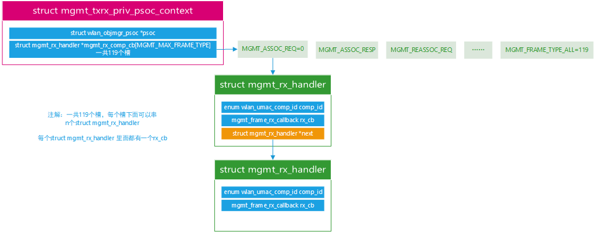
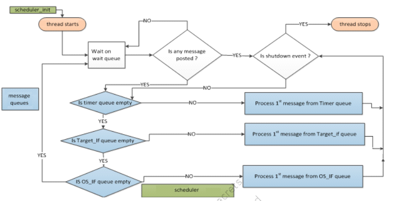

# 驱动层RX MGMT过程

## ol_ath_mgmt_rx_event_handler函数分析

```c
static int ol_ath_mgmt_rx_event_handler(ol_scn_t sc, u_int8_t *data, u_int32_t datalen)
{
    wbuf_t wbuf;

    // 将data数据解压，到rx_event里面
    // bufp 指向
    struct mgmt_rx_event_params rx_event = {0};
    wmi_extract_mgmt_rx_params(wmi_handle, data, &rx_event, &bufp);
    
    //初始化缓存长度为接受数据的长度rx_event.buf_len
    wbuf =  wbuf_alloc(ic->ic_osdev, WBUF_RX_INTERNAL,len);
    wbuf_init(wbuf, rx_event.buf_len);
    wh = (struct ieee80211_frame *)wbuf_header(wbuf);
    
    // 拷贝管理帧数据到wh 中
    OS_MEMCPY(wh, bufp, rx_event.buf_len);

    {
        uint8_t mgmt_type = (wh)->i_fc[0] & IEEE80211_FC0_TYPE_MASK;
	    uint8_t mgmt_subtype = (wh)->i_fc[0] & IEEE80211_FC0_SUBTYPE_MASK;
        WIM_LOG_DEBUG("rx frame type 0x%x subtype 0x%x  "QDF_MAC_ADDR_FMT" ",mgmt_type, mgmt_subtype,QDF_MAC_ADDR_REF(wh->i_addr2));
    }
    // 继续往下调用 处理 wh 管理帧 下面分析 ol_ath_mgmt_handler函数
    ol_ath_mgmt_handler(pdev, scn, wbuf, wh, rx_event, false);

}
```

上面分析的疑问

1. `ol_ath_mgmt_rx_event_handler`函数哪里注册和调用？

   - 注册地方

     ```c
     void
     ol_ath_mgmt_soc_attach(ol_ath_soc_softc_t *soc)
     {
         wmi_unified_t wmi_handle;
     
         wmi_handle = lmac_get_wmi_unified_hdl(soc->psoc_obj);
         /* Register WMI event handlers  注册地方 */
         wmi_unified_register_event_handler(wmi_handle, wmi_mgmt_rx_event_id, ol_ath_mgmt_rx_event_handler, WMI_RX_UMAC_CTX);
         {
             return wmi_register_event_handler_with_ctx(wmi_handle, event_id,handler_func, rx_ctx,WMI_RX_PROCESSED_BUFF);
             {
                 // 真正把ol_ath_mgmt_rx_event_handler赋值给	wmi_handle->event_handler[idx] 指针，下面看在哪里调用的
                 	wmi_handle->event_handler[idx] = handler_func; // 真正把ol_ath_mgmt_rx_event_handler赋值给	wmi_handle->event_handler[idx] 指针，
     			     wmi_handle->event_id[idx] = evt_id;
             }
         }
      }
     ```

   - 调用地方

     ```c
     static QDF_STATUS wmi_initialize_worker_context(struct wmi_unified *wmi_handle)
     {
         // 创建工作线程，回调函数为 wmi_rx_diag_event_work
     	qdf_create_work(0, &wmi_handle->rx_event_work,wmi_rx_event_work, wmi_handle);
     }
     // 在工作线程中，取出数据队列，然后调用__wmi_control_rx处理
     static void wmi_rx_event_work(void *arg)
     {
         buf = qdf_nbuf_queue_remove(&wmi->event_queue);
         while (buf) {
             __wmi_control_rx(wmi, buf);
             {
                   void __wmi_control_rx(struct wmi_unified *wmi_handle, wmi_buf_t evt_buf)
                     {
                         /* Call the WMI registered event handler */
                         if (wmi_handle->target_type == WMI_TLV_TARGET) {
                             ev_buff_type = wmi_handle->ctx[idx].buff_type;
                             if (ev_buff_type == WMI_RX_PROCESSED_BUFF) {
                                 wmi_handle->event_handler[idx] (wmi_handle->scn_handle,wmi_cmd_struct_ptr, len); // 实际调用地方
                             } else if (ev_buff_type == WMI_RX_RAW_BUFF) {
                                 ev_buf.evt_raw_buf = data;
                                 ev_buf.evt_processed_buf = wmi_cmd_struct_ptr;
                                 wmi_handle->event_handler[idx] (wmi_handle->scn_handle,(void *)&ev_buf, len);
                             }
                         }
                         else
                             wmi_handle->event_handler[idx] (wmi_handle->scn_handle,data, len);
                     }
             }
         }
     }
     ```

     

2. 怎么解压数据到event中？

   ```c
   struct mgmt_rx_event_params {
       uint32_t    chan_freq;
       uint32_t    channel;
       uint32_t    snr;
       uint8_t     rssi_ctl[WLAN_MGMT_TXRX_HOST_MAX_ANTENNA];
       uint32_t    rate;
       enum wlan_phymode    phy_mode;
       uint32_t    buf_len;
       uint8_t     status;
       uint32_t    flags;
       int32_t     rssi;
       uint32_t    tsf_delta;
       uint8_t     pdev_id;
       void        *rx_params;
   };
   
   static QDF_STATUS extract_mgmt_rx_params_tlv(wmi_unified_t wmi_handle,
   	void *evt_buf, struct mgmt_rx_event_params *hdr,
   	uint8_t **bufp)
   {
   	WMI_MGMT_RX_EVENTID_param_tlvs *param_tlvs = NULL;
   	wmi_mgmt_rx_hdr *ev_hdr = NULL;
   	int i;
   
   	param_tlvs = (WMI_MGMT_RX_EVENTID_param_tlvs *) evt_buf;
   
   	ev_hdr = param_tlvs->hdr;
   
   	hdr->pdev_id = wmi_handle->ops->convert_pdev_id_target_to_host(
   							wmi_handle,
   							ev_hdr->pdev_id);
   	hdr->chan_freq = ev_hdr->chan_freq;
   	hdr->channel = ev_hdr->channel;
   	hdr->snr = ev_hdr->snr;
   	hdr->rate = ev_hdr->rate;
   	hdr->phy_mode = ev_hdr->phy_mode;
   	hdr->buf_len = ev_hdr->buf_len;
   	hdr->status = ev_hdr->status;
   	hdr->flags = ev_hdr->flags;
   	hdr->rssi = ev_hdr->rssi;
   	hdr->tsf_delta = ev_hdr->tsf_delta;
   	for (i = 0; i < ATH_MAX_ANTENNA; i++)
   		hdr->rssi_ctl[i] = ev_hdr->rssi_ctl[i];
   
   	*bufp = param_tlvs->bufp;
   
   	return QDF_STATUS_SUCCESS;
   }
   ```

   

3. `ol_ath_mgmt_handler`函数后面干了什么？

   下面新开章节分析
   
   大致流程如下：
   
   ```c
   static int ol_ath_mgmt_rx_event_handler(ol_scn_t sc, u_int8_t *data, u_int32_t datalen)
   {
       struct mgmt_rx_event_params rx_event = {0};
       // 解压tlv数据 存放到rx_event里面
       wmi_extract_mgmt_rx_params(wmi_handle, data, &rx_event, &bufp);
   	ol_ath_mgmt_handler(pdev, scn, wbuf, wh, rx_event, false);
   	{
   		mgmt_txrx_rx_handler(psoc, wbuf, &rx_event);
   		{
   			mgmt_rx_ops = wlan_lmac_if_get_mgmt_txrx_rx_ops(psoc);
   
   			if (mgmt_rx_ops && mgmt_rx_ops->mgmt_rx_frame_handler)
   				return mgmt_rx_ops->mgmt_rx_frame_handler(psoc, nbuf, params);
   						//该函数为 tgt_mgmt_txrx_rx_frame_handler
   						{
   							// 该函数很重要 下面单独拉出来，分析
   						}
   		}
   	}
   }
   ```
   
   

## ol_ath_mgmt_handler函数分析

```c
void ol_ath_mgmt_handler(struct wlan_objmgr_pdev *pdev,
        struct ol_ath_softc_net80211 *scn,
        wbuf_t wbuf,
        struct ieee80211_frame * wh,
        struct mgmt_rx_event_params rx_event,
        bool null_data_handler)
{

    struct ieee80211com *ic = &scn->sc_ic;
    struct ieee80211_rx_status rs;
    struct ieee80211_node *ni;
    struct wlan_objmgr_psoc *psoc;


    qdf_mem_zero(&rs, sizeof(rs));

   // 这里根据帧内容 找到一个node，
    ni = ieee80211_find_rxnode(ic, (struct ieee80211_frame_min *)wbuf_header(wbuf), WLAN_MGMT_RX_ID);
    psoc = wlan_pdev_get_psoc(scn->sc_pdev);
    
    // 把一些状态赋值给 struct ieee80211_rx_status
    rs.rs_ic = ic;
    rs.rs_ni = ni;
    rs.rs_snr = rx_event.snr;
 
    rx_event.rx_params = (void *)&rs;  // 注意这里的 rx_event.rx_params 是struct ieee80211_rx_status

   // 如果我们收到一个带有广播 bssid 的 probereq，通常发送者发送以发现新网络，所有 vap 都应发送回复
    // ol_ath_rxstat2ieee(ic, &rx_event, &rs);函数，继续跟进ic和rx_event数据更新 状态到 rs中
    // 这里最终到到了mgmt_txrx_rx_handler(psoc, wbuf, &rx_event);函数 下面分析
    if (ni == NULL || (IEEE80211_IS_PROBEREQ(wh) && IEEE80211_IS_BROADCAST(wh->i_addr3))) {
        ol_ath_rxstat2ieee(ic, &rx_event, &rs);
        mgmt_txrx_rx_handler(psoc, wbuf, &rx_event);
        if (ni) {
            ieee80211_free_node(ni, WLAN_MGMT_RX_ID);
        }
    } else {
        ol_ath_rxstat2ieee(ni->ni_ic, &rx_event, &rs);
#ifdef QCA_SUPPORT_CP_STATS
        WLAN_PEER_CP_STAT_SET(ni, rx_mgmt_rate, rx_event.rate);
        WLAN_PEER_CP_STAT_SET(ni, rx_mgmt_snr, rx_event.snr);
#endif
        /*
         * hand over the wbuf to the mgmt_txrx layer
         * for further processing.
         */
        mgmt_txrx_rx_handler(psoc, wbuf, &rx_event);
        ieee80211_free_node(ni, WLAN_MGMT_RX_ID);
    }
    return ;
}
```


## mgmt_txrx_rx_handler函数分析

```c
static inline QDF_STATUS
mgmt_txrx_rx_handler(struct wlan_objmgr_psoc *psoc, qdf_nbuf_t nbuf,
			void *params)
{
	struct wlan_lmac_if_mgmt_txrx_rx_ops *mgmt_rx_ops;

    // 根据psoc 得到 注册的 管理帧处理函数mgmt_rx_ops
	mgmt_rx_ops = wlan_lmac_if_get_mgmt_txrx_rx_ops(psoc);

    // 调用该函数，实际	mgmt_txrx_rx_ops->mgmt_rx_frame_handler =tgt_mgmt_txrx_rx_frame_handler;
    // 故而调用tgt_mgmt_txrx_rx_frame_handler函数，下面分析该函数
	if (mgmt_rx_ops && mgmt_rx_ops->mgmt_rx_frame_handler)
		return mgmt_rx_ops->mgmt_rx_frame_handler(psoc, nbuf, params);

	if (nbuf)
		qdf_nbuf_free(nbuf);

	return QDF_STATUS_E_NULL_VALUE;
}
```


## tgt_mgmt_txrx_rx_frame_handler函数分析

```c
QDF_STATUS tgt_mgmt_txrx_rx_frame_handler(
			struct wlan_objmgr_psoc *psoc,
			qdf_nbuf_t buf,
			struct mgmt_rx_event_params *mgmt_rx_params)
{
	struct mgmt_txrx_priv_psoc_context *mgmt_txrx_psoc_ctx;
	struct ieee80211_frame *wh;
	qdf_nbuf_t copy_buf;
	struct wlan_objmgr_peer *peer = NULL;
	uint8_t mgmt_type, mgmt_subtype;
	uint8_t *mac_addr, *mpdu_data_ptr;
	enum mgmt_frame_type frm_type;
	struct mgmt_rx_handler *rx_handler;
	struct mgmt_rx_handler *rx_handler_head = NULL, *rx_handler_tail = NULL;
	u_int8_t *data, *ivp = NULL;
	uint16_t buflen;
	uint16_t len = 0;
	QDF_STATUS status = QDF_STATUS_SUCCESS;
	bool is_from_addr_valid, is_bssid_valid;


	data = (uint8_t *)qdf_nbuf_data(buf);
	wh = (struct ieee80211_frame *)data;
	buflen = qdf_nbuf_len(buf);


    // 得到管理帧的类型
        /* 得到帧类型 mgmt_type 	 00 管理帧
                    		01 控制帧
                    		10 数据帧
               mgmt_subtype  对于mgmt_type为00的管理帧 该字段意思为
               				0000 Association request
               				0001 Association response
               				0010 Reassociation req
               				0011 Reassociation response
               				0100 Probe response
               				0101 Probe response
               				1000 Beacon
               				1001 ATIM
               				1010 Disassociation
               				1011 Authentication
               				1100 Deauthentication
     */    
	mgmt_type = (wh)->i_fc[0] & IEEE80211_FC0_TYPE_MASK;
	mgmt_subtype = (wh)->i_fc[0] & IEEE80211_FC0_SUBTYPE_MASK;


	/* 得到80211 数据实体的指针 mpdu_data_ptr is pointer to action header */
	mpdu_data_ptr = (uint8_t *)qdf_nbuf_data(buf) +izeof(struct ieee80211_frame);

	frm_type = mgmt_txrx_get_frm_type(mgmt_subtype, mpdu_data_ptr);

	mgmt_txrx_psoc_ctx = (struct mgmt_txrx_priv_psoc_context *)wlan_objmgr_psoc_get_comp_private_obj(psoc,WLAN_UMAC_COMP_MGMT_TXRX);

    // 下面 功能会取出所有注册的处理函数，rx_handler_head 指向其头部 rx_handler_tail 指向其尾部 注册的地方下面分析
    // 根据查找函数一共注册了3个
    // MGMT_FRAME_TYPE_ALL  对应  ieee80211_mgmt_input 函数
    // MGMT_PROBE_RESP      对应  tgt_scan_bcn_probe_rx_callback 函数
    // MGMT_BEACON          对应  tgt_scan_bcn_probe_rx_callback 函数
	rx_handler = mgmt_txrx_psoc_ctx->mgmt_rx_comp_cb[frm_type];
	if (rx_handler) {
		status = wlan_mgmt_txrx_rx_handler_list_copy(rx_handler,&rx_handler_head, &rx_handler_tail);
	}

	rx_handler = mgmt_txrx_psoc_ctx->mgmt_rx_comp_cb[MGMT_FRAME_TYPE_ALL];
	if (rx_handler) {
		status = wlan_mgmt_txrx_rx_handler_list_copy(rx_handler,
				&rx_handler_head, &rx_handler_tail);
	}


	mac_addr = (uint8_t *)wh->i_addr2;
	/*
	 * peer can be NULL in following 2 scenarios:
	 * 1. broadcast frame received
	 * 2. operating in monitor mode
	 *
	 * and in both scenarios, the receiver of frame
	 * is expected to do processing accordingly considerng
	 * the fact that peer = NULL can be received and is a valid
	 * scenario.
	 */
	peer = wlan_objmgr_get_peer(psoc, mgmt_rx_params->pdev_id,mac_addr, WLAN_MGMT_SB_ID);
	if (!peer && !qdf_is_macaddr_broadcast(
	    (struct qdf_mac_addr *)wh->i_addr1)) {
		mac_addr = (uint8_t *)wh->i_addr1;
		peer = wlan_objmgr_get_peer(psoc,mgmt_rx_params->pdev_id, mac_addr, WLAN_MGMT_SB_ID);
	}
    // 下面就是轮询调用上面的三个回调函数 从rx_handler_head 调用到  rx_handler_tail
    // tgt_scan_bcn_probe_rx_callback tgt_scan_bcn_probe_rx_callback  ieee80211_mgmt_input
    // 故而只需分析tgt_scan_bcn_probe_rx_callback和ieee80211_mgmt_input函数即可
	rx_handler = rx_handler_head;
	while (rx_handler->next) {
		copy_buf = qdf_nbuf_clone(buf);

		if (!copy_buf) {
			rx_handler = rx_handler->next;
			continue;
		}

		rx_handler->rx_cb(psoc, peer, copy_buf,
					mgmt_rx_params, frm_type);
		rx_handler = rx_handler->next;
	}
	rx_handler->rx_cb(psoc, peer, buf,
				mgmt_rx_params, frm_type);

	if (peer)
		wlan_objmgr_peer_release_ref(peer, WLAN_MGMT_SB_ID);

rx_handler_mem_free:
	while (rx_handler_head) {
		rx_handler = rx_handler_head;
		rx_handler_head = rx_handler_head->next;
		qdf_mem_free(rx_handler);
	}

	return status;
}
```

遗留问题

- `mgmt_txrx_psoc_ctx->mgmt_rx_comp_cb[frm_type]`值哪里来的

  下面先介绍几个重要概念：

  - 结构体`struct mgmt_rx_handler`内容如下，就是一个单向链表

    ```c
    struct mgmt_rx_handler {
        enum wlan_umac_comp_id comp_id;
        mgmt_frame_rx_callback rx_cb;
        struct mgmt_rx_handler *next;
    };
    ```

    comp_id 组件id如下：

    ```c
    enum wlan_umac_comp_id {
    	WLAN_UMAC_COMP_MLME               = 0,
    	WLAN_UMAC_COMP_MGMT_TXRX          = 1,
    	WLAN_UMAC_COMP_SERIALIZATION      = 2,
    	WLAN_UMAC_COMP_SCAN               = 3,
    	WLAN_UMAC_COMP_PMO                = 4,
    	WLAN_UMAC_COMP_P2P                = 5,
    	WLAN_UMAC_COMP_POLICY_MGR         = 6,
    	WLAN_UMAC_COMP_CONFIG             = 7,
    	WLAN_TARGET_IF_COMP_DIRECT_BUF_RX = 8,
    	WLAN_UMAC_COMP_WIFI_POS           = 9,
    	WLAN_UMAC_COMP_TDLS               = 10,
    	WLAN_UMAC_COMP_ATF                = 11,
    	WLAN_UMAC_COMP_SA_API             = 12,
    	WLAN_UMAC_COMP_REGULATORY         = 13,
    	WLAN_UMAC_COMP_CRYPTO             = 14,
    	WLAN_UMAC_COMP_NAN                = 15,
    	WLAN_UMAC_COMP_DFS                = 16,
    	WLAN_UMAC_COMP_OFFCHAN_TXRX       = 17,
    	WLAN_UMAC_COMP_SON                = 18,
    	WLAN_UMAC_COMP_SPECTRAL           = 19,
    	WLAN_UMAC_COMP_SPLITMAC           = 20,
    	WLAN_UMAC_COMP_DISA               = 21,
    	WLAN_UMAC_COMP_GREEN_AP           = 22,
    	WLAN_UMAC_COMP_FTM                = 23,
    	WLAN_UMAC_COMP_FD                 = 24,
    	WLAN_UMAC_COMP_OCB                = 25,
    	WLAN_UMAC_COMP_IPA                = 26,
    	WLAN_UMAC_COMP_CP_STATS           = 27,
    	WLAN_UMAC_COMP_ACTION_OUI         = 28,
    	WLAN_UMAC_COMP_FWOL               = 29,
    	WLAN_UMAC_COMP_CFR                = 30,
    	WLAN_UMAC_COMP_INTEROP_ISSUES_AP  = 31,
    	WLAN_UMAC_COMP_BLACKLIST_MGR      = 32,
    	WLAN_UMAC_COMP_COEX               = 33,
    	WLAN_UMAC_COMP_FTM_TIME_SYNC      = 34,
    	WLAN_UMAC_COMP_PKT_CAPTURE        = 35,
    	WLAN_UMAC_COMP_DCS                = 36,
    	WLAN_IOT_SIM_COMP                 = 37,
    	WLAN_UMAC_COMP_IF_MGR             = 38,
    	WLAN_UMAC_COMP_GPIO               = 39,
    	WLAN_UMAC_COMP_ID_MAX,
    };
    ```

    

  - `mgmt_rx_comp_cb[frm_type]`是`struct mgmt_rx_handler *`类型槽，一共MGMT_FRAME_TYPE_ALL多个

    如下图所示，一共有119个槽，每个槽的索引为帧类型，没个槽下面可以挂N个`rx_handler`，

    

  - `wlan_mgmt_txrx_register_rx_cb`函数作用即实现下面的功能

    有N个`struct mgmt_rx_handler*`类型的槽，每个槽初始都是空的，每个槽的索引为frm_type，比如我们现在同一个frm_type类型下挂了多个struct mgmt_rx_handler的实体，操作如下：

    ```c
    
    struct mgmt_txrx_mgmt_frame_cb_info cb_info[2];
    cb_info[0].frm_type = MGMT_BEACON;
    cb_info[0].mgmt_rx_cb = tgt_scan_bcn_rx_callback;
    cb_info[1].frm_type = MGMT_BEACON;
    cb_info[1].mgmt_rx_cb = tgt_scan_probe_rx_callback;
    wlan_mgmt_txrx_register_rx_cb(psoc,WLAN_UMAC_COMP_SCAN, cb_info, 2);
    /*
    调用完函数后，
     struct mgmt_rx_handler[0]->rx_cb = cb_info[0].mgmt_rx_cb即tgt_scan_bcn_rx_callback
     struct mgmt_rx_handler[1]->rx_cb = cb_info[1].mgmt_rx_cb即tgt_scan_probe_rx_callback
    struct mgmt_rx_handler[1]->next = struct mgmt_rx_handler[0]
    mgmt_rx_comp_cb[MGMT_BEACON]   = struct mgmt_rx_handler[1]
    效果如下：
        						     |--------------------------------------|
    MGMT_BEACON| struct mgmt_rx_handler[1]  |->next  指向 struct mgmt_rx_handler[0]
    								 |--------------------------------------|
    */
    
    
    ```

    说白了就是把他们单链表串起来

-  实际的代码中注册地方

  ```c
  rx_cb_info.frm_type = MGMT_FRAME_TYPE_ALL;
  rx_cb_info.mgmt_rx_cb = ieee80211_mgmt_input;
  wlan_mgmt_txrx_register_rx_cb(soc->psoc_obj, WLAN_UMAC_COMP_MLME,&rx_cb_info, 1);
  
  struct mgmt_txrx_mgmt_frame_cb_info cb_info[2];
  cb_info[0].frm_type = MGMT_PROBE_RESP;
  cb_info[0].mgmt_rx_cb = tgt_scan_bcn_probe_rx_callback;
  cb_info[1].frm_type = MGMT_BEACON;
  cb_info[1].mgmt_rx_cb = tgt_scan_bcn_probe_rx_callback;
  wlan_mgmt_txrx_register_rx_cb(psoc,WLAN_UMAC_COMP_SCAN, cb_info, 2);
  ```

  最终效果如下：

  ```
  struct mgmt_rx_handler *类型槽
  |--------------------------------------|
  |   MGMT_ASSOC_REQ				 |
  |--------------------------------------|
  |   MGMT_ASSOC_RESP				|
  |--------------------------------------|
  						：																					   ______________________________________________
  |--------------------------------------|													 |comp_id = WLAN_UMAC_COMP_SCAN									|
  |   MGMT_PROBE_RESP				|struct mgmt_rx_handler  |rx_cb        = tgt_scan_bcn_probe_rx_callback					   | 【A】
  |--------------------------------------|                                                     |next          = mgmt_rx_comp_cb[MGMT_PROBE_RESP]   |
  						：																					   ______________________________________________
  |--------------------------------------|													 |comp_id = WLAN_UMAC_COMP_SCAN									|
  |   MGMT_BEACON         			  |struct mgmt_rx_handler  |rx_cb        = tgt_scan_bcn_probe_rx_callback					 |【B】
  |--------------------------------------|                                                     |next          = mgmt_rx_comp_cb[MGMT_BEACON]             |
                        	：																					   --------------------------------------------------------------------------
  						：			
                          ：                                                                                       ______________________________________________
  |--------------------------------------|													 |comp_id = WLAN_UMAC_COMP_MLME									|
  |   MGMT_FRAME_TYPE_ALL   |struct mgmt_rx_handler  |rx_cb        = ieee80211_mgmt_input					                       |【C】
  |--------------------------------------|                                                     |next          = mgmt_rx_comp_cb[MGMT_FRAME_TYPE_ALL]  |
                        																					            --------------------------------------------------------------------------
  
  ```

  

- `wlan_mgmt_txrx_rx_handler_list_copy(rx_handler,&rx_handler_head, &rx_handler_tail)`函数作用是什么

  把rx_handler里面的内容，串起来，rx_handler_head指向其头，rx_handler_tail指向其尾部，比如上面注册的三个，调用后如下

  ```c
  	rx_handler = mgmt_txrx_psoc_ctx->mgmt_rx_comp_cb[frm_type];
  	if (rx_handler) {
  		status = wlan_mgmt_txrx_rx_handler_list_copy(rx_handler,&rx_handler_head, &rx_handler_tail);
  	}
  
  	rx_handler = mgmt_txrx_psoc_ctx->mgmt_rx_comp_cb[MGMT_FRAME_TYPE_ALL];
  	if (rx_handler) {
  		status = wlan_mgmt_txrx_rx_handler_list_copy(rx_handler,
  				&rx_handler_head, &rx_handler_tail);
  	}
  ```

  比如现在传入的是beacon帧，结果如下：

  ```
  rx_handler_head->【B】 ->【C】<-rx_handler_tail
  
  ```

  如果beacon帧后面还有handler，比如存在B1，那么最终结果如下：

  ```
  rx_handler_head->【B1】 ->【B】 ->【C】<-rx_handler_tail
  ```

综上：下面需要分析：

- `tgt_scan_bcn_probe_rx_callback` 函数
- `ieee80211_mgmt_input` 函数

### tgt_scan_bcn_probe_rx_callback函数分析

```c
QDF_STATUS tgt_scan_bcn_probe_rx_callback(struct wlan_objmgr_psoc *psoc,
	struct wlan_objmgr_peer *peer, qdf_nbuf_t buf,
	struct mgmt_rx_event_params *rx_param,
	enum mgmt_frame_type frm_type)
{
	struct scheduler_msg msg = {0};
	struct scan_bcn_probe_event *bcn = NULL;
	QDF_STATUS status;
	uint32_t scan_queue_size = 0;

    // 进行类型判断，能进到该函数的只有PROBE_RESP和BEACON帧
	if ((frm_type != MGMT_PROBE_RESP) &&
	    (frm_type != MGMT_BEACON)) {
		scm_err("frame is not beacon or probe resp");
		status = QDF_STATUS_E_INVAL;
		goto free;
	}

    // 创建struct scan_bcn_probe_event 并 填充内容
	bcn = qdf_mem_malloc_atomic(sizeof(*bcn));
	bcn->rx_data =qdf_mem_malloc_atomic(sizeof(*rx_param));
	if (frm_type == MGMT_PROBE_RESP)
		bcn->frm_type = MGMT_SUBTYPE_PROBE_RESP;
	else
		bcn->frm_type = MGMT_SUBTYPE_BEACON;

	bcn->psoc = psoc;
	bcn->buf = buf;
    // 拷贝数据
	qdf_mem_copy(bcn->rx_data, rx_param, sizeof(*rx_param));


    // 创建msg
	msg.bodyptr = bcn;
	msg.callback = scm_handle_bcn_probe;
	msg.flush_callback = scm_bcn_probe_flush_callback;

    // 调度器post 消息，调度器运作机制，参见本文档《scheduler_post_message 消息机制》章节
	status = scheduler_post_message(QDF_MODULE_ID_SCAN,
					QDF_MODULE_ID_SCAN,
					QDF_MODULE_ID_SCAN, &msg);
	// 到这里，等待调度器取到该消息，会执行该消息的回调函数scm_handle_bcn_probe 下面分析该函数


free:
	if (bcn && bcn->rx_data)
		qdf_mem_free(bcn->rx_data);
	if (bcn)
		qdf_mem_free(bcn);
	if (buf)
		qdf_nbuf_free(buf);

	return status;
}

```

#### scm_handle_bcn_probe函数分析

```c
QDF_STATUS scm_handle_bcn_probe(struct scheduler_msg *msg)
{
	return __scm_handle_bcn_probe(msg->bodyptr);
}

// 该函数的主要作用就是解压beacon帧，根据需要 然后把sacn_list 插入到 内核的扫描列表中，这里不做过多分析
QDF_STATUS __scm_handle_bcn_probe(struct scan_bcn_probe_event *bcn)
{
	struct wlan_objmgr_psoc *psoc;
	struct wlan_objmgr_pdev *pdev = NULL;
	struct scan_cache_entry *scan_entry;
	struct wlan_scan_obj *scan_obj;
	qdf_list_t *scan_list = NULL;
	QDF_STATUS status = QDF_STATUS_SUCCESS;
	uint32_t list_count, i;
	qdf_list_node_t *next_node = NULL;
	struct scan_cache_node *scan_node;
	struct wlan_frame_hdr *hdr = NULL;

	hdr = (struct wlan_frame_hdr *)qdf_nbuf_data(bcn->buf);
	psoc = bcn->psoc;
	pdev = wlan_objmgr_get_pdev_by_id(psoc,
			   bcn->rx_data->pdev_id, WLAN_SCAN_ID);

	scan_obj = wlan_psoc_get_scan_obj(psoc);

	if (bcn->frm_type == MGMT_SUBTYPE_BEACON &&
	    wlan_reg_is_dfs_for_freq(pdev, bcn->rx_data->chan_freq)) {
		util_scan_add_hidden_ssid(pdev, bcn->buf);
	}

	scan_list =
		 util_scan_unpack_beacon_frame(pdev, qdf_nbuf_data(bcn->buf),
			qdf_nbuf_len(bcn->buf), bcn->frm_type,
			bcn->rx_data);
	if (!scan_list || qdf_list_empty(scan_list)) {
		scm_debug("failed to unpack %d frame BSSID: "QDF_MAC_ADDR_FMT,
			  bcn->frm_type, QDF_MAC_ADDR_REF(hdr->i_addr3));
		status = QDF_STATUS_E_INVAL;
		goto free_nbuf;
	}

	list_count = qdf_list_size(scan_list);
	for (i = 0; i < list_count; i++) {
		status = qdf_list_remove_front(scan_list, &next_node);
		if (QDF_IS_STATUS_ERROR(status) || !next_node) {
			scm_debug("list remove failure i:%d, lsize:%d, BSSID: "QDF_MAC_ADDR_FMT,
				  i, list_count, QDF_MAC_ADDR_REF(hdr->i_addr3));
			status = QDF_STATUS_E_INVAL;
			goto free_nbuf;
		}

		scan_node = qdf_container_of(next_node,
			struct scan_cache_node, node);

		scan_entry = scan_node->entry;

		if (scan_obj->drop_bcn_on_chan_mismatch &&
		    scan_entry->channel_mismatch) {
			scm_nofl_debug("Drop frame for chan mismatch "QDF_MAC_ADDR_FMT" Seq Num: %d freq %d RSSI %d",
				       QDF_MAC_ADDR_REF(scan_entry->bssid.bytes),
				       scan_entry->seq_num,
				       scan_entry->channel.chan_freq,
				       scan_entry->rssi_raw);
			util_scan_free_cache_entry(scan_entry);
			qdf_mem_free(scan_node);
			continue;
		}
		/* Do not add invalid channel entry as kernel will reject it */
		if (scan_obj->drop_bcn_on_invalid_freq &&
		    wlan_reg_is_disable_for_freq(pdev,
					scan_entry->channel.chan_freq)) {
			scm_nofl_debug("Drop frame for invalid freq %d: "QDF_MAC_ADDR_FMT" Seq Num: %d RSSI %d",
				       scan_entry->channel.chan_freq,
				       QDF_MAC_ADDR_REF(scan_entry->bssid.bytes),
				       scan_entry->seq_num,
				       scan_entry->rssi_raw);
			util_scan_free_cache_entry(scan_entry);
			qdf_mem_free(scan_node);
			continue;
		}
		if (scan_obj->cb.update_beacon)
			scan_obj->cb.update_beacon(pdev, scan_entry);

		status = scm_add_update_entry(psoc, pdev, scan_entry);
		if (QDF_IS_STATUS_ERROR(status)) {
			scm_debug("failed to add entry for BSSID: "QDF_MAC_ADDR_FMT" Seq Num: %d",
				  QDF_MAC_ADDR_REF(scan_entry->bssid.bytes),
				  scan_entry->seq_num);
			util_scan_free_cache_entry(scan_entry);
			qdf_mem_free(scan_node);
			continue;
		}

		qdf_mem_free(scan_node);
	}

free_nbuf:
	if (scan_list)
		qdf_mem_free(scan_list);
	if (bcn->psoc)
		wlan_objmgr_psoc_release_ref(bcn->psoc, WLAN_SCAN_ID);
	if (pdev)
		wlan_objmgr_pdev_release_ref(pdev, WLAN_SCAN_ID);
	if (bcn->rx_data)
		qdf_mem_free(bcn->rx_data);
	if (bcn->buf)
		qdf_nbuf_free(bcn->buf);
	qdf_mem_free(bcn);

	return status;
}
```


### ieee80211_mgmt_input函数分析

```c
QDF_STATUS
ieee80211_mgmt_input(struct wlan_objmgr_psoc *psoc,
                     struct wlan_objmgr_peer *peer,
                     wbuf_t wbuf,
                     struct mgmt_rx_event_params *mgmt_rx_params,
                     enum mgmt_frame_type txrx_type)
{
    struct ieee80211_rx_status *rx_status = (struct ieee80211_rx_status *)mgmt_rx_params->rx_params;
    struct ieee80211_node *ni = rx_status->rs_ni;
    struct ieee80211_frame *wh = (struct ieee80211_frame *)wbuf_header(wbuf);
    struct ieee80211com *ic = rx_status->rs_ic;


    if (!ni || (IEEE80211_IS_PROBEREQ(wh) && IEEE80211_IS_BROADCAST(wh->i_addr3))) {
        ieee80211_input_all(ic, wbuf, rx_status);
    } else {
        ieee80211_input(ni, wbuf, rx_status);
    }

    return QDF_STATUS_SUCCESS;
}
```

接下来分析`ieee80211_input_all`函数

```c
int
ieee80211_input_all(struct ieee80211com *ic,
    wbuf_t wbuf, struct ieee80211_rx_status *rs)
{
    struct ieee80211_iter_input_all_arg params;
    u_int32_t num_vaps;
    struct ieee80211_frame *wh = (struct ieee80211_frame *)wbuf_header(wbuf);
    uint8_t addr2[QDF_MAC_ADDR_SIZE];
    uint8_t addr3[QDF_MAC_ADDR_SIZE];
    bool is_mbss_ie_enable = wlan_pdev_nif_feat_cap_get(ic->ic_pdev_obj,
                                                         WLAN_PDEV_F_MBSS_IE_ENABLE);
    bool is_probe_req = IEEE80211_IS_PROBEREQ(wh);

    if (is_mbss_ie_enable && is_probe_req) {
        qdf_mem_copy(addr2, wh->i_addr2, QDF_MAC_ADDR_SIZE);
        qdf_mem_copy(addr3, wh->i_addr3, QDF_MAC_ADDR_SIZE);
        ic->ic_mbss.resp_sent = 0;
    }

    params.wbuf = wbuf;
    params.rs = rs;
    params.type = -1;

    ieee80211_iterate_vap_list_internal(ic,ieee80211_iter_input_all,(void *)&params,num_vaps);

    if (is_mbss_ie_enable && is_probe_req) {
        if (IEEE80211_IS_BROADCAST(addr3) ||
            (!IEEE80211_IS_BROADCAST(addr3) &&
             !ic->ic_mbss.resp_sent))
            ieee80211_input_handle_mbss_probereq(ic, addr2);
    }

    if (params.wbuf != NULL)        /* no vaps, reclaim wbuf */
        wbuf_free(params.wbuf);

    return params.type;
}
```

大致顺序如下：

```
ieee80211_input_all
	ieee80211_iterate_vap_list_internal(ic,ieee80211_iter_input_all,(void *)&params,num_vaps);
		ieee80211_iter_input_all
			ieee80211_input
				
```

```c
int
ieee80211_input(struct ieee80211_node *ni, wbuf_t wbuf, struct ieee80211_rx_status *rs)
{
#define QOS_NULL   (IEEE80211_FC0_TYPE_DATA | IEEE80211_FC0_SUBTYPE_QOS_NULL)
#define HAS_SEQ(type, subtype)   (((type & 0x4) == 0) && ((type | subtype) != QOS_NULL))
    struct ieee80211com *ic = ni->ni_ic;
    struct ieee80211_frame *wh;
    struct ieee80211vap *vap = ni->ni_vap;
    struct ieee80211_phy_stats *phy_stats;
    int type = -1, subtype = -1, dir;

    u_int16_t rxseq =0;
    u_int8_t *bssid;
    bool snr_update = true;
    bool is_bcast = false;


    wh = (struct ieee80211_frame *) wbuf_header(wbuf);


    type = wh->i_fc[0] & IEEE80211_FC0_TYPE_MASK;
    subtype = wh->i_fc[0] & IEEE80211_FC0_SUBTYPE_MASK;
    dir = wh->i_fc[1] & IEEE80211_FC1_DIR_MASK;

    if (IEEE80211_IS_BROADCAST(wh->i_addr3))
        is_bcast = true;


        if(snr_update && rs->rs_isvalidsnr)
            ni->ni_snr = rs->rs_snr;


    if (type == IEEE80211_FC0_TYPE_DATA) {
		// 这里处理data帧
        ieee80211_input_data(ni, wbuf, rs, subtype, dir);
    } else if (type == IEEE80211_FC0_TYPE_MGT) {

                // 这里处理管理帧
                IEEE80211_HANDLE_MGMT(ic,vap,ni, wbuf, subtype,type,  rs);
    } else if (type == IEEE80211_FC0_TYPE_CTL) {
   			// 这里处理控制帧
        ieee80211_recv_ctrl(ni, wbuf, subtype, rs);
        /*
         * deliver the frame to the os. the handler cosumes the wbuf.
         */
        if (vap->iv_evtable) {
            vap->iv_evtable->wlan_receive(vap->iv_ifp, wbuf, type, subtype, rs);
        }
    } 

}
```

调用过程如下：

```
IEEE80211_HANDLE_MGMT
	ieee80211_recv_mgmt
		
```

```c
int
ieee80211_recv_mgmt(struct ieee80211_node *ni,
                    wbuf_t wbuf,
                    int subtype,
                    struct ieee80211_rx_status *rs)
{
    struct ieee80211vap *vap = ni->ni_vap;
    struct ieee80211com *ic = ni->ni_ic;
    struct ieee80211_frame *wh;
    int    is_bcast, forward_to_filter = 1;
    int    i;
    int    eq=0, ret = 0;
    struct ieee80211vap *tmpvap = NULL;
    bool action_taken = true;
    wh = (struct ieee80211_frame *) wbuf_header(wbuf);

    if ((vap->iv_opmode == IEEE80211_M_HOSTAP) && vap->iv_vap_is_down) {
        IEEE80211_DPRINTF(vap, IEEE80211_MSG_MLME,
                "AP vap_is_down. drop frame subtype: %d, TA:%s\n", subtype,
                ether_sprintf(wh->i_addr2));
        return -EINVAL;
    }

    /* Make sure this is not a rogue frame carrying source address
     * same as some active vap on underlying radio.
     * If yes, do not process this frame and drop it.
     */
    TAILQ_FOREACH(tmpvap, &(ic)->ic_vaps, iv_next) {
        if (IEEE80211_ADDR_EQ(wh->i_addr2, tmpvap->iv_myaddr)) {
            IEEE80211_DPRINTF(vap, IEEE80211_MSG_AUTH,
                "%s: WARN: Rx frame subtype:%d on vap:%d from mac:%s(matching vap:%d)\n",
                __func__, subtype, vap->iv_unit, ether_sprintf(wh->i_addr2),
                tmpvap->iv_unit);
            return -EINVAL;
        }
    }

    if (IEEE80211_IS_MULTICAST(wh->i_addr2) ||
        IS_NULL_ADDR(wh->i_addr2)) {
        /* Drop the management and control frames originated with invalid
         * address, viz., multicast or zero address
         */
        IEEE80211_DPRINTF(vap, IEEE80211_MSG_INPUT,
            "%s: Invalid SA:%s in received mgmt frm - ignore silently",
            __func__, ether_sprintf(wh->i_addr2));
                return 0;
    }

    /* check for ACL policy if smart mesh is enabled */
    if ((vap->iv_smart_mesh_cfg & SMART_MESH_ACL_ENHANCEMENT)) {

        if (!ieee80211_acl_check(vap, wh->i_addr2)) {
            IEEE80211_DPRINTF(vap, IEEE80211_MSG_ACL,
                    "[%s] MGMT subtype:%d, disallowed by ACL \n", ether_sprintf(ni->ni_macaddr), subtype);
#ifdef QCA_SUPPORT_CP_STATS
            vdev_cp_stats_rx_acl_inc(vap->vdev_obj, 1);
#endif
            return -EINVAL;
        }
    }

#if UMAC_SUPPORT_WNM
    if (ieee80211_vap_wnm_is_set(vap) && ieee80211_wnm_bss_is_set(vap->wnm) &&
            ni != ni->ni_bss_node) {
        ieee80211_wnm_bssmax_updaterx(ni, IEEE80211_IS_MFP_FRAME(wh));
    }
#endif

    if(subtype ==  IEEE80211_FC0_SUBTYPE_AUTH ||
       subtype ==  IEEE80211_FC0_SUBTYPE_ASSOC_REQ||
       subtype ==  IEEE80211_FC0_SUBTYPE_REASSOC_REQ) {
        if (ni != ni->ni_vap->iv_bss) {
            wds_clear_wds_table(ni,&ic->ic_sta, wbuf);
        }
    }

    is_bcast = IEEE80211_IS_BROADCAST(wh->i_addr1) ? 1:0;
    if (IEEE80211_IS_MFP_FRAME(wh)) {
        struct wlan_objmgr_pdev *pdev;
        struct wlan_objmgr_psoc *psoc;
        struct wlan_lmac_if_crypto_rx_ops *crypto_rx_ops;

        pdev = ic->ic_pdev_obj;
        if(pdev == NULL) {
            qdf_print("%s[%d]pdev is NULL", __func__, __LINE__);
            return -1;
        }
        psoc = wlan_pdev_get_psoc(pdev);
        if(psoc == NULL) {
            qdf_print("%s[%d]psoc is NULL", __func__, __LINE__);
            return -1;
        }
       IEEE80211_DPRINTF(vap, IEEE80211_MSG_MLME, "Received MFP frame with Subtype 0x%2X\n", subtype);
       /*
       * There are two reasons that a received MFP frame must be dropped:
       * 1) decryption error
       * 2) MFP is not negociated
       */
    crypto_rx_ops = wlan_crypto_get_crypto_rx_ops(psoc);
    if ((crypto_rx_ops && WLAN_CRYPTO_RX_OPS_DECAP(crypto_rx_ops) &&
              (WLAN_CRYPTO_RX_OPS_DECAP(crypto_rx_ops)(vap->vdev_obj,
                                       wbuf, ni->ni_macaddr, 16) != 0))
                    || (!ieee80211_is_pmf_enabled(vap, ni)) || (rs->rs_flags)){
              /* Increment rx decrypt errors in peer stats */
#ifdef QCA_SUPPORT_CP_STATS
              peer_cp_stats_rx_decryptcrc_inc(ni->peer_obj, 1);
#endif

              IEEE80211_DPRINTF(vap, IEEE80211_MSG_MLME, "Decrypt Error MFP frame with Subtype 0x%2X\n", subtype);
              return -EINVAL;
        } else {
#ifdef QCA_SUPPORT_CP_STATS
       is_bcast ? vdev_mcast_cp_stats_rx_decryptok_inc(vap->vdev_obj, 1):
                  vdev_ucast_cp_stats_rx_decryptok_inc(vap->vdev_obj, 1);
#endif
        }
        /* recalculate wh pointer, header may shift after decap */
        wh = (struct ieee80211_frame *) wbuf_header(wbuf);
        /* NB: We clear the Protected bit later */
    }
    else {
        u_int8_t *frm = (u_int8_t *)&wh[1];
        u_int8_t *efrm = wbuf_header(wbuf) + wbuf_get_pktlen(wbuf);
        struct ieee80211_action *ia;

        IEEE80211_VERIFY_LENGTH(efrm - frm, sizeof(struct ieee80211_action));
        ia = (struct ieee80211_action *)frm;

        if (ieee80211_is_pmf_enabled(vap, ni) &&
            (subtype == IEEE80211_FC0_SUBTYPE_ACTION)) {
            switch(ia->ia_category) {
                case IEEE80211_ACTION_CAT_SPECTRUM:
                case IEEE80211_ACTION_CAT_QOS:
                case IEEE80211_ACTION_CAT_DLS:
                case IEEE80211_ACTION_CAT_BA:
                case IEEE80211_ACTION_CAT_RADIO:
                case IEEE80211_ACTION_CAT_SA_QUERY:
                case IEEE80211_ACTION_CAT_PROT_DUAL:
                case IEEE80211_ACTION_CAT_WNM:
                case IEEE80211_ACTION_CAT_WMM_QOS:
                case IEEE80211_ACTION_CAT_FST:
                    /* unprotected action frame that must be protected, drop it */
                    IEEE80211_DISCARD(vap, IEEE80211_MSG_INPUT,
                          wh, ieee80211_mgt_subtype_name[
                              subtype >> IEEE80211_FC0_SUBTYPE_SHIFT],
                          "%s", "mfp frame is not protected");
                    return -EINVAL;
                default:
                    break;
            }
        }
    }

    if ((vap->iv_opmode == IEEE80211_M_HOSTAP) && (vap->iv_bss == ni)) {
       switch (subtype) {
           case IEEE80211_FC0_SUBTYPE_BEACON:
           case IEEE80211_FC0_SUBTYPE_PROBE_REQ:
           case IEEE80211_FC0_SUBTYPE_PROBE_RESP:
           case IEEE80211_FC0_SUBTYPE_AUTH:
           case IEEE80211_FC0_SUBTYPE_ATIM:
           case IEEE80211_FC0_SUBTYPE_ACTION:
           case IEEE80211_FCO_SUBTYPE_ACTION_NO_ACK:
               break;
           default:
               IEEE80211_DPRINTF(vap, IEEE80211_MSG_MLME, "Dropping mgmt frame with subtype %d recevied in self peer\n",subtype);
               return -EINVAL;
        }
    }

#ifdef QCA_SUPPORT_CP_STATS
    is_bcast ? vdev_mcast_cp_stats_rx_mgmt_inc(vap->vdev_obj, 1):
               vdev_ucast_cp_stats_rx_mgmt_inc(vap->vdev_obj, 1);
#endif

    switch (subtype) {
    case IEEE80211_FC0_SUBTYPE_PROBE_RESP:
    case IEEE80211_FC0_SUBTYPE_BEACON:
        ieee80211_recv_beacon(ni, wbuf, subtype, rs); // 处理接收的beacon帧 和 probe 应答帧

        break;

    case IEEE80211_FC0_SUBTYPE_PROBE_REQ:

        if(ieee80211_recv_probereq(ni, wbuf, subtype, rs) < 0) { // 处理probe 请求帧
                ret = -EINVAL;
                forward_to_filter = 0;
        }
        break;

    case IEEE80211_FC0_SUBTYPE_AUTH:

        if(ieee80211_recv_auth(ni, wbuf, subtype, rs) < 0) { // 处理au请求帧
            ret = -EINVAL;
           forward_to_filter = 0;
	}
        break;

    case IEEE80211_FC0_SUBTYPE_ASSOC_RESP:
    case IEEE80211_FC0_SUBTYPE_REASSOC_RESP:
        ieee80211_recv_asresp(ni, wbuf, subtype); // 处理as的 应答帧
        break;

    case IEEE80211_FC0_SUBTYPE_ASSOC_REQ: // 处理as 请求帧
    case IEEE80211_FC0_SUBTYPE_REASSOC_REQ:

        if (ieee80211_recv_asreq(ni, wbuf, subtype)) {
            ret = -EINVAL;
            forward_to_filter = 0;
        }
        break;

    case IEEE80211_FC0_SUBTYPE_DEAUTH: // 处理 de au 帧
        ret = ieee80211_recv_deauth(ni, wbuf, subtype);

        break;

    case IEEE80211_FC0_SUBTYPE_DISASSOC: // 处理 de as帧
        ret = ieee80211_recv_disassoc(ni, wbuf, subtype);

        break;

    case IEEE80211_FC0_SUBTYPE_ACTION:
    case IEEE80211_FCO_SUBTYPE_ACTION_NO_ACK:
        ret = ieee80211_recv_action(ni, wbuf, subtype, rs, &action_taken);// 处理action帧

        break;

    default:
        break;
    }

    /*
     * deliver 802.11 frame if the OS is interested in it and
     * we have decided to forward it. (Some processed Action frames are not forwarded
     * to hostapd to avoid getting another response)
     */
    if (ieee80211_vap_registered_is_set(vap) && forward_to_filter && vap->iv_evtable && vap->iv_evtable->wlan_receive_filter_80211) {
        ret = vap->iv_evtable->wlan_receive_filter_80211(vap->iv_ifp, wbuf, IEEE80211_FC0_TYPE_MGT, subtype, rs);// os层面的过滤
        if (ret && (subtype == IEEE80211_FC0_SUBTYPE_AUTH)) {
            ni = ieee80211_vap_find_node(vap, wh->i_addr2, WLAN_MGMT_RX_ID);
            if(ni && (ni != vap->iv_bss)) {
                IEEE80211_NODE_LEAVE(ni) ;
            }
            if(ni) {
                ieee80211_free_node(ni, WLAN_MGMT_RX_ID);
	    }
        }
    }

    return ret;
}

```


## scheduler_post_message 消息机制



scheduler提供一个消息处理的线程，有三个优先级的消息队列：

1. Timer Message Queue
2. Target Interface Message Queue
3. OS Interface Message Queue

**注意：**消息优先级顺序为Timer Message Queue > Target Interface Message Queue > OS Interface Message Queue

模块在post消息体中会存在钩子函数，在scheduler调度器中取到消息后，会调用消息的钩子函数。

scheduler调度器api如下：

1. `scheduler_init(void)`：初始化调度器，创建控制器线程，和对应的消息队列
2. `scheduler_deinit(void)`：去初始化，释放资源
3. `scheduler_register_module(QDF_MODULE_ID qid, scheduler_msg_process_fn_callback)`：注册队列及其相应的处理程序。优先级顺序与注册队列的顺序相同
4. `scheduler_deregister_module(QDF_MODULE_ID qid)`：取消注册队列。这应该在卸载驱动程序期间完成，然后再执行调度程序卸载
5. `scheduler_post_msg_by_priority(qid, *msg, is_high_priority)`：将消息发布到给定消息队列的前面，根据队列优先级处理对用的消息

scheduler 消息使用示例：

1. 这是一个初始化调度器的示例：

   ```c
   if (QDF_STATUS_SUCCESS != scheduler_init())
   goto scheduler_init_fail;
   ```

   

2. 注册队列的处理函数

   ```c
   scheduler_register_module(QDF_MODULE_ID_SYS,&scheduler_timer_q_mq_handler);
   scheduler_register_module(QDF_MODULE_ID_TARGET_IF,&scheduler_target_if_mq_handler);
   scheduler_register_module(QDF_MODULE_ID_OS_IF,&scheduler_os_if_mq_handler);
   ```

   函数中提到的回调是指定队列的默认消息处理程序。无论何时将消息发布到指定队列，都会调用默认处理程序。

3. post msg

   ```c
   // 定义调度消息结构体msg
   struct scheduler_msg msg = {0};
   
   // 下面是填充event_info内容，
   struct scan_event *event = &event_info->event;
   uint8_t vdev_id = event->vdev_id;
   QDF_STATUS status;
   event_info->vdev = wlan_objmgr_get_vdev_by_id_from_psoc(psoc,vdev_id, WLAN_SCAN_ID);
   if (!event_info->vdev) {
   	scm_err("null vdev, vdev_id: %d, psoc: 0x%p", vdev_id, psoc);
   	return QDF_STATUS_E_INVAL;
   }
   // 这步很重要，填充消息msg 信息
   msg.bodyptr = event_info; // 指针，在回调函数中 可以拿出来用，相当于一个用户指针，放什么内容自己决定
   msg.callback = scm_scan_event_handler; // 消息回调函数
   ```

   然后使用下面的代码post出消息

   ```c
   status = scheduler_post_msg(QDF_MODULE_ID_TARGET_IF, &msg);// 抛出消息到消息队里，scheduler取到消息后，会调用对应的回调函数scm_scan_event_handler
   if (QDF_IS_STATUS_ERROR(status)) {
   	wlan_objmgr_vdev_release_ref(event_info->vdev, WLAN_SCAN_ID);
   ```

   

4. 注意事项

   - `msg.bodyptr`指针由用户自己申请并释放内存，调度器不管，可以在
     - post前申请内存
     - 回调函数中释放内存
   - 消息队列的申请管理释放等都是在调度器中完成


分发数据到网络协议栈

```c
// 定义地方
static wlan_event_handler_table common_evt_handler = {
    osif_receive,
    osif_receive_filter_80211,
    osif_receive_monitor_80211,
    osif_dev_xmit_queue,
    osif_vap_xmit_queue,
    NULL,
#if ATH_SUPPORT_IWSPY
	osif_iwspy_update,
#endif
#if ATH_SUPPORT_FLOWMAC_MODULE
    osif_pause_queue,
#endif
    osif_vap_scan_cancel,       /* wlan_vap_scan_cancel */
    osif_bringup_ap_vaps,       /* wlan_bringup_ap_vaps */
};
// 注册地方
static void osif_vap_setup(wlan_if_t vap, struct net_device *dev,
                            enum ieee80211_opmode opmode)
{
    osif_dev *osifp = ath_netdev_priv(dev);

    switch(opmode) {
    case IEEE80211_M_STA:
    case IEEE80211_M_P2P_CLIENT:
        wlan_vap_register_event_handlers(vap,&common_evt_handler);
    
    case IEEE80211_M_HOSTAP:
    case IEEE80211_M_P2P_GO:
        wlan_vap_register_event_handlers(vap,&common_evt_handler); // 
}
//函数原型
static void osif_receive (os_if_t osif, wbuf_t wbuf,
                        u_int16_t type, u_int16_t subtype,
                        ieee80211_recv_status *rs)
{
    struct sk_buff *skb = (struct sk_buff *)wbuf;

    if (type != IEEE80211_FC0_TYPE_DATA) {
        if(wbuf_next(wbuf) != NULL) {
            wbuf_t wbx = wbuf;
            while (wbx) {
                wbuf = wbuf_next(wbx);
                wbuf_free(wbx);
                wbx = wbuf;
            }
        } else {
            wbuf_free(wbuf);
        }
        return;
    }
    /* deliver the data to network interface */
    __osif_deliver_data(osif, skb);
}
    
// 调用地方
         /*
         * deliver the frame to the os. the handler cosumes the wbuf.
         */
        if (vap->iv_evtable) {
            vap->iv_evtable->wlan_receive(vap->iv_ifp, wbuf, type, subtype, rs);
        }
```

