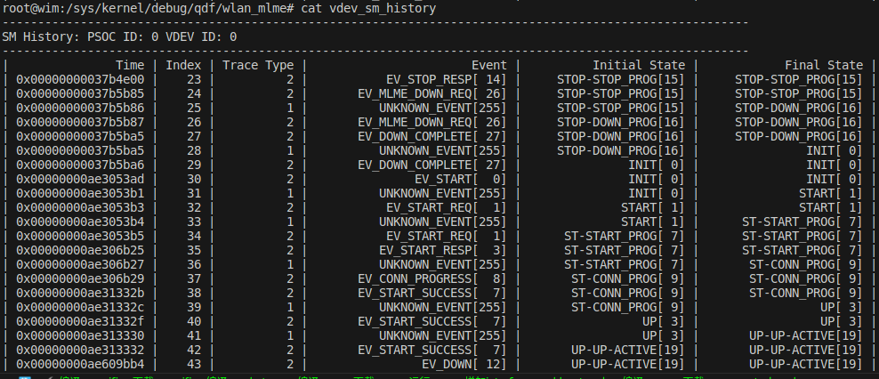

# 驱动层WALN 状态机运行机制

## wlan_sm 状态机基类介绍

### 状态机基本struct信息

1. 状态机信息结构体：`struct wlan_sm_state_info` 

   ```c
   struct wlan_sm_state_info {
   	uint8_t state;						// 当前状态
   	uint8_t parent_state;		// 父状态
   	uint8_t initial_substate;	// 子状态
   	uint8_t has_substates;		// 是否有子状态标志
   	const char *name;				// 状态的名字
   	void (*wlan_sm_entry) (void *ctx);// entry回调 
   	void (*wlan_sm_exit) (void *ctx);// exit回调
   	bool (*wlan_sm_event) (void *ctx, uint16_t event,uint16_t event_data_len, void *event_data);/// 事件回调
   };
   ```

   比如我们定义一个状态机的时候，首先定义各个状态对应的`struct wlan_sm_state_info`，如下：

   ```c
   struct wlan_sm_state_info sm_info[] = {
   	{
   		(uint8_t)WLAN_VDEV_S_INIT,
   		(uint8_t)WLAN_SM_ENGINE_STATE_NONE,
   		(uint8_t)WLAN_SM_ENGINE_STATE_NONE,
   		true,
   		"INIT",
   		mlme_vdev_state_init_entry,
   		mlme_vdev_state_init_exit,
   		mlme_vdev_state_init_event
   	},
   	{
   		(uint8_t)WLAN_VDEV_S_START,
   		(uint8_t)WLAN_SM_ENGINE_STATE_NONE,
   		(uint8_t)WLAN_SM_ENGINE_STATE_NONE,
   		true,
   		"START",
   		mlme_vdev_state_start_entry,
   		mlme_vdev_state_start_exit,
   		mlme_vdev_state_start_event
   	}
   };
   
   ```

   

2. 状态机事件名字

   事件名字代表事件的字符串表达

   ```c
   static const char *vdev_sm_event_names[] = {
   	"EV_START",
   	"EV_START_REQ",
   	"EV_RESTART_REQ",
   };
   ```

   

3. 状态机结构体：`struct wlan_sm`

   ```c
   struct wlan_sm {
   	uint8_t name[WLAN_SM_ENGINE_MAX_NAME]; // 该状态机的名字
   	uint8_t cur_state;// 当前状态
   	uint8_t num_states;// 该状态机一共有多少个状态
   	uint8_t last_event;// 上次事件
   	struct wlan_sm_state_info *state_info;// 该状态机的 状态信息，里面存放着每个状态的  回调函数 具体参见	struct wlan_sm_state_info
   	void *ctx;// 用户指针
   	qdf_atomic_t in_state_transition;// 锁
   	const char **event_names;// 该状态机所拥有的所有事件名字数组 就是上面第2部提到的 static const char *vdev_sm_event_names[]
   	uint32_t num_event_names;// 一共多少个事件，取决于 static const char *vdev_sm_event_names[] 数组的大小
   #ifdef SM_ENG_HIST_ENABLE
   	struct wlan_sm_history history;// 用来记录状态机变迁的历史记录
   #endif
   };
   ```

   


### 状态机api函数

1. 创建状态机函数

   ```c
   /**
    * wlan_sm_create() - SM create
    * @name: 该状态机名字
    * @ctx: caller pointer：用户指针
    * @init_state: 默认初始化状态
    * @state_info:状态机信息。里面存放各个状态对应的回调函数
    * @num_state: 该状态机一共有多少个状态
    * @event_names:事件表对应的名字
    * @num_event_names: 一共有多少个事件
    *
    * 创建状态机
    *
    * Return:  struct wlan_sm 句柄
    *                   NULL 创建失败
    */
   struct wlan_sm *wlan_sm_create(const char *name, void *ctx,
   			       uint8_t init_state,
   			       struct wlan_sm_state_info *state_info,
   			       uint8_t num_states,
   			       const char **event_names,
   			       uint32_t num_event_names);
   {
   	struct wlan_sm *sm;
   	u_int32_t i;
       // 创建内存
   	sm = qdf_mem_malloc(sizeof(*sm));
      
       // 保存历史相关
   	wlan_sm_history_init(sm);
   
       // 把 传入参数传入 到sm 结构体中
   	sm->cur_state = init_state;
   	sm->num_states = num_states;
   	sm->state_info = state_info;
   	sm->ctx = ctx;
   	sm->last_event = WLAN_SM_ENGINE_EVENT_NONE;
   	qdf_atomic_set(&sm->in_state_transition, 0); // 初始化锁
   	sm->event_names = event_names;
   	sm->num_event_names = num_event_names;
   
   	qdf_str_lcopy(sm->name, name, WLAN_SM_ENGINE_MAX_NAME);
   
   
   	return sm;
   }
   ```

2. 删除状态机

   ```c
   void wlan_sm_delete(struct wlan_sm *sm)
   {
   	wlan_sm_history_delete(sm); // 删除历史相关
   	qdf_mem_free(sm); // 直接释放sm内存
   }
   ```

   

3. 状态机事件dispatch

   ```c
   /**
    * wlan_sm_dispatch() - API to notify event to SM
    * @sm: 状态机句柄
    * @event: 事件id
    * @event_data_len: 事件数据长度
    * @event_data: 事件数据
    *
    * 通知事件到 状态机sm，并回调对应状态下的函数
    *
    * Return: QDF_STATUS_SUCCESS  处理成功
    *                 QDF_STATUS_E_INVAL 处理失败
    */
   QDF_STATUS wlan_sm_dispatch(struct wlan_sm *sm, uint16_t event,
   			    uint16_t event_data_len, void *event_data)
   {
   	bool event_handled = false;
   	uint8_t state;
   	const char *event_name = NULL;
   
   	state = sm->cur_state;
   	// 记录 上此发生的事件
   	sm->last_event = event;
   
       // 记录历史
   	wlan_sm_save_history(sm, SM_EVENT_MSG_PROCESSING, sm->cur_state,sm->cur_state, event);
   
       // 如果当前状态不为空，找到 该状态下event 处理函数 wlan_sm_event，进行 回调 这里 并没有 进行转态变迁，只是做了wlan_sm_event的回调
   	if (state != WLAN_SM_ENGINE_STATE_NONE) {
           // 回调当前状态下的 wlan_sm_event 函数
   		event_handled = (*sm->state_info[state].wlan_sm_event) (sm->ctx, event, event_data_len, event_data);
   		if (!event_handled) {
   			sm_engine_nofl_info("%s: event %d not handled in state %s",
   					    sm->name, event,
   					    sm->state_info[sm->cur_state].name);
   			return QDF_STATUS_E_INVAL;
   		}
   	}
   
   	return QDF_STATUS_SUCCESS;
   }
   
   ```

   从上面的分析可以看出

   - 该函数记录上次发生了什么事件	`sm->last_event = event;`
   - 该函数只调用了事件的处理函数`wlan_sm_event`，并没有进行任何状态的变迁, 当然在`wlan_sm_event`函数中 有可能进行状态变迁

4. 状态机传输函数，变迁状态到新的状态

   ```c
   /**
    * wlan_sm_transition_to() - API to move the state of SM
    * @sm: 状态机处理句柄
    * @state: 将要变迁到的状态
    */
   void wlan_sm_transition_to(struct wlan_sm *sm, uint8_t state)
   {
   	struct wlan_sm_state_info *state_info;
   	uint8_t new_state;
   	uint8_t old_state;
   	uint8_t new_sub_st;
   	uint8_t ol_sub_st;
   	uint8_t cur_state;
   
    
   	state_info = sm->state_info;
   	cur_state = sm->cur_state;
   
   	/* 
   	*   cannot change state from state entry/exit routines
   	* 不能够在状态enrty或者exit中 执行 转态变迁，锁子呢在
       */
   	if (qdf_atomic_read(&sm->in_state_transition)) {
   		sm_engine_alert(
   			"%s: can not call state transition from entry/exit routines",
   					sm->name);
   		QDF_BUG(0);
   		return;
   	}
   	// 上锁
   	qdf_atomic_set(&sm->in_state_transition, 1);
   
       // 保存历史
   	wlan_sm_save_history(sm, SM_EVENT_STATE_TRANSITION, sm->cur_state,state, 0xFF);
   
       // 新状态合法性检查
   	if ((state == WLAN_SM_ENGINE_STATE_NONE) ||
   	    (state >= WLAN_SM_ENGINE_MAX_STATES) ||
   	    (state >= sm->num_states)) {
   		sm_engine_err(
   			"%s: to state %d needs to be a valid state current_state=%d",
   					sm->name, cur_state, state);
   		return;
   	}
   
   	/*
   	 * Here state and sub state are derived for debug printing only
   	 * as SME keeps state and sub state as flat, to differentiate between
   	 * state and substate, checks current state if it has parent state,
   	 * the parent state is printed along with the sub state
   	 */
       // 下面这一堆 没什么用，只是用来打印，
       // 思想就是
      /*
       *old_state  																ol_sub_st      
      * state_info[cur_state].parent_state;             cur_state             情况1 当前状态有 父状态
       * cur_state                                                                          0                    情况2 当前状态没有 父状态
     */  
       
       /*
   	* new_state  												new_sub_st          
     	* state_info[state].parent_state;             state              情况1 将要变迁状态  有 父状态
       * state                                                                     0   				情况2 将要变迁状态 没有 父状态
       */
   	if (state_info[cur_state].parent_state != WLAN_SM_ENGINE_STATE_NONE)
   		old_state = state_info[cur_state].parent_state;
   	else
   		old_state = cur_state;
   
   	if (state_info[state].parent_state != WLAN_SM_ENGINE_STATE_NONE)
   		new_state = state_info[state].parent_state;
   	else
   		new_state = state;
   
   	if (state_info[cur_state].parent_state != WLAN_SM_ENGINE_STATE_NONE)
   		ol_sub_st = cur_state;
   	else
   		ol_sub_st = 0;
   
   	if (state_info[state].parent_state != WLAN_SM_ENGINE_STATE_NONE)
   		new_sub_st = state;
   	else
   		new_sub_st = 0;
   
   	sm_engine_nofl_debug("%s: %s > %s, %s > %s", sm->name,
   			     state_info[old_state].name,
   			     state_info[new_state].name,
   			     ol_sub_st ? state_info[ol_sub_st].name : "IDLE",
   			     new_sub_st ? state_info[new_sub_st].name : "IDLE");
   
   	/*
   	 * 要从 cur_state 变迁到  新的状态 state
   	 * 调用 cur_state 下的 退出函数 wlan_sm_exit
   	 * 如果 cur_state 有父状态，顺序 调用 他的父状态 的退出函数 
   	 */
   	while (cur_state != WLAN_SM_ENGINE_STATE_NONE) {
   		if (state_info[cur_state].wlan_sm_exit)
   			state_info[cur_state].wlan_sm_exit(sm->ctx);
   
   		cur_state = state_info[cur_state].parent_state;
   	}
   
   	/*
   	 * 要从 cur_state 变迁到  新的状态 state
   	 * 调用 state 下的 进入函数 wlan_sm_entry
   	 * 如果 state 有子状态，顺序 调用 他的子状态 的进入函数  
   	 * 并且 把状态机的sm->cur_state 更新为最后一次调用的 状态，如果最后一次是子状态，就赋值为子状态，
   	 */
   	cur_state = state;
   	while (cur_state != WLAN_SM_ENGINE_STATE_NONE) {
   		if (state_info[cur_state].wlan_sm_entry)
   			state_info[cur_state].wlan_sm_entry(sm->ctx);
   
   		sm->cur_state = cur_state;
   		cur_state = state_info[cur_state].initial_substate;
   
   		if (cur_state != WLAN_SM_ENGINE_STATE_NONE)
   			sm_engine_nofl_debug("%s: Initial sub state %s",
   					     sm->name,
   					     state_info[cur_state].name);
   	}
       // 解锁
   	qdf_atomic_set(&sm->in_state_transition, 0);
   }
   
   ```

   从上面的分析可以看出：

   - 该函数先调用当前状态sm->cur_state的退出函数，如果有父状态，顺序调用它父亲的退出函数；
   - 调用要变迁的状态state 的进入函数，如果有子状态，也调用它的子状态的进入函数，并且把 状态机的 当前状态 变迁到 state(ps：如果有子状态就是 子状态)

5. 得到上次的事件

   ```c
   uint8_t wlan_sm_get_lastevent(struct wlan_sm *sm)
   {
   	return sm->last_event;
   }
   ```

   

6. 得到当前状态

   ```c
   uint8_t wlan_sm_get_current_state(struct wlan_sm *sm)
   {
   	return sm->cur_state;
   }
   ```

   

7. 得到状态的名字

   ```c
   const char *wlan_sm_get_state_name(struct wlan_sm *sm, uint8_t state)
   {
   	return sm->state_info[state].name;
   }
   ```

   

8. 得到当前状态的名字

   ```
   const char *wlan_sm_get_current_state_name(struct wlan_sm *sm)
   {
   	return sm->state_info[sm->cur_state].name;
   }
   ```


## wlan_sm 状态机示例mlme状态机

1. 创建状态机

   ```c
   QDF_STATUS mlme_vdev_sm_create(struct vdev_mlme_obj *vdev_mlme)
   {
   	struct wlan_sm *sm;
   	uint8_t name[WLAN_SM_ENGINE_MAX_NAME];
   	struct wlan_objmgr_vdev *vdev = vdev_mlme->vdev;
   
      qdf_scnprintf(name, sizeof(name), "VDEV%d-MLME",wlan_vdev_get_id(vdev_mlme->vdev));
     // 创建状态机，
     // 状态机名字为 VDEV%d-MLME
     // 初始化状态为 WLAN_VDEV_S_INIT
     // 状态信息表为 sm_info
     // 状态机事件名字为 vdev_sm_event_names
   	sm = wlan_sm_create(name, vdev_mlme,
   			    WLAN_VDEV_S_INIT,
   			    sm_info,
   			    QDF_ARRAY_SIZE(sm_info),
   			    vdev_sm_event_names,
   			    QDF_ARRAY_SIZE(vdev_sm_event_names));
    
   	vdev_mlme->sm_hdl = sm;
    
   	return QDF_STATUS_SUCCESS;
   }
   ```

   上面函数提到的mlme状态机的：

   - 状态信息表：

     ```c
     struct wlan_sm_state_info sm_info[] = {
     	{
     		(uint8_t)WLAN_VDEV_S_INIT,
     		(uint8_t)WLAN_SM_ENGINE_STATE_NONE,
     		(uint8_t)WLAN_SM_ENGINE_STATE_NONE,
     		true,
     		"INIT",
     		mlme_vdev_state_init_entry,
     		mlme_vdev_state_init_exit,
     		mlme_vdev_state_init_event
     	},
     	{
     		(uint8_t)WLAN_VDEV_S_START,
     		(uint8_t)WLAN_SM_ENGINE_STATE_NONE,
     		(uint8_t)WLAN_SM_ENGINE_STATE_NONE,
     		true,
     		"START",
     		mlme_vdev_state_start_entry,
     		mlme_vdev_state_start_exit,
     		mlme_vdev_state_start_event
     	},
     	{
     		(uint8_t)WLAN_VDEV_S_DFS_CAC_WAIT,
     		(uint8_t)WLAN_SM_ENGINE_STATE_NONE,
     		(uint8_t)WLAN_SM_ENGINE_STATE_NONE,
     		true,
     		"DFS_CAC_WAIT",
     		mlme_vdev_state_dfs_cac_wait_entry,
     		mlme_vdev_state_dfs_cac_wait_exit,
     		mlme_vdev_state_dfs_cac_wait_event
     	},
     	{
     		(uint8_t)WLAN_VDEV_S_UP,
     		(uint8_t)WLAN_SM_ENGINE_STATE_NONE,
     		(uint8_t)WLAN_SM_ENGINE_STATE_NONE,
     		true,
     		"UP",
     		mlme_vdev_state_up_entry,
     		mlme_vdev_state_up_exit,
     		mlme_vdev_state_up_event
     	},
     	{
     		(uint8_t)WLAN_VDEV_S_SUSPEND,
     		(uint8_t)WLAN_SM_ENGINE_STATE_NONE,
     		(uint8_t)WLAN_SM_ENGINE_STATE_NONE,
     		true,
     		"SUSPEND",
     		mlme_vdev_state_suspend_entry,
     		mlme_vdev_state_suspend_exit,
     		mlme_vdev_state_suspend_event
     	},
     	{
     		(uint8_t)WLAN_VDEV_S_STOP,
     		(uint8_t)WLAN_SM_ENGINE_STATE_NONE,
     		(uint8_t)WLAN_VDEV_SS_STOP_STOP_PROGRESS,
     		true,
     		"STOP",
     		mlme_vdev_state_stop_entry,
     		mlme_vdev_state_stop_exit,
     		mlme_vdev_state_stop_event
     	},
     	{
     		(uint8_t)WLAN_VDEV_S_MAX,
     		(uint8_t)WLAN_SM_ENGINE_STATE_NONE,
     		(uint8_t)WLAN_SM_ENGINE_STATE_NONE,
     		false,
     		"INVALID",
     		NULL,
     		NULL,
     		NULL
     	},
     	{
     		(uint8_t)WLAN_VDEV_SS_START_START_PROGRESS,
     		(uint8_t)WLAN_VDEV_S_START,
     		(uint8_t)WLAN_SM_ENGINE_STATE_NONE,
     		false,
     		"ST-START_PROG",
     		mlme_vdev_subst_start_start_progress_entry,
     		mlme_vdev_subst_start_start_progress_exit,
     		mlme_vdev_subst_start_start_progress_event
     	},
     	{
     		(uint8_t)WLAN_VDEV_SS_START_RESTART_PROGRESS,
     		(uint8_t)WLAN_VDEV_S_START,
     		(uint8_t)WLAN_SM_ENGINE_STATE_NONE,
     		false,
     		"ST-RESTART_PROG",
     		mlme_vdev_subst_start_restart_progress_entry,
     		mlme_vdev_subst_start_restart_progress_exit,
     		mlme_vdev_subst_start_restart_progress_event
     	},
     	{
     		(uint8_t)WLAN_VDEV_SS_START_CONN_PROGRESS,
     		(uint8_t)WLAN_VDEV_S_START,
     		(uint8_t)WLAN_SM_ENGINE_STATE_NONE,
     		false,
     		"ST-CONN_PROG",
     		mlme_vdev_subst_start_conn_progress_entry,
     		mlme_vdev_subst_start_conn_progress_exit,
     		mlme_vdev_subst_start_conn_progress_event
     	},
     	{
     		(uint8_t)WLAN_VDEV_SS_START_DISCONN_PROGRESS,
     		(uint8_t)WLAN_VDEV_S_START,
     		(uint8_t)WLAN_SM_ENGINE_STATE_NONE,
     		false,
     		"ST-DISCONN_PROG",
     		mlme_vdev_subst_start_disconn_progress_entry,
     		mlme_vdev_subst_start_disconn_progress_exit,
     		mlme_vdev_subst_start_disconn_progress_event
     	},
     	{
     		(uint8_t)WLAN_VDEV_SS_SUSPEND_SUSPEND_DOWN,
     		(uint8_t)WLAN_VDEV_S_SUSPEND,
     		(uint8_t)WLAN_SM_ENGINE_STATE_NONE,
     		false,
     		"SP-SUSPEND_DOWN",
     		mlme_vdev_subst_suspend_suspend_down_entry,
     		mlme_vdev_subst_suspend_suspend_down_exit,
     		mlme_vdev_subst_suspend_suspend_down_event
     	},
     	{
     		(uint8_t)WLAN_VDEV_SS_SUSPEND_SUSPEND_RESTART,
     		(uint8_t)WLAN_VDEV_S_SUSPEND,
     		(uint8_t)WLAN_SM_ENGINE_STATE_NONE,
     		false,
     		"SP-SUSPEND_RESTART",
     		mlme_vdev_subst_suspend_suspend_restart_entry,
     		mlme_vdev_subst_suspend_suspend_restart_exit,
     		mlme_vdev_subst_suspend_suspend_restart_event
     	},
     	{
     		(uint8_t)WLAN_VDEV_SS_SUSPEND_HOST_RESTART,
     		(uint8_t)WLAN_VDEV_S_SUSPEND,
     		(uint8_t)WLAN_SM_ENGINE_STATE_NONE,
     		false,
     		"SP-HOST_RESTART",
     		mlme_vdev_subst_suspend_host_restart_entry,
     		mlme_vdev_subst_suspend_host_restart_exit,
     		mlme_vdev_subst_suspend_host_restart_event
     	},
     	{
     		(uint8_t)WLAN_VDEV_SS_SUSPEND_CSA_RESTART,
     		(uint8_t)WLAN_VDEV_S_SUSPEND,
     		(uint8_t)WLAN_SM_ENGINE_STATE_NONE,
     		false,
     		"SP-CSA_RESTART",
     		mlme_vdev_subst_suspend_csa_restart_entry,
     		mlme_vdev_subst_suspend_csa_restart_exit,
     		mlme_vdev_subst_suspend_csa_restart_event
     	},
     	{
     		(uint8_t)WLAN_VDEV_SS_STOP_STOP_PROGRESS,
     		(uint8_t)WLAN_VDEV_S_STOP,
     		(uint8_t)WLAN_SM_ENGINE_STATE_NONE,
     		false,
     		"STOP-STOP_PROG",
     		mlme_vdev_subst_stop_stop_progress_entry,
     		mlme_vdev_subst_stop_stop_progress_exit,
     		mlme_vdev_subst_stop_stop_progress_event
     	},
     	{
     		(uint8_t)WLAN_VDEV_SS_STOP_DOWN_PROGRESS,
     		(uint8_t)WLAN_VDEV_S_STOP,
     		(uint8_t)WLAN_SM_ENGINE_STATE_NONE,
     		false,
     		"STOP-DOWN_PROG",
     		mlme_vdev_subst_stop_down_progress_entry,
     		mlme_vdev_subst_stop_down_progress_exit,
     		mlme_vdev_subst_stop_down_progress_event
     	},
     	{
     		(uint8_t)WLAN_VDEV_SS_IDLE,
     		(uint8_t)WLAN_SM_ENGINE_STATE_NONE,
     		(uint8_t)WLAN_SM_ENGINE_STATE_NONE,
     		false,
     		"IDLE",
     		NULL,
     		NULL,
     		NULL,
     	},
     	{
     		(uint8_t)WLAN_VDEV_SS_MLO_SYNC_WAIT,
     		(uint8_t)WLAN_VDEV_S_UP,
     		(uint8_t)WLAN_SM_ENGINE_STATE_NONE,
     		false,
     		"UP-MLO-SYNC-WAIT",
     		mlme_vdev_subst_mlo_sync_wait_entry,
     		mlme_vdev_subst_mlo_sync_wait_exit,
     		mlme_vdev_subst_mlo_sync_wait_event
     	},
     	{
     		(uint8_t)WLAN_VDEV_SS_UP_ACTIVE,
     		(uint8_t)WLAN_VDEV_S_UP,
     		(uint8_t)WLAN_SM_ENGINE_STATE_NONE,
     		false,
     		"UP-UP-ACTIVE",
     		mlme_vdev_subst_up_active_entry,
     		mlme_vdev_subst_up_active_exit,
     		mlme_vdev_subst_up_active_event
     	},
     	{
     		(uint8_t)WLAN_VDEV_SS_MAX,
     		(uint8_t)WLAN_SM_ENGINE_STATE_NONE,
     		(uint8_t)WLAN_SM_ENGINE_STATE_NONE,
     		false,
     		"INVALID",
     		NULL,
     		NULL,
     		NULL,
     	},
     };
     ```

     

   - 事件名字

     ```c
     static const char *vdev_sm_event_names[] = {
     	"EV_START",
     	"EV_START_REQ",
     	"EV_RESTART_REQ",
     	"EV_START_RESP",
     	"EV_RESTART_RESP",
     	"EV_START_REQ_FAIL",
     	"EV_RESTART_REQ_FAIL",
     	"EV_START_SUCCESS",
     	"EV_CONN_PROGRESS",
     	"EV_STA_CONN_START",
     	"EV_DFS_CAC_WAIT",
     	"EV_DFS_CAC_COMPLETED",
     	"EV_DOWN",
     	"EV_CONNECTION_FAIL",
     	"EV_STOP_RESP",
     	"EV_STOP_FAIL",
     	"EV_DOWN_FAIL",
     	"EV_DISCONNECT_COMPLETE",
     	"EV_SUSPEND_RESTART",
     	"EV_HOST_RESTART",
     	"EV_UP_HOST_RESTART",
     	"EV_FW_VDEV_RESTART",
     	"EV_UP_FAIL",
     	"EV_RADAR_DETECTED",
     	"EV_CSA_RESTART",
     	"EV_CSA_COMPLETE",
     	"EV_MLME_DOWN_REQ",
     	"EV_DOWN_COMPLETE",
     	"EV_ROAM",
     	"EV_STOP_REQ",
     	"EV_CHAN_SWITCH_DISABLED",
     	"EV_MLO_SYNC_COMPLETE",
     };
     ```

     

   - 所有状态

     ```c
     /**
      * enum wlan_vdev_state - VDEV state
      * @WLAN_VDEV_S_INIT:                     Default state, IDLE state
      * @WLAN_VDEV_S_START:                    START  state
      * @WLAN_VDEV_S_DFS_CAC_WAIT:             CAC period
      * @WLAN_VDEV_S_UP:                       UP state
      * @WLAN_VDEV_S_SUSPEND:                  Suspend state
      * @WLAN_VDEV_S_STOP:                     STOP state
      * @WLAN_VDEV_S_MAX:                      MAX state
      * @WLAN_VDEV_SS_START_START_PROGRESS:    Start progress sub state
      * @WLAN_VDEV_SS_START_RESTART_PROGRESS:  Restart progress sub state
      * @WLAN_VDEV_SS_START_CONN_PROGRESS:     Start connection progress sub state
      * @WLAN_VDEV_SS_START_DISCONN_PROGRESS:  Start Disconnection progress sub state
      * @WLAN_VDEV_SS_SUSPEND_SUSPEND_DOWN:    Suspend down sub state
      * @WLAN_VDEV_SS_SUSPEND_SUSPEND_RESTART: Suspend restart sub state
      * @WLAN_VDEV_SS_SUSPEND_HOST_RESTART:    Suspend host restart sub state
      * @WLAN_VDEV_SS_SUSPEND_CSA_RESTART:     Suspend CSA restart sub state
      * @WLAN_VDEV_SS_STOP_STOP_PROGRESS:      Stop progress sub state
      * @WLAN_VDEV_SS_STOP_DOWN_PROGRESS:      Stop down progress sub state
      * @WLAN_VDEV_SS_IDLE:                    Idle sub state (used, only if a state
      *                                        does not have substate)
      * @WLAN_VDEV_SS_MLO_SYNC_WAIT:           Sync wait sub state for MLO SAP
      * @WLAN_VDEV_SS_UP_ACTIVE:               Up active sub state
      * @WLAN_VDEV_SS_MAX:                     Max substate
      */
     enum wlan_vdev_state {
     	WLAN_VDEV_S_INIT = 0,
     	WLAN_VDEV_S_START = 1,
     	WLAN_VDEV_S_DFS_CAC_WAIT = 2,
     	WLAN_VDEV_S_UP = 3,
     	WLAN_VDEV_S_SUSPEND = 4,
     	WLAN_VDEV_S_STOP = 5,
     	WLAN_VDEV_S_MAX = 6,
     	WLAN_VDEV_SS_START_START_PROGRESS = 7,
     	WLAN_VDEV_SS_START_RESTART_PROGRESS = 8,
     	WLAN_VDEV_SS_START_CONN_PROGRESS = 9,
     	WLAN_VDEV_SS_START_DISCONN_PROGRESS = 10,
     	WLAN_VDEV_SS_SUSPEND_SUSPEND_DOWN = 11,
     	WLAN_VDEV_SS_SUSPEND_SUSPEND_RESTART = 12,
     	WLAN_VDEV_SS_SUSPEND_HOST_RESTART = 13,
     	WLAN_VDEV_SS_SUSPEND_CSA_RESTART = 14,
     	WLAN_VDEV_SS_STOP_STOP_PROGRESS = 15,
     	WLAN_VDEV_SS_STOP_DOWN_PROGRESS = 16,
     	WLAN_VDEV_SS_IDLE = 17,
     	WLAN_VDEV_SS_MLO_SYNC_WAIT = 18,
     	WLAN_VDEV_SS_UP_ACTIVE = 19,
     	WLAN_VDEV_SS_MAX = 20,
     };
     ```

     

   - 所有事件

     ```c
     
     /**
      * enum wlan_vdev_sm_evt - VDEV SM event
      * @WLAN_VDEV_SM_EV_START:               Start VDEV UP operation
      * @WLAN_VDEV_SM_EV_START_REQ:           Invokes VDEV START handshake
      * @WLAN_VDEV_SM_EV_RESTART_REQ:         Invokes VDEV RESTART handshake
      * @WLAN_VDEV_SM_EV_START_RESP:          Notification on START resp
      * @WLAN_VDEV_SM_EV_RESTART_RESP:        Notification on RESTART resp
      * @WLAN_VDEV_SM_EV_START_REQ_FAIL:      Notification on START req failure
      * @WLAN_VDEV_SM_EV_RESTART_REQ_FAIL:    Notification on RESTART req failure
      * @WLAN_VDEV_SM_EV_START_SUCCESS:       Notification of Join Success
      * @WLAN_VDEV_SM_EV_CONN_PROGRESS:       Invoke Connection/up process
      * @WLAN_VDEV_SM_EV_STA_CONN_START:      Invoke Station Connection process
      * @WLAN_VDEV_SM_EV_DFS_CAC_WAIT:        Invoke DFS CAC WAIT timer
      * @WLAN_VDEV_SM_EV_DFS_CAC_COMPLETED:   Notifies on CAC completion
      * @WLAN_VDEV_SM_EV_DOWN:                Invokes VDEV DOWN operation
      * @WLAN_VDEV_SM_EV_CONNECTION_FAIL:     Notifications for UP/connection failure
      * @WLAN_VDEV_SM_EV_STOP_RESP:           Notifcation of stop response
      * @WLAN_VDEV_SM_EV_STOP_FAIL:           Notification of stop req failure
      * @WLAN_VDEV_SM_EV_DOWN_FAIL:           Notification of down failure
      * @WLAN_VDEV_SM_EV_DISCONNECT_COMPLETE: Notification of Peer cleanup complete
      * @WLAN_VDEV_SM_EV_SUSPEND_RESTART:     Invokes suspend restart operation
      * @WLAN_VDEV_SM_EV_HOST_RESTART:        Invokes host only restart operation
      * @WLAN_VDEV_SM_EV_UP_HOST_RESTART:     Moves to UP state without sending UP
      *                                       command to lower layers
      * @WLAN_VDEV_SM_EV_FW_VDEV_RESTART:     Invokes FW only restart
      * @WLAN_VDEV_SM_EV_UP_FAIL:             Notification of up command failure
      * @WLAN_VDEV_SM_EV_RADAR_DETECTED:      Notification of RADAR detected, Random
      *                                       channel should be selected before
      *                                       triggering this event
      * @WLAN_VDEV_SM_EV_CSA_RESTART:         Invokes CSA IE operation
      * @WLAN_VDEV_SM_EV_CSA_COMPLETE:        Notifiction of CSA process complete
      * @WLAN_VDEV_SM_EV_MLME_DOWN_REQ:       Invoke DOWN command operation
      * @WLAN_VDEV_SM_EV_DOWN_COMPLETE:       Notification of DOWN complete
      * @WLAN_VDEV_SM_EV_ROAM:                Notifiction on ROAMING
      * @WLAN_VDEV_SM_EV_STOP_REQ:            Invoke API to initiate STOP handshake
      * @WLAN_VDEV_SM_EV_CHAN_SWITCH_DISABLED:Test only, CSA completes without
      *					 change in channel
      * @WLAN_VDEV_SM_EV_MLO_SYNC_COMPLETE:   MLO mgr triggers this event for the mlo
      *                                       sap in vdev wait up state, if all the
      *                                       links finish vdev start rsp.
      */
     enum wlan_vdev_sm_evt {
     	WLAN_VDEV_SM_EV_START = 0,
     	WLAN_VDEV_SM_EV_START_REQ = 1,
     	WLAN_VDEV_SM_EV_RESTART_REQ = 2,
     	WLAN_VDEV_SM_EV_START_RESP = 3,
     	WLAN_VDEV_SM_EV_RESTART_RESP = 4,
     	WLAN_VDEV_SM_EV_START_REQ_FAIL = 5,
     	WLAN_VDEV_SM_EV_RESTART_REQ_FAIL = 6,
     	WLAN_VDEV_SM_EV_START_SUCCESS = 7,
     	WLAN_VDEV_SM_EV_CONN_PROGRESS = 8,
     	WLAN_VDEV_SM_EV_STA_CONN_START = 9,
     	WLAN_VDEV_SM_EV_DFS_CAC_WAIT = 10,
     	WLAN_VDEV_SM_EV_DFS_CAC_COMPLETED = 11,
     	WLAN_VDEV_SM_EV_DOWN = 12,
     	WLAN_VDEV_SM_EV_CONNECTION_FAIL = 13,
     	WLAN_VDEV_SM_EV_STOP_RESP = 14,
     	WLAN_VDEV_SM_EV_STOP_FAIL = 15,
     	WLAN_VDEV_SM_EV_DOWN_FAIL = 16,
     	WLAN_VDEV_SM_EV_DISCONNECT_COMPLETE = 17,
     	WLAN_VDEV_SM_EV_SUSPEND_RESTART = 18,
     	WLAN_VDEV_SM_EV_HOST_RESTART = 19,
     	WLAN_VDEV_SM_EV_UP_HOST_RESTART = 20,
     	WLAN_VDEV_SM_EV_FW_VDEV_RESTART = 21,
     	WLAN_VDEV_SM_EV_UP_FAIL = 22,
     	WLAN_VDEV_SM_EV_RADAR_DETECTED = 23,
     	WLAN_VDEV_SM_EV_CSA_RESTART = 24,
     	WLAN_VDEV_SM_EV_CSA_COMPLETE = 25,
     	WLAN_VDEV_SM_EV_MLME_DOWN_REQ = 26,
     	WLAN_VDEV_SM_EV_DOWN_COMPLETE = 27,
     	WLAN_VDEV_SM_EV_ROAM = 28,
     	WLAN_VDEV_SM_EV_STOP_REQ = 29,
     	WLAN_VDEV_SM_EV_CHAN_SWITCH_DISABLED = 30,
     	WLAN_VDEV_SM_EV_MLO_SYNC_COMPLETE = 31,
     };
     ```

     

2. 事件通知

   ```c
   QDF_STATUS mlme_vdev_sm_deliver_event(struct vdev_mlme_obj *vdev_mlme,
   				      enum wlan_vdev_sm_evt event,
   				      uint16_t event_data_len, void *event_data)
   {
   	return wlan_sm_dispatch(vdev_mlme->sm_hdl, event,event_data_len, event_data);
   }
   ```

   

3. 事件变迁

   ```c
   static void mlme_vdev_sm_transition_to(struct vdev_mlme_obj *vdev_mlme,
   				       enum wlan_vdev_state state)
   {
   	wlan_sm_transition_to(vdev_mlme->sm_hdl, state);
   }
   ```

   

4. 

## 保存状态机历史

上面我们注意到在状态机变迁或者事件分发函数中会有 `wlan_sm_save_history(sm, SM_EVENT_MSG_PROCESSING, sm->cur_state,sm->cur_state, event)`函数调用，

该函数就是用来保存状态机历史的，历史可以直接输出到屏幕，也可以保存到文件，下面以保存到文件为例说明：

### 基本结构体

```c

enum wlan_sm_trace_type {
	SM_EVENT_STATE_TRANSITION = 1, // 在传输函数中 调用保存
	SM_EVENT_MSG_PROCESSING,         // 在事件通知函数中 调用保存
};

struct wlan_sm_history_info {
	enum wlan_sm_trace_type trace_type;   // 类型 参见enum wlan_sm_trace_type
	uint8_t event_type;  // 事件类型
	uint8_t initial_state; // 当前状态 Current state (state/sub-state)
	uint8_t final_state;   // 新状态
	uint64_t time;            // 事件戳
};

/**
 * struct wlan_sm_history - history structure
 * @sm_history_lock: SM history lock
 * @index:           Last updated entry index
 * @data:            Histoy elements array
 */
struct wlan_sm_history {
	qdf_spinlock_t sm_history_lock;
	uint8_t index; // 索引，默认最大50个  最大值参见 WLAN_SM_ENGINE_HISTORY_SIZE
	struct wlan_sm_history_info data[WLAN_SM_ENGINE_HISTORY_SIZE]; // 一共
};
```

解释：相当于定义了50个信息 `struct wlan_sm_history_info`结构体数组，然后保存一次，index++，最大的时候轮回。

### api函数

1. 保存到历史

   ```c
   void wlan_sm_save_history(struct wlan_sm *sm,
   			  enum wlan_sm_trace_type trace_type,
   			  uint8_t initial_state, uint8_t final_state,
   			  uint16_t event_type)
   {
   	struct wlan_sm_history *p_sm_history = &sm->history;
   	struct wlan_sm_history_info *p_memento;
   
   	/*
   	 * History saved in circular buffer.
   	 * Save a pointer to next write location and increment pointer.
   	 */
   	qdf_spin_lock_bh(&p_sm_history->sm_history_lock);
       // 取出一个 data内存
   	p_memento = &p_sm_history->data[p_sm_history->index];
       
       // 索引++ 并限幅
   	p_sm_history->index++;
   	p_sm_history->index %= WLAN_SM_ENGINE_HISTORY_SIZE;
   
   	qdf_spin_unlock_bh(&p_sm_history->sm_history_lock);
   
       // 存放内容到 data内存中
   	qdf_mem_zero(p_memento, sizeof(*p_memento));
   	p_memento->trace_type = trace_type;
   	p_memento->initial_state = initial_state;
   	p_memento->final_state = final_state;
   	p_memento->event_type = event_type;
   	p_memento->time = qdf_get_log_timestamp();
   }
   ```

   

2. 直接打印历史

   ```c
   void wlan_sm_print_history(struct wlan_sm *sm)
   {
   	struct wlan_sm_history *p_sm_history = &sm->history;
   	uint8_t i;
   	uint8_t idx;
   
   	/*
   	 * History saved in circular buffer.
   	 * Save a pointer to next write location and increment pointer.
   	 */
   	qdf_spin_lock_bh(&p_sm_history->sm_history_lock);
   
    
       // 从当前p_sm_history->index 开始，轮询打印 每个p_sm_history->data[idx]里面的内容
   	for (i = 0; i < WLAN_SM_ENGINE_HISTORY_SIZE; i++) {
   		idx = (p_sm_history->index + i) % WLAN_SM_ENGINE_HISTORY_SIZE;
   		wlan_sm_print_history_entry(
   			sm, &p_sm_history->data[idx], idx);
   	}
   
   	qdf_spin_unlock_bh(&p_sm_history->sm_history_lock);
   }
   ```

   

3. 输出历史到文件

   ```c
   // 文件句柄 m哪里来
   void wlan_sm_print_fs_history(struct wlan_sm *sm, qdf_debugfs_file_t m)
   {
   	struct wlan_sm_history *p_sm_history = &sm->history;
   	uint8_t i;
   	uint8_t idx;
   
   	/*
   	 * History saved in circular buffer.
   	 * Save a pointer to next write location and increment pointer.
   	 */
   	qdf_spin_lock_bh(&p_sm_history->sm_history_lock);
   
        // 从当前p_sm_history->index 开始，轮询输出 每个p_sm_history->data[idx]里面的内容到文件，那么是哪个文件，下面介绍
   	for (i = 0; i < WLAN_SM_ENGINE_HISTORY_SIZE; i++) {
   		idx = (p_sm_history->index + i) % WLAN_SM_ENGINE_HISTORY_SIZE;
   		wlan_sm_print_fs_history_entry(sm, &p_sm_history->data[idx], idx, m);
   	}
   
   	qdf_spin_unlock_bh(&p_sm_history->sm_history_lock);
   }
   
   static void wlan_sm_print_fs_history_entry(struct wlan_sm *sm,
   					   struct wlan_sm_history_info *ent,
   					   uint16_t i, qdf_debugfs_file_t m)
   {
   	const char *event_name = NULL;
   		qdf_debugfs_printf(
   			m, "| 0x%016llx |%6d |%11d |%28d |%19s[%2d] |%19s[%2d] |\n",
   			ent->time, i, ent->trace_type,
   			ent->event_type,
   			sm->state_info[ent->initial_state].name,
   			ent->initial_state,
   			sm->state_info[ent->final_state].name,
   			ent->final_state);
   	
   }
   // 该函数相当于写文件file
   void qdf_debugfs_printf(qdf_debugfs_file_t file, const char *f, ...)
   {
   	va_list args;
   
   	va_start(args, f);
   	seq_vprintf(file, f, args);
   	va_end(args);
   }
   ```

   

### 文件创建地方

```c
static struct qdf_debugfs_fops sm_dbg_buf_fops = {
   .show  = sm_dbg_fs_open,
   .write = sm_dbg_fs_write,
   .priv  = NULL,
};

qdf_dentry_t mlme_debugfs_entry;

static void wlan_sm_dbgfs_create(void)
{
    mlme_debugfs_entry = qdf_debugfs_create_dir("wlan_mlme", NULL);
    if (mlme_debugfs_entry) {
       if (!qdf_debugfs_create_file_simplified("vdev_sm_history",
                                               (QDF_FILE_USR_READ |
                                                QDF_FILE_GRP_READ |
                                                QDF_FILE_OTH_READ),
                                               mlme_debugfs_entry,
                                              &sm_dbg_buf_fops)) {
          qdf_err("debugfs entry creation failed!");
          return;
       }
    }
}
// 这里用了内核的 debugfs_create_file 相关内容，这里不做过多解释
// 总之会 在 /sys/kernel/debug/qdf/wlan_mlme 下创建 vdev_sm_history状态机，
```

