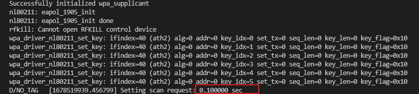
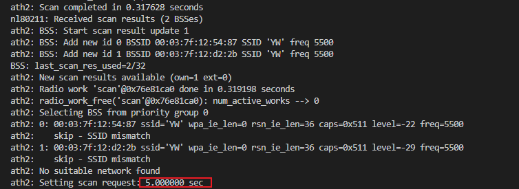
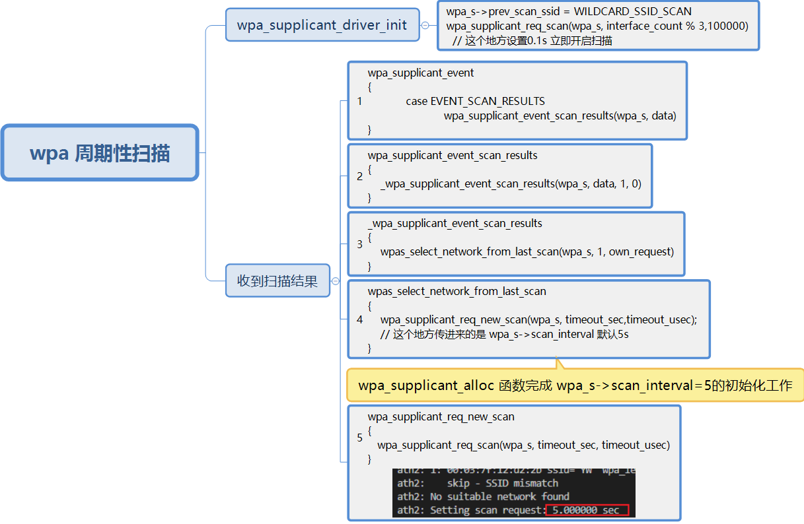
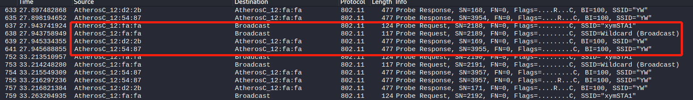
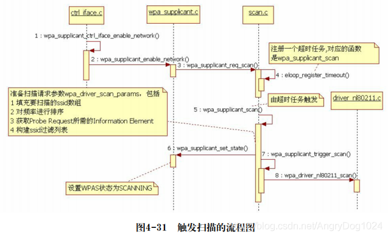
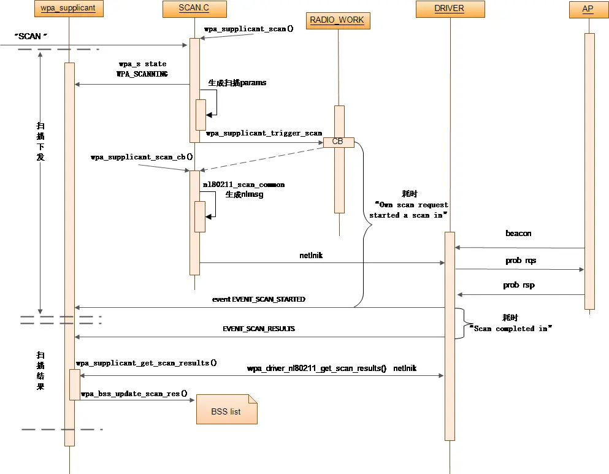
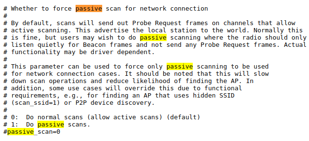

# wpa_supplicant 扫描代码分析

## WPA周期性扫描

上电后，弱sta未连接任何AP，且当wpa状态DISCONNECTED的状态， 并且保存了未被disable的AP， 则WPAS会发起周期扫描 。

```c
// wpa状态
enum wpa_states {
    WPA_DISCONNECTED,
    WPA_INTERFACE_DISABLED,
    WPA_INACTIVE,
    WPA_SCANNING,
    WPA_AUTHENTICATING,
    WPA_ASSOCIATING,
    WPA_ASSOCIATED,
    WPA_4WAY_HANDSHAKE,
    WPA_GROUP_HANDSHAKE,
    WPA_COMPLETED
};

```


过程如下：

```c
int wpa_supplicant_driver_init(struct wpa_supplicant *wpa_s)
{
	wpa_s->prev_scan_ssid = WILDCARD_SSID_SCAN;
	wpa_s->prev_scan_wildcard = 0;

	if (wpa_supplicant_enabled_networks(wpa_s)) {
		if (wpa_s->wpa_state == WPA_INTERFACE_DISABLED) {
			wpa_supplicant_set_state(wpa_s, WPA_DISCONNECTED);
			interface_count = 0;
		}
#ifndef ANDROID
		if (!wpa_s->p2p_mgmt &&
		    wpa_supplicant_delayed_sched_scan(wpa_s,
						      interface_count % 3,
						      100000))
			wpa_supplicant_req_scan(wpa_s, interface_count % 3,
						100000);// 在这个地方，设置0.1s 后启动扫描
#endif /* ANDROID */
		interface_count++;
	} else
		wpa_supplicant_set_state(wpa_s, WPA_INACTIVE);

	return 0;


}

```

对应日志如下：



此后驱动层上报扫描结果到应用层，处理流程如下：

```c

void wpa_supplicant_event(void *ctx, enum wpa_event_type event,
			  union wpa_event_data *data)
{
	case EVENT_SCAN_RESULTS:
		if (wpa_supplicant_event_scan_results(wpa_s, data))
				break; /* interface may have been removed */	
}			
  
static int wpa_supplicant_event_scan_results(struct wpa_supplicant *wpa_s,
					     union wpa_event_data *data)
{
	res = _wpa_supplicant_event_scan_results(wpa_s, data, 1, 0);
}						 
static int _wpa_supplicant_event_scan_results(struct wpa_supplicant *wpa_s,
					      union wpa_event_data *data,
					      int own_request, int update_only)
{
	return wpas_select_network_from_last_scan(wpa_s, 1, own_request);
}						  

static int wpas_select_network_from_last_scan(struct wpa_supplicant *wpa_s,
					      int new_scan, int own_request)
{
	int timeout_sec = wpa_s->scan_interval; // wpa_supplicant_alloc函数初始化为5s
			
	if (wpa_supplicant_req_sched_scan(wpa_s)){
		wpa_supplicant_req_new_scan(wpa_s, timeout_sec,
					timeout_usec); // 这个地方传进来的是 wpa_s->scan_interval 默认5s
		log_d("wpas_select_network_from_last_scan\n");
	}

	wpa_msg_ctrl(wpa_s, MSG_INFO,
		 WPA_EVENT_NETWORK_NOT_FOUND);
}
static void wpa_supplicant_req_new_scan(struct wpa_supplicant *wpa_s,
					int timeout_sec, int timeout_usec)
{
	wpa_supplicant_req_scan(wpa_s, timeout_sec, timeout_usec);
}
```

日志如下：




上面提到的`wpa_s->scan_interval`初始值地方如下：

```c
// 初始化扫描间隔的地方
static struct wpa_supplicant *
wpa_supplicant_alloc(struct wpa_supplicant *parent)
{
	struct wpa_supplicant *wpa_s;

	wpa_s = os_zalloc(sizeof(*wpa_s));

	wpa_s->scan_req = INITIAL_SCAN_REQ; //  默认扫描类型为INITIAL_SCAN_REQ
	wpa_s->scan_interval = 5; 			//  这里设置的默认扫描时间
	wpa_s->new_connection = 1;

	wpa_s->sched_scanning = 0;
    //······
	return wpa_s;
}
```

这个参数可以通过下面的命令修改

```bash
wpa_cli -p /var/run/wpa_supplicant-ath2 -i ath2 scan_interval 5
# 注意：ath2 要换成自己的无线网卡  
# scan_interval 5： 说明是在没有连接ap的时候，wpa自动扫描时间间隔为5 s
```


总结上面的流程如下：




空口抓包分析如下：




到最后发起扫描的函数为`void wpa_supplicant_req_scan(struct wpa_supplicant *wpa_s, int sec, int usec)`，后面会重点分析。

## 手动发起扫描

执行扫描命令

```bash 
wpa_cli -p /var/run/wpa_supplicant-ath2 -i ath2 scan 
TYPE=ONLY
freq=5600   #参数个数如：  freq=2412-2432,2462,5000-6000
passive=1 
use_id=1
only_new=1   #Request driver to clear scan cache due to manual only_new=1 scan
scan_id=
bssid=88:ff:ff:12:40:01
wildcard_ssid=1
ssid YW ssid 5957  #解释0x59 对应字符Y  0x57 对应字符W    所以就是请求 ssid 为 YW 的ap   如果请求多个格式如下 ssid YW ssid 5957 ssid 5856    中间都是空格隔开的，这个参数在发出probe帧的时候是指定ssid的

#注意 上面的参数 按照当前顺序写 否则 有可能不生效
```

扫描过程分析

```c
// 收到命令后，会在下面的地方进行解析
char * wpa_supplicant_ctrl_iface_process(struct wpa_supplicant *wpa_s,
					 char *buf, size_t *resp_len)
{
	if (os_strcmp(buf, "SCAN") == 0) {
		wpas_ctrl_scan(wpa_s, NULL, reply, reply_size, &reply_len);
	}
}

static void wpas_ctrl_scan(struct wpa_supplicant *wpa_s, char *params,
			   char *reply, int reply_size, int *reply_len)
{
	// 解析scan参数
    if (os_strncasecmp(params, "TYPE=ONLY", 9) == 0)
			scan_only = 1;
	
    
    
    if (!wpa_s->sched_scanning && !wpa_s->scanning &&
        ((wpa_s->wpa_state <= WPA_SCANNING) ||
         (wpa_s->wpa_state == WPA_COMPLETED))) 
    {
        // 不是sched_scanning且没有正在scanning  且
        // 状态小于WPA_SCANNING或者已经WPA_COMPLETED 的时候
        // 解释：sched_scanning：如果wifi driver支持sched scan的话， 
        //      WPAS可以使用sched scan来进行定时扫描，
        //      sched scan 的扫描间隔存储在 struct wpa_supplicant.sched_scan_interval 中
        //  
		// 
        
         wpa_supplicant_req_scan(wpa_s, 0, 0);
    }else if (wpa_s->sched_scanning){
        // 正在sched_scanning扫描，先取消sched_scanning，然后在重新扫描
        wpa_supplicant_cancel_sched_scan(wpa_s);
        wpa_supplicant_req_scan(wpa_s, 0, 0);
    }else{
        // 否则返回结果 FAIL-BUSY
        wpa_printf(MSG_DEBUG, "Ongoing scan action - reject new request");
		*reply_len = os_snprintf(reply, reply_size, "FAIL-BUSY\n"); 
    }
}
```

综上：需要解析`wpa_supplicant_req_scan`函数

1. wpa_supplicant_req_scan函数解析

   函数原型

   ```c
   void wpa_supplicant_req_scan(struct wpa_supplicant *wpa_s, int sec, int usec)
   {
   	int res;
   
   	//······
   	res = eloop_deplete_timeout(sec, usec, wpa_supplicant_scan, wpa_s,
   				    NULL);
   	//······
   	wpa_dbg(wpa_s, MSG_DEBUG, "Setting scan request: %d.%06d sec",sec, usec);
       // 通过eloop机制，注册wpa_supplicant_scan 函数，时间到会自动调用wpa_supplicant_scan函数
   	eloop_register_timeout(sec, usec, wpa_supplicant_scan, wpa_s, NULL);
   	 
   }
   ```

   

### wpa_supplicant_scan

`wpa_supplicant_scan`函数分析

分析前先了解下wpa的扫描类型

```c
enum scan_req_type {
		/**
		 * NORMAL_SCAN_REQ - Normal scan request
		 *
		 * This is used for scans initiated by wpa_supplicant to find an
		 * AP for a connection.
		 */
		NORMAL_SCAN_REQ, // 解释：wpa程序自己发起的扫描请求

		/**
		 * INITIAL_SCAN_REQ - Initial scan request
		 *
		 * This is used for the first scan on an interface to force at
		 * least one scan to be run even if the configuration does not
		 * include any enabled networks.
		 */
		INITIAL_SCAN_REQ,// 解释：

		/**
		 * MANUAL_SCAN_REQ - Manual scan request
		 *
		 * This is used for scans where the user request a scan or
		 * a specific wpa_supplicant operation (e.g., WPS) requires scan
		 * to be run.
		 */
		MANUAL_SCAN_REQ // 解释：用户通过wpa_cli 命令发起的扫描请求
	} scan_req, last_scan_req;
```


```c
static void wpa_supplicant_scan(void *eloop_ctx, void *timeout_ctx)
{
	struct wpa_supplicant *wpa_s = eloop_ctx;
	struct wpa_ssid *ssid;
	int ret, p2p_in_prog;
	struct wpabuf *extra_ie = NULL;
	struct wpa_driver_scan_params params;
	struct wpa_driver_scan_params *scan_params;
	size_t max_ssids;
	int connect_without_scan = 0;

	wpa_s->ignore_post_flush_scan_res = 0;

    // 如果接口禁能，直接返回：很好理解 比如ath0 没有up起来
	if (wpa_s->wpa_state == WPA_INTERFACE_DISABLED) {
		wpa_dbg(wpa_s, MSG_DEBUG, "Skip scan - interface disabled");
		return;
	}
	//当前wifi为断开状态，并且是wpa_s自主发起的扫描，则直接设置wpa_s状态为断开，不再扫描，
    //直接返回
	if (wpa_s->disconnected && wpa_s->scan_req == NORMAL_SCAN_REQ) {
		wpa_dbg(wpa_s, MSG_DEBUG, "Disconnected - do not scan");
		wpa_supplicant_set_state(wpa_s, WPA_DISCONNECTED);
		return;
	}
	
    //如果已经在扫描，则延后1秒再发起扫描
	if (wpa_s->scanning) {
		/* 
		 * If we are already in scanning state, we shall reschedule the
		 * the incoming scan request.
		 */
		wpa_dbg(wpa_s, MSG_DEBUG, "Already scanning - Reschedule the incoming scan req");
		wpa_supplicant_req_scan(wpa_s, 1, 0);
		return;
	}
    
	//conf文件中没有使能可用的网络，并且是wpa_s自主发起的扫描，则直接返回，
    //并设置状 WPA_INACTIVE
	if (!wpa_supplicant_enabled_networks(wpa_s) &&
	    wpa_s->scan_req == NORMAL_SCAN_REQ) {
        
		wpa_dbg(wpa_s, MSG_DEBUG, "No enabled networks - do not scan");
		wpa_supplicant_set_state(wpa_s, WPA_INACTIVE);
		return;
	}
    // wpa_s->conf->ap_scan 默认1 
    // 如果采用有线认证 这里不支持 下面这个不用管
	if (wpa_s->conf->ap_scan != 0 &&
	    (wpa_s->drv_flags & WPA_DRIVER_FLAGS_WIRED)) {
		wpa_dbg(wpa_s, MSG_DEBUG, "Using wired authentication - "
			"overriding ap_scan configuration");
		wpa_s->conf->ap_scan = 0;
		wpas_notify_ap_scan_changed(wpa_s);
	}
	//1---wpas负责扫描和选择网络  默认1
    //0、2---驱动负责扫描和连接 int ap_scan;
	if (wpa_s->conf->ap_scan == 0) {
		wpa_supplicant_gen_assoc_event(wpa_s);
		return;
	}
	
	ssid = NULL;
    // 扫描模式不是MANUAL模式，即wpa_s 自己发起的扫描
    // 且 wpa_s->connect_without_scan 不为空的时候，p2p和mesh模式下不为空
    // 这里不关心
    // 
	if (wpa_s->scan_req != MANUAL_SCAN_REQ &&
	    wpa_s->connect_without_scan) {
		connect_without_scan = 1;
		for (ssid = wpa_s->conf->ssid; ssid; ssid = ssid->next) {
			if (ssid == wpa_s->connect_without_scan)
				break;
		}
	}
	// 下面也是p2p先不考虑
	p2p_in_prog = wpas_p2p_in_progress(wpa_s);
	if (p2p_in_prog && p2p_in_prog != 2 &&
	    (!ssid ||
	     (ssid->mode != WPAS_MODE_AP && ssid->mode != WPAS_MODE_P2P_GO))) {
		wpa_dbg(wpa_s, MSG_DEBUG, "Delay station mode scan while P2P operation is in progress");
		wpa_supplicant_req_scan(wpa_s, 5, 0);
		return;
	}

	/*
	 * Don't cancel the scan based on ongoing PNO; defer it. Some scans are
	 * used for changing modes inside wpa_supplicant (roaming,
	 * auto-reconnect, etc). Discarding the scan might hurt these processes.
	 * The normal use case for PNO is to suspend the host immediately after
	 * starting PNO, so the periodic 100 ms attempts to run the scan do not
	 * normally happen in practice multiple times, i.e., this is simply
	 * restarting scanning once the host is woken up and PNO stopped.
	 */
    // 下面是安卓那种pno 计划扫描模式，这里也不考虑
	if (wpa_s->pno || wpa_s->pno_sched_pending) {
		wpa_dbg(wpa_s, MSG_DEBUG, "Defer scan - PNO is in progress");
		wpa_supplicant_req_scan(wpa_s, 0, 100000);
		return;
	}

    //wpa_s->conf->ap_scan=1 这里走else分支
	if (wpa_s->conf->ap_scan == 2)
		max_ssids = 1;
	else {
        // 对max_ssids 进行限幅
		max_ssids = wpa_s->max_scan_ssids;
		if (max_ssids > WPAS_MAX_SCAN_SSIDS)
			max_ssids = WPAS_MAX_SCAN_SSIDS;
	}
    
	// 保存上次的扫描模式 
	wpa_s->last_scan_req = wpa_s->scan_req;
    // 把当前扫描模式切换为 NORMAL_SCAN_REQ
	wpa_s->scan_req = NORMAL_SCAN_REQ;

    //如果该项不为空，则直接关联，跳过扫描步骤，
    // 从上面的结果分析connect_without_scan=0，在sta模式中没有这一项，p2p中可能会用到，这里
    // 也不考虑
	if (connect_without_scan) {
		wpa_s->connect_without_scan = NULL;
		if (ssid) {
			wpa_printf(MSG_DEBUG, "Start a pre-selected network "
				   "without scan step");
			wpa_supplicant_associate(wpa_s, NULL, ssid);
			return;
		}
	}
	//params参数中保存扫描用到的参数
	os_memset(&params, 0, sizeof(params));
    // 保存上次的wpa_s->wpa_state
	wpa_s->scan_prev_wpa_state = wpa_s->wpa_state;
    
    //下面修改状态，为 WPA_SCANNING
	if (wpa_s->wpa_state == WPA_DISCONNECTED ||
	    wpa_s->wpa_state == WPA_INACTIVE)
		wpa_supplicant_set_state(wpa_s, WPA_SCANNING);

	/*
	 * If autoscan has set its own scanning parameters
	 */
    //如果设置了autosan， 直接扫描 这里为空
	if (wpa_s->autoscan_params != NULL) {
		scan_params = wpa_s->autoscan_params;
		goto scan;
	}

    //这里设置特殊的ssid 扫描的，
    // 如果扫描参数为 wpa_cli scan ssid 5957  解释0x59 对应字符Y  0x57 对应字符W    
    // 所以就是请求 ssid 为 YW 的ap
	if (wpa_s->last_scan_req == MANUAL_SCAN_REQ &&
	    wpa_set_ssids_from_scan_req(wpa_s, &params, max_ssids)) {
		wpa_printf(MSG_DEBUG, "Use specific SSIDs from SCAN command");
		goto ssid_list_set;
	}

	/* Find the starting point from which to continue scanning */
    //找到最开始的ssid
	ssid = wpa_s->conf->ssid;
	if (wpa_s->prev_scan_ssid != WILDCARD_SSID_SCAN) {
		while (ssid) {
			if (ssid == wpa_s->prev_scan_ssid) {
				ssid = ssid->next;
				break;
			}
			ssid = ssid->next;
		}
	}

	if (wpa_s->last_scan_req != MANUAL_SCAN_REQ &&
#ifdef CONFIG_AP
	    !wpa_s->ap_iface &&
#endif /* CONFIG_AP */
	    wpa_s->conf->ap_scan == 2) {
		wpa_s->connect_without_scan = NULL;
		wpa_s->prev_scan_wildcard = 0;
		wpa_supplicant_assoc_try(wpa_s, ssid);
		return;
	} else if (wpa_s->conf->ap_scan == 2) {
		/*
		 * User-initiated scan request in ap_scan == 2; scan with
		 * wildcard SSID.
		 */
		ssid = NULL;
	} else if (wpa_s->reattach && wpa_s->current_ssid != NULL) {
		/*
		 * Perform single-channel single-SSID scan for
		 * reassociate-to-same-BSS operation.
		 */
		/* Setup SSID */
        // 由于wpa_s->conf->ap_scan=1
        // wpa_s->reattach不为空 说明wpa_cli reattach 重新关联同一个bss，
        // wpa_s->current_ssid不为空 说明当前连接过ap
		ssid = wpa_s->current_ssid;
		wpa_hexdump_ascii(MSG_DEBUG, "Scan SSID",
				  ssid->ssid, ssid->ssid_len);
		params.ssids[0].ssid = ssid->ssid;
		params.ssids[0].ssid_len = ssid->ssid_len;
		params.num_ssids = 1;

		/*
		 * Allocate memory for frequency array, allocate one extra
		 * slot for the zero-terminator.
		 */
		params.freqs = os_malloc(sizeof(int) * 2);
		if (params.freqs) {
			params.freqs[0] = wpa_s->assoc_freq;
			params.freqs[1] = 0;
		}

		/*
		 * Reset the reattach flag so that we fall back to full scan if
		 * this scan fails.
		 */
		wpa_s->reattach = 0;
	} else {
        // 由于wpa_s->conf->ap_scan=1
        // wpa_s->reattach 为空 
        // wpa_s->current_ssid 空 说明当前没有连接过ap
        // 即没有连接过ap 走这个分支
		struct wpa_ssid *start = ssid, *tssid;
		int freqs_set = 0;
		if (ssid == NULL && max_ssids > 1)
			ssid = wpa_s->conf->ssid;
		while (ssid) {
            /*
             * 有一些AP被设置为hidden ssid，即它不响应wildcard ssid扫描的Probe Request
             * 同时，自己发送的Beacon帧也不携带ssid信息
             * 这样，只有知道ssid的STA才能和这些AP连接上，其安全性略有提高
             * scan_ssid 就是用来判断此无线网络是否需要指明ssid
             * 这里默认为0
             */
			if (!wpas_network_disabled(wpa_s, ssid) &&
			    ssid->scan_ssid) {
				wpa_hexdump_ascii(MSG_DEBUG, "Scan SSID",
						  ssid->ssid, ssid->ssid_len);
				params.ssids[params.num_ssids].ssid =
					ssid->ssid;
				params.ssids[params.num_ssids].ssid_len =
					ssid->ssid_len;
				params.num_ssids++;
				if (params.num_ssids + 1 >= max_ssids)
					break;
			}

			if (!wpas_network_disabled(wpa_s, ssid)) {
				/*
				 * Also add the SSID of the OWE BSS, to allow
				 * discovery of transition mode APs more
				 * quickly.
				 */
                // OWE相关 这里不做解释
				wpa_add_owe_scan_ssid(wpa_s, &params, ssid,
						      max_ssids);
			}

			ssid = ssid->next;
			if (ssid == start)
				break;
			if (ssid == NULL && max_ssids > 1 &&
			    start != wpa_s->conf->ssid)
				ssid = wpa_s->conf->ssid;
		}

		if (wpa_s->scan_id_count &&
		    wpa_s->last_scan_req == MANUAL_SCAN_REQ)
			wpa_set_scan_ssids(wpa_s, &params, max_ssids);
		/*
          处理扫描时的频率选择
          如果已经知道目标无线网络的工作信道，可以直接设定频率参数以优化扫描过程
          否则，无线网卡将尝试在各个信道上搜索无线网络
         */
		for (tssid = wpa_s->conf->ssid;
		     wpa_s->last_scan_req != MANUAL_SCAN_REQ && tssid;
		     tssid = tssid->next) {
			if (wpas_network_disabled(wpa_s, tssid))
				continue;
			if (((params.freqs || !freqs_set) &&
			     tssid->scan_freq) &&
			    int_array_len(params.freqs) < 100) {
				int_array_concat(&params.freqs,
						 tssid->scan_freq);
			} else {
				os_free(params.freqs);
				params.freqs = NULL;
			}
			freqs_set = 1;
		}
        //对所有频率参数进行升序排序
		int_array_sort_unique(params.freqs);
	}

	if (ssid && max_ssids == 1) {
		/*
		 * If the driver is limited to 1 SSID at a time interleave
		 * wildcard SSID scans with specific SSID scans to avoid
		 * waiting a long time for a wildcard scan.
		 */
		if (!wpa_s->prev_scan_wildcard) {
			params.ssids[0].ssid = NULL;
			params.ssids[0].ssid_len = 0;
			wpa_s->prev_scan_wildcard = 1;
			wpa_dbg(wpa_s, MSG_DEBUG, "Starting AP scan for "
				"wildcard SSID (Interleave with specific)");
		} else {
			wpa_s->prev_scan_ssid = ssid;
			wpa_s->prev_scan_wildcard = 0;
			wpa_dbg(wpa_s, MSG_DEBUG,
				"Starting AP scan for specific SSID: %s",
				wpa_ssid_txt(ssid->ssid, ssid->ssid_len));
		}
	} else if (ssid) {
		/* max_ssids > 1 */

		wpa_s->prev_scan_ssid = ssid;
		wpa_dbg(wpa_s, MSG_DEBUG, "Include wildcard SSID in "
			"the scan request");
		params.num_ssids++;
	} else if (wpa_s->last_scan_req == MANUAL_SCAN_REQ &&
		   wpa_s->manual_scan_passive && params.num_ssids == 0) {
		wpa_dbg(wpa_s, MSG_DEBUG, "Use passive scan based on manual request");
	} else if (wpa_s->conf->passive_scan) {
		wpa_dbg(wpa_s, MSG_DEBUG,
			"Use passive scan based on configuration");
	} else {
		wpa_s->prev_scan_ssid = WILDCARD_SSID_SCAN;
		params.num_ssids++;
		wpa_dbg(wpa_s, MSG_DEBUG, "Starting AP scan for wildcard "
			"SSID");
	}

ssid_list_set:
	//wps和p2p会用到指定扫描的频率  //对频率参数进行修改，和P2P以及WPS有关
    wpa_supplicant_optimize_freqs(wpa_s, &params);
    
    //是否携带附件的IE信息，主要用在WPS等情况
	extra_ie = wpa_supplicant_extra_ies(wpa_s);

	if (wpa_s->last_scan_req == MANUAL_SCAN_REQ &&
	    wpa_s->manual_scan_only_new) {
		wpa_printf(MSG_DEBUG,
			   "Request driver to clear scan cache due to manual only_new=1 scan");
		params.only_new_results = 1;
	}

	if (wpa_s->last_scan_req == MANUAL_SCAN_REQ && params.freqs == NULL &&
	    wpa_s->manual_scan_freqs) {
		wpa_dbg(wpa_s, MSG_DEBUG, "Limit manual scan to specified channels");
		params.freqs = wpa_s->manual_scan_freqs;
		wpa_s->manual_scan_freqs = NULL;
	}

	if (params.freqs == NULL && wpa_s->select_network_scan_freqs) {
		wpa_dbg(wpa_s, MSG_DEBUG,
			"Limit select_network scan to specified channels");
		params.freqs = wpa_s->select_network_scan_freqs;
		wpa_s->select_network_scan_freqs = NULL;
	}

	if (params.freqs == NULL && wpa_s->next_scan_freqs) {
		wpa_dbg(wpa_s, MSG_DEBUG, "Optimize scan based on previously "
			"generated frequency list");
		params.freqs = wpa_s->next_scan_freqs;
	} else
		os_free(wpa_s->next_scan_freqs);
	wpa_s->next_scan_freqs = NULL;
	wpa_setband_scan_freqs(wpa_s, &params);

	/* See if user specified frequencies. If so, scan only those. */
	if (wpa_s->conf->freq_list && !params.freqs) {
		wpa_dbg(wpa_s, MSG_DEBUG,
			"Optimize scan based on conf->freq_list");
		int_array_concat(&params.freqs, wpa_s->conf->freq_list);
	}

	/* Use current associated channel? */
	if (wpa_s->conf->scan_cur_freq && !params.freqs) {
		unsigned int num = wpa_s->num_multichan_concurrent;

		params.freqs = os_calloc(num + 1, sizeof(int));
		if (params.freqs) {
			num = get_shared_radio_freqs(wpa_s, params.freqs, num);
			if (num > 0) {
				wpa_dbg(wpa_s, MSG_DEBUG, "Scan only the "
					"current operating channels since "
					"scan_cur_freq is enabled");
			} else {
				os_free(params.freqs);
				params.freqs = NULL;
			}
		}
	}

#ifdef CONFIG_MBO
	if (wpa_s->enable_oce & OCE_STA)
		params.oce_scan = 1;
#endif /* CONFIG_MBO */
	//如果conf中定义了filter_bssid使能，那么扫描结果中只包含conf中已有的ssid
      /*
      scan请求可以设置一个过滤条件
      扫描完毕后，driver wrapper会过滤掉那些不符合条件的无线网络
      filter_ssid用来保存那些不能被过滤的无线网络ssid
      即扫描到的无线网络不在filter_ssids中，它将被过滤掉
     */
	params.filter_ssids = wpa_supplicant_build_filter_ssids(
		wpa_s->conf, &params.num_filter_ssids);
	if (extra_ie) {
		params.extra_ies = wpabuf_head(extra_ie);
		params.extra_ies_len = wpabuf_len(extra_ie);
	}

#ifdef CONFIG_P2P
	if (wpa_s->p2p_in_provisioning || wpa_s->p2p_in_invitation ||
	    (wpa_s->show_group_started && wpa_s->go_params)) {
		/*
		 * The interface may not yet be in P2P mode, so we have to
		 * explicitly request P2P probe to disable CCK rates.
		 */
		params.p2p_probe = 1;
	}
#endif /* CONFIG_P2P */

	if ((wpa_s->mac_addr_rand_enable & MAC_ADDR_RAND_SCAN) &&
	    wpa_s->wpa_state <= WPA_SCANNING)
		wpa_setup_mac_addr_rand_params(&params, wpa_s->mac_addr_scan);

	if (!is_zero_ether_addr(wpa_s->next_scan_bssid)) {
		struct wpa_bss *bss;

		params.bssid = wpa_s->next_scan_bssid;
		bss = wpa_bss_get_bssid_latest(wpa_s, params.bssid);
		if (!wpa_s->next_scan_bssid_wildcard_ssid &&
		    bss && bss->ssid_len && params.num_ssids == 1 &&
		    params.ssids[0].ssid_len == 0) {
			params.ssids[0].ssid = bss->ssid;
			params.ssids[0].ssid_len = bss->ssid_len;
			wpa_dbg(wpa_s, MSG_DEBUG,
				"Scan a previously specified BSSID " MACSTR
				" and SSID %s",
				MAC2STR(params.bssid),
				wpa_ssid_txt(bss->ssid, bss->ssid_len));
		} else {
			wpa_dbg(wpa_s, MSG_DEBUG,
				"Scan a previously specified BSSID " MACSTR,
				MAC2STR(params.bssid));
		}
	}

	scan_params = &params;

scan:
#ifdef CONFIG_P2P
	/*
	 * If the driver does not support multi-channel concurrency and a
	 * virtual interface that shares the same radio with the wpa_s interface
	 * is operating there may not be need to scan other channels apart from
	 * the current operating channel on the other virtual interface. Filter
	 * out other channels in case we are trying to find a connection for a
	 * station interface when we are not configured to prefer station
	 * connection and a concurrent operation is already in process.
	 */
	if (wpa_s->scan_for_connection &&
	    wpa_s->last_scan_req == NORMAL_SCAN_REQ &&
	    !scan_params->freqs && !params.freqs &&
	    wpas_is_p2p_prioritized(wpa_s) &&
	    wpa_s->p2p_group_interface == NOT_P2P_GROUP_INTERFACE &&
	    non_p2p_network_enabled(wpa_s)) {
		unsigned int num = wpa_s->num_multichan_concurrent;

		params.freqs = os_calloc(num + 1, sizeof(int));
		if (params.freqs) {
			num = get_shared_radio_freqs(wpa_s, params.freqs, num);
			if (num > 0 && num == wpa_s->num_multichan_concurrent) {
				wpa_dbg(wpa_s, MSG_DEBUG, "Scan only the current operating channels since all channels are already used");
			} else {
				os_free(params.freqs);
				params.freqs = NULL;
			}
		}
	}
#endif /* CONFIG_P2P */
	//向driver wrapper发起scan请求，调用driver wrapper的scan2函数
    // 下面重点分析该函数
	ret = wpa_supplicant_trigger_scan(wpa_s, scan_params);

	if (ret && wpa_s->last_scan_req == MANUAL_SCAN_REQ && params.freqs &&
	    !wpa_s->manual_scan_freqs) {
		/* Restore manual_scan_freqs for the next attempt */
		wpa_s->manual_scan_freqs = params.freqs;
		params.freqs = NULL;
	}

	wpabuf_free(extra_ie);
	os_free(params.freqs);
	os_free(params.filter_ssids);
	os_free(params.mac_addr);

	if (ret) {
		wpa_msg(wpa_s, MSG_WARNING, "Failed to initiate AP scan");
		if (wpa_s->scan_prev_wpa_state != wpa_s->wpa_state)
			wpa_supplicant_set_state(wpa_s,
						 wpa_s->scan_prev_wpa_state);
		/* Restore scan_req since we will try to scan again */
		wpa_s->scan_req = wpa_s->last_scan_req;
		wpa_supplicant_req_scan(wpa_s, 1, 0);
	} else {
		wpa_s->scan_for_connection = 0;
#ifdef CONFIG_INTERWORKING
		wpa_s->interworking_fast_assoc_tried = 0;
#endif /* CONFIG_INTERWORKING */
		wpa_s->next_scan_bssid_wildcard_ssid = 0;
		if (params.bssid)
			os_memset(wpa_s->next_scan_bssid, 0, ETH_ALEN);
	}
}

```

接下来分析wpa_supplicant_trigger_scan函数

#### wpa_supplicant_trigger_scan

1. `wpa_supplicant_trigger_scan`函数分析

   ```c
   int wpa_supplicant_trigger_scan(struct wpa_supplicant *wpa_s,
   				struct wpa_driver_scan_params *params)
   {
   	struct wpa_driver_scan_params *ctx;
   
   	if (wpa_s->scan_work) {
   		wpa_dbg(wpa_s, MSG_INFO, "Reject scan trigger since one is already pending");
   		return -1;
   	}
   
   	ctx = wpa_scan_clone_params(params);
   	if (!ctx ||
   		//把wpas_trigger_scan_cb 添加到工作队列
   	    radio_add_work(wpa_s, 0, "scan", 0, wpas_trigger_scan_cb, ctx) < 0)
   	{
   		wpa_scan_free_params(ctx);
   		wpa_msg(wpa_s, MSG_INFO, WPA_EVENT_SCAN_FAILED "ret=-1");
   		return -1;
   	}
   
   	return 0;
   }
   ```

2. wpas_trigger_scan_cb函数分析

   ```c
   static void wpas_trigger_scan_cb(struct wpa_radio_work *work, int deinit)
   {
   	struct wpa_supplicant *wpa_s = work->wpa_s;
   	struct wpa_driver_scan_params *params = work->ctx;
   	int ret;
   
   	if (deinit) {
   		if (!work->started) {
   			wpa_scan_free_params(params);
   			return;
   		}
   		wpa_supplicant_notify_scanning(wpa_s, 0);
   		wpas_notify_scan_done(wpa_s, 0);
   		wpa_s->scan_work = NULL;
   		return;
   	}
   
   	if ((wpa_s->mac_addr_rand_enable & MAC_ADDR_RAND_SCAN) &&
   	    wpa_s->wpa_state <= WPA_SCANNING)
   		wpa_setup_mac_addr_rand_params(params, wpa_s->mac_addr_scan);
   
   	if (wpas_update_random_addr_disassoc(wpa_s) < 0) {
   		wpa_msg(wpa_s, MSG_INFO,
   			"Failed to assign random MAC address for a scan");
   		wpa_scan_free_params(params);
   		wpa_msg(wpa_s, MSG_INFO, WPA_EVENT_SCAN_FAILED "ret=-1");
   		radio_work_done(work);
   		return;
   	}
   
   	wpa_supplicant_notify_scanning(wpa_s, 1);
   
   	if (wpa_s->clear_driver_scan_cache) {
   		wpa_printf(MSG_DEBUG,
   			   "Request driver to clear scan cache due to local BSS flush");
   		params->only_new_results = 1;
   	}
   	// 调用驱动层，实现扫描  下面重点分析该函数
   	ret = wpa_drv_scan(wpa_s, params);
   	/*
   	 * Store the obtained vendor scan cookie (if any) in wpa_s context.
   	 * The current design is to allow only one scan request on each
   	 * interface, hence having this scan cookie stored in wpa_s context is
   	 * fine for now.
   	 *
   	 * Revisit this logic if concurrent scan operations per interface
   	 * is supported.
   	 */
   	if (ret == 0)
   		wpa_s->curr_scan_cookie = params->scan_cookie;
   	wpa_scan_free_params(params);
   	work->ctx = NULL;
   	if (ret) {
   		int retry = wpa_s->last_scan_req != MANUAL_SCAN_REQ &&
   			!wpa_s->beacon_rep_data.token;
   
   		if (wpa_s->disconnected)
   			retry = 0;
   
   		wpa_supplicant_notify_scanning(wpa_s, 0);
   		wpas_notify_scan_done(wpa_s, 0);
   		if (wpa_s->wpa_state == WPA_SCANNING)
   			wpa_supplicant_set_state(wpa_s,
   						 wpa_s->scan_prev_wpa_state);
   		wpa_msg(wpa_s, MSG_INFO, WPA_EVENT_SCAN_FAILED "ret=%d%s",
   			ret, retry ? " retry=1" : "");
   		radio_work_done(work);
   
   		if (retry) {
   			/* Restore scan_req since we will try to scan again */
   			wpa_s->scan_req = wpa_s->last_scan_req;
   			wpa_supplicant_req_scan(wpa_s, 1, 0);
   		} else if (wpa_s->scan_res_handler) {
   			/* Clear the scan_res_handler */
   			wpa_s->scan_res_handler = NULL;
   		}
   
   		if (wpa_s->beacon_rep_data.token)
   			wpas_rrm_refuse_request(wpa_s);
   
   		return;
   	}
   
   	os_get_reltime(&wpa_s->scan_trigger_time);
   	wpa_s->scan_runs++;
   	wpa_s->normal_scans++;
   	wpa_s->own_scan_requested = 1;
   	wpa_s->clear_driver_scan_cache = 0;
   	wpa_s->scan_work = work;
   }
   ```

下面分析wpa_drv_scan函数

##### wpa_drv_scan

1. wpa_drv_scan函数分析

   ```c
   static inline int wpa_drv_scan(struct wpa_supplicant *wpa_s,
   			       struct wpa_driver_scan_params *params)
   {
   #ifdef CONFIG_TESTING_OPTIONS
   	if (wpa_s->test_failure == WPAS_TEST_FAILURE_SCAN_TRIGGER)
   		return -EBUSY;
   #endif /* CONFIG_TESTING_OPTIONS */
   	if (wpa_s->driver->scan2)
   		return wpa_s->driver->scan2(wpa_s->drv_priv, params);
   	return -1;
   }
   ```

   这里的wpa_s->driver->scan2 对应的为driver_nl80211_scan2函数

   ```c
   const struct wpa_driver_ops wpa_driver_nl80211_ops = {
   	.name = "nl80211",
   	.desc = "Linux nl80211/cfg80211",
   	.get_bssid = wpa_driver_nl80211_get_bssid,
   	.get_ssid = wpa_driver_nl80211_get_ssid,
   	.set_key = driver_nl80211_set_key,
   	.scan2 = driver_nl80211_scan2, // 这里初始化
   };
   ```

下面需要driver_nl80211_scan2函数分析

###### driver_nl80211_scan2

1. driver_nl80211_scan2

   ```
   static int driver_nl80211_scan2(void *priv,
   				struct wpa_driver_scan_params *params)
   {
   	struct i802_bss *bss = priv;
   	return wpa_driver_nl80211_scan(bss, params);
   }
   
   ```

2. wpa_driver_nl80211_scan

   wpa_driver_nl80211_scan函数分析，发送NL80211_CMD_TRIGGER_SCAN的消息到内核

   ```c
   int wpa_driver_nl80211_scan(struct i802_bss *bss,
   			    struct wpa_driver_scan_params *params)
   {
       //i802_bss是driver wrapper的上下文信息
       //获取wpa_driver_nl80211_data对象
   	struct wpa_driver_nl80211_data *drv = bss->drv;
   	int ret = -1, timeout;
   	struct nl_msg *msg = NULL;
   
   	wpa_dbg(drv->ctx, MSG_DEBUG, "nl80211: scan request");
   	drv->scan_for_auth = 0;
   
   	if (TEST_FAIL())
   		return -1;
   	// 生成nl消息 msg 命令为 NL80211_CMD_TRIGGER_SCAN  非常重要
   	msg = nl80211_scan_common(bss, NL80211_CMD_TRIGGER_SCAN, params);
   	if (!msg)
   		return -1;
   
   	if (params->p2p_probe) {
   		struct nlattr *rates;
   
   		wpa_printf(MSG_DEBUG, "nl80211: P2P probe - mask SuppRates");
   
   		rates = nla_nest_start(msg, NL80211_ATTR_SCAN_SUPP_RATES);
   		if (rates == NULL)
   			goto fail;
   
   		/*
   		 * Remove 2.4 GHz rates 1, 2, 5.5, 11 Mbps from supported rates
   		 * by masking out everything else apart from the OFDM rates 6,
   		 * 9, 12, 18, 24, 36, 48, 54 Mbps from non-MCS rates. All 5 GHz
   		 * rates are left enabled.
   		 */
   		if (nla_put(msg, NL80211_BAND_2GHZ, 8,
   			    "\x0c\x12\x18\x24\x30\x48\x60\x6c"))
   			goto fail;
   		nla_nest_end(msg, rates);
   
   		if (nla_put_flag(msg, NL80211_ATTR_TX_NO_CCK_RATE))
   			goto fail;
   	}
   
   	if (params->bssid) {
   		wpa_printf(MSG_DEBUG, "nl80211: Scan for a specific BSSID: "
   			   MACSTR, MAC2STR(params->bssid));
   		if (nla_put(msg, NL80211_ATTR_MAC, ETH_ALEN, params->bssid))
   			goto fail;
   	}
       // 通过发送nl消息，扫描返回的event 接收后在处理
   	ret = send_and_recv_msgs(drv, msg, NULL, NULL);
   	msg = NULL;
   	if (ret) {
   		wpa_printf(MSG_DEBUG, "nl80211: Scan trigger failed: ret=%d "
   			   "(%s)", ret, strerror(-ret));
   		if (drv->hostapd && is_ap_interface(drv->nlmode)) {
   			enum nl80211_iftype old_mode = drv->nlmode;
   
   			/*
   			 * mac80211 does not allow scan requests in AP mode, so
   			 * try to do this in station mode.
   			 */
   			if (wpa_driver_nl80211_set_mode(
   				    bss, NL80211_IFTYPE_STATION))
   				goto fail;
   
   			if (wpa_driver_nl80211_scan(bss, params)) {
   				wpa_driver_nl80211_set_mode(bss, old_mode);
   				goto fail;
   			}
   
   			/* Restore AP mode when processing scan results */
   			drv->ap_scan_as_station = old_mode;
   			ret = 0;
   		} else
   			goto fail;
   	}
   
   	drv->scan_state = SCAN_REQUESTED;
   	/* Not all drivers generate "scan completed" wireless event, so try to
   	 * read results after a timeout. */
   	timeout = 10;
       /*
         一般情况下，driver扫描完成后需要通知WPAS一个scan complte事件
         如果驱动不通知，WPAS会自己去查询driver以获取扫描到的无线网络信息
         WPAS通过scan_complete_events变量来判断driver是否会通知此事件的
        */
       // 如果驱动不支持上报扫描结果的event 那么注册超时10秒，如果支持，注册超时30秒，
       // 利用wpa_driver_nl80211_scan_timeout读取扫描结果
   	if (drv->scan_complete_events) {
   		/*
   		 * The driver seems to deliver events to notify when scan is
   		 * complete, so use longer timeout to avoid race conditions
   		 * with scanning and following association request.
   		 */
   		timeout = 30;
   	}
   	wpa_printf(MSG_DEBUG, "Scan requested (ret=%d) - scan timeout %d "
   		   "seconds", ret, timeout);
   	eloop_cancel_timeout(wpa_driver_nl80211_scan_timeout, drv, drv->ctx);
       
   	eloop_register_timeout(timeout, 0, wpa_driver_nl80211_scan_timeout,
   			       drv, drv->ctx);
       //最终会调用wpa_supplicant_event(timeout_ctx, EVENT_SCAN_RESULTS, NULL);接收扫描结果   
   	drv->last_scan_cmd = NL80211_CMD_TRIGGER_SCAN;
   
   fail:
   	nlmsg_free(msg);
   	return ret;
   }
   ```

   

3. 发送NL80211_CMD_TRIGGER_SCAN消息后就到了驱动层

   qca/src/linux-4.4/net/wireless/nl80211.c 文件下的NL80211_CMD_TRIGGER_SCAN对应的函数nl80211_trigger_scan

   ```c
   static const struct genl_ops nl80211_ops[] = {
   {
   		.cmd = NL80211_CMD_TRIGGER_SCAN,
   		.doit = nl80211_trigger_scan,
   		.policy = nl80211_policy,
   		.flags = GENL_ADMIN_PERM,
   		.internal_flags = NL80211_FLAG_NEED_WDEV_UP |
   				  NL80211_FLAG_NEED_RTNL,
   	},
   }
   ```

   下面就属于驱动层内容了


## 关于扫描耗时计算

   wpa_s中关于扫描统计了两个耗时

   - 下发驱动扫描命令到驱动执行扫描的时间

     ```c
     //正式运行radio work时间
     radio_start_next_work（）
         os_get_reltime(&now);
         work->cb(work, 0);
         wpas_trigger_scan_cb()
             os_get_reltime(&wpa_s->scan_trigger_time);
     
     //下发驱动扫描后，接收到driver  EVENT_SCAN_STARTED（这个event就是为了输出log，没有什么实际的操作）
     //计算开始扫描时间
     os_get_reltime(&wpa_s->scan_start_time);
     //输出socket调用时间
     os_reltime_sub(&wpa_s->scan_start_time, &wpa_s->scan_trigger_time, &diff);
     wpa_dbg(wpa_s, MSG_DEBUG, "Own scan request started a scan in %ld.%06ld seconds", diff.sec, diff.usec);
     ```

     

   - 驱动执行扫描的耗时

     ```c
     //计算dirver发送上EVENT_SCAN_STARTED 和 EVENT_SCAN_RESULTS 耗时
         os_reltime_sub(&now, &wpa_s->scan_start_time, &diff);
         wpa_dbg(wpa_s, MSG_DEBUG, "Scan completed in %ld.%06ld seconds",diff.sec, diff.usec);
     ```

     
## 关于扫描结果处理

前面介绍了扫描请求中，driver_nl80211发送了 `NL80211_CMD_TRIGGER_SCAN` 命令以通知它开始扫描周围的无线网络，当驱动层完成此任务后，它将向`wpa_driver_nl80211_init_nl_global`函数中注册的三个netlink组播之一的`scan`组播地址发送结果

现在来看do_process_drv_enevt中和扫描结果相关的代码

```c
static void do_process_drv_event(struct i802_bss *bss, int cmd,
				 struct nlattr **tb)
{
	struct wpa_driver_nl80211_data *drv = bss->drv;
	int external_scan_event = 0;
	struct nlattr *frame = tb[NL80211_ATTR_FRAME];

    //ap_scan_as_station和hostapd有关
	if (drv->ap_scan_as_station != NL80211_IFTYPE_UNSPECIFIED &&
	    (cmd == NL80211_CMD_NEW_SCAN_RESULTS ||
	     cmd == NL80211_CMD_SCAN_ABORTED)) {
		wpa_driver_nl80211_set_mode(drv->first_bss,
					    drv->ap_scan_as_station);
		drv->ap_scan_as_station = NL80211_IFTYPE_UNSPECIFIED;
	}

	switch (cmd) {
    //dirver wrapper发送NL80211_CMD_TRIGGER_SCAN命令之后，wlan driver也会回复同名的一个消息
	case NL80211_CMD_TRIGGER_SCAN:
		wpa_dbg(drv->ctx, MSG_DEBUG, "nl80211: Scan trigger");
		drv->scan_state = SCAN_STARTED;
		if (drv->scan_for_auth) {
			/*
			 * Cannot indicate EVENT_SCAN_STARTED here since we skip
			 * EVENT_SCAN_RESULTS in scan_for_auth case and the
			 * upper layer implementation could get confused about
			 * scanning state.
			 */
			wpa_printf(MSG_DEBUG, "nl80211: Do not indicate scan-start event due to internal scan_for_auth");
			break;
		}
		wpa_supplicant_event(drv->ctx, EVENT_SCAN_STARTED, NULL);
		break;
	case NL80211_CMD_NEW_SCAN_RESULTS:
		wpa_dbg(drv->ctx, MSG_DEBUG,
			"nl80211: New scan results available");
		if (drv->last_scan_cmd != NL80211_CMD_VENDOR)
			drv->scan_state = SCAN_COMPLETED;
        //收到来自driver的scan回复
		drv->scan_complete_events = 1;
		if (drv->last_scan_cmd == NL80211_CMD_TRIGGER_SCAN) {
            //取消超时任务
			eloop_cancel_timeout(wpa_driver_nl80211_scan_timeout,
					     drv, drv->ctx);
			drv->last_scan_cmd = 0;
		} else {
			external_scan_event = 1;
		}
        //用来处理和发送与scan相关的driver event
		send_scan_event(drv, 0, tb, external_scan_event);
		break;

	default:
		wpa_dbg(drv->ctx, MSG_DEBUG, "nl80211: Ignored unknown event "
			"(cmd=%d)", cmd);
		break;
	}
}


```

send_scan_event 将解析来自 wlan driver 的扫描完毕事件，然后再向WPAS发送driver event

下面看下send_scan_event 函数

```c
static void send_scan_event(struct wpa_driver_nl80211_data *drv, int aborted,
			    struct nlattr *tb[], int external_scan)
{
    //代表driver event的数据结构
    //是一个联合体，包含assoc_info、auth_info、scan_info等内容
	union wpa_event_data event;
	struct nlattr *nl;
	int rem;
    //扫描信息，包含频率数组以及wpa_driver_scan_ssid等数组
    //scan_info不是扫描结果
	struct scan_info *info;
#define MAX_REPORT_FREQS 50
	int freqs[MAX_REPORT_FREQS];
	int num_freqs = 0;

    /*
      scan_for_auth变量和wlan driver有关，它描述了如下的应用场景
      当WPAS发起认证（authentication）操作时，它将向driver发送 NL80211_CMD_AUTHENTICATE 命令
      driver可能因为某种原因（超时等），其内部存储的目标BSS（代表目标无线网络）信息失效
      这时，它将返回 ENOENT 给WPAS
      正常情况下，WPAS应该重新扫描
      但为了加快这个流程，WPAS可以单独扫描目标无线网络（因为WPAS还是保存了目标无线网络的信息，例如频道等），然后再发起认证操作
      从笔者角度来看，该场景对应的问题是wlan driver没有目标BSS信息，而WPAS有目标BSS信息
      WPAS和wlan driver是两个不同模块，二者的信息并不能总是保持一致
      既然WPAS有目标BSS信息，那么可以通过更加快捷的方法让wlan driver也得到这个信息(通过在指定频道到扫描目标BSS)
      从而加快整个流程（从WPAS角度来看，用户加入无线网络的流程已经到了Authentication阶段
      此时再退回到重新扫描的阶段实在有些麻烦
     */
	if (!external_scan && drv->scan_for_auth) {
		drv->scan_for_auth = 0;
		wpa_printf(MSG_DEBUG, "nl80211: Scan results for missing "
			   "cfg80211 BSS entry");
		wpa_driver_nl80211_authenticate_retry(drv);
		return;
	}

	os_memset(&event, 0, sizeof(event));
	info = &event.scan_info;
	info->aborted = aborted;
	info->external_scan = external_scan;
	info->nl_scan_event = 1;

    //遍历NL80211_ATTR_SCAN_SSIDS属性
	if (tb[NL80211_ATTR_SCAN_SSIDS]) {
		nla_for_each_nested(nl, tb[NL80211_ATTR_SCAN_SSIDS], rem) {
			struct wpa_driver_scan_ssid *s =
				&info->ssids[info->num_ssids];
			s->ssid = nla_data(nl);
			s->ssid_len = nla_len(nl);
			wpa_printf(MSG_DEBUG, "nl80211: Scan probed for SSID '%s'",
				   wpa_ssid_txt(s->ssid, s->ssid_len));
			info->num_ssids++;
			if (info->num_ssids == WPAS_MAX_SCAN_SSIDS)
				break;
		}
	}
    //获取netlink消息中的频率信息
	if (tb[NL80211_ATTR_SCAN_FREQUENCIES]) {
		char msg[300], *pos, *end;
		int res;

		pos = msg;
		end = pos + sizeof(msg);
		*pos = '\0';

		nla_for_each_nested(nl, tb[NL80211_ATTR_SCAN_FREQUENCIES], rem)
		{
			freqs[num_freqs] = nla_get_u32(nl);
			res = os_snprintf(pos, end - pos, " %d",
					  freqs[num_freqs]);
			if (!os_snprintf_error(end - pos, res))
				pos += res;
			num_freqs++;
			if (num_freqs == MAX_REPORT_FREQS - 1)
				break;
		}
		info->freqs = freqs;
		info->num_freqs = num_freqs;
		wpa_printf(MSG_DEBUG, "nl80211: Scan included frequencies:%s",
			   msg);
	}

	if (tb[NL80211_ATTR_SCAN_START_TIME_TSF] &&
	    tb[NL80211_ATTR_SCAN_START_TIME_TSF_BSSID]) {
		info->scan_start_tsf =
			nla_get_u64(tb[NL80211_ATTR_SCAN_START_TIME_TSF]);
		os_memcpy(info->scan_start_tsf_bssid,
			  nla_data(tb[NL80211_ATTR_SCAN_START_TIME_TSF_BSSID]),
			  ETH_ALEN);
	}

    //wpa_supplicant_event被driver event模块用来发送driver事件给WPAS
	wpa_supplicant_event(drv->ctx, EVENT_SCAN_RESULTS, &event);
}

```

scan_info定义于联合体wpa_event_data中，包含了本次扫描请求扫描了哪些SSID、对应的频率等

scan_info不是扫描后得到的结果，而是代表驱动处理scan请求时的一些处理信息，对于那些不支持通知scan complete事件的driver而言，scan_info就没法获得。


下面分析wpa_supplicant_event函数

   ```c
wpa_supplicant_event(wpa_supplicant *wpa_s, EVENT_SCAN_RESULTS, NULL);
{
    case EVENT_SCAN_RESULTS:
    if (wpa_s->wpa_state == WPA_INTERFACE_DISABLED) {
        wpa_s->scan_res_handler = NULL;
        wpa_s->own_scan_running = 0;
        wpa_s->radio->external_scan_running = 0;
        wpa_s->last_scan_req = NORMAL_SCAN_REQ;
        break;
    }

    if (!(data && data->scan_info.external_scan) &&
        os_reltime_initialized(&wpa_s->scan_start_time)) {
        struct os_reltime now, diff;
        os_get_reltime(&now);
        //计算dirver发送上EVENT_SCAN_STARTED 和 EVENT_SCAN_RESULTS 耗时
        os_reltime_sub(&now, &wpa_s->scan_start_time, &diff);
        wpa_s->scan_start_time.sec = 0;
        wpa_s->scan_start_time.usec = 0;
        wpa_dbg(wpa_s, MSG_DEBUG, "Scan completed in %ld.%06ld seconds",
                diff.sec, diff.usec);
    }
    //获取扫描结果， 如果返回值为0，则成功获取到扫描结果
    if (wpa_supplicant_event_scan_results(wpa_s, data))
        break; /* interface may have been removed */
    if (!(data && data->scan_info.external_scan))
        wpa_s->own_scan_running = 0;
    if (data && data->scan_info.nl_scan_event)
        wpa_s->radio->external_scan_running = 0;
    radio_work_check_next(wpa_s);
    break;
}

   ```

   下面分析wpa_supplicant_event_scan_results

```c

 
    //获取扫描结果， 如果返回值为0，则成功获取到扫描结果
static int wpa_supplicant_event_scan_results(struct wpa_supplicant *wpa_s,
					     union wpa_event_data *data)
{
	struct wpa_supplicant *ifs;
	int res;

	res = _wpa_supplicant_event_scan_results(wpa_s, data, 1, 0);
	if (res == 2) {
		/*
		 * Interface may have been removed, so must not dereference
		 * wpa_s after this.
		 */
		return 1;
	}

	if (res < 0) {
		/*
		 * If no scan results could be fetched, then no need to
		 * notify those interfaces that did not actually request
		 * this scan. Similarly, if scan results started a new operation on this
		 * interface, do not notify other interfaces to avoid concurrent
		 * operations during a connection attempt.
		 */
		return 0;
	}

	/*
	 * Check other interfaces to see if they share the same radio. If
	 * so, they get updated with this same scan info.
	 */
	dl_list_for_each(ifs, &wpa_s->radio->ifaces, struct wpa_supplicant,
			 radio_list) {
		if (ifs != wpa_s) {
			wpa_printf(MSG_DEBUG, "%s: Updating scan results from "
				   "sibling", ifs->ifname);
			res = _wpa_supplicant_event_scan_results(ifs, data, 0,
								 res > 0);
			if (res < 0)
				return 0;
		}
	}

	return 0;
}

     
```

```c
/*
 * Return a negative value if no scan results could be fetched or if scan
 * results should not be shared with other virtual interfaces.
 * Return 0 if scan results were fetched and may be shared with other
 * interfaces.
 * Return 1 if scan results may be shared with other virtual interfaces but may
 * not trigger any operations.
 * Return 2 if the interface was removed and cannot be used.
 */
static int _wpa_supplicant_event_scan_results(struct wpa_supplicant *wpa_s,
					      union wpa_event_data *data,
					      int own_request, int update_only)
{
    //从驱动获取扫描结果，
    struct wpa_scan_results *scan_res = wpa_supplicant_get_scan_results(wpa_s,  data ? &data->scan_info : NULL, 1);
    {
        //从驱动中获取结果
        scan_res = wpa_drv_get_scan_results2(wpa_s);
        wpa_driver_nl80211_get_scan_results(void *priv)
        {
            //生成msg 并从驱动中获取，bss_info_handler 为处理结果的函数
            nl80211_cmd(drv, msg, NLM_F_DUMP, NL80211_CMD_GET_SCAN);
            ret = send_and_recv_msgs(drv, msg, bss_info_handler, &arg);
        }

        //检查wpa_s->bssid_filter，如果不为空则进行filter
        filter_scan_res(wpa_s, scan_res);
        //进行一次排序
        qsort(scan_res->res, scan_res->num, sizeof(struct wpa_scan_res *), compar);

        //for 更新每一个扫描结果，存储到wpa_s bbs链表和 bssid中
        wpa_bss_update_scan_res(wpa_s, scan_res->res[i], &scan_res->fetch_time);
    }

    // 扫描结果为空的情况下处理情况
    if (scan_res == NULL) {
		if (wpa_s->conf->ap_scan == 2 || ap ||
		    wpa_s->scan_res_handler == scan_only_handler)
			return -1;
		if (!own_request)
			return -1;
		if (data && data->scan_info.external_scan)
			return -1;
		wpa_dbg(wpa_s, MSG_DEBUG, "Failed to get scan results - try "
			"scanning again");
		wpa_supplicant_req_new_scan(wpa_s, 1, 0);
		ret = -1;
		goto scan_work_done;
	}
    
 #ifndef CONFIG_NO_RANDOM_POOL
    /*
      把扫描结果得到的无线网络频率、信号强度等信息取出来，然后写到crpto模块
      这样可以增加随机数生成的随机性
     */
	num = scan_res->num;
	if (num > 10)
		num = 10;
	for (i = 0; i < num; i++) {
		u8 buf[5];
		struct wpa_scan_res *res = scan_res->res[i];
		buf[0] = res->bssid[5];
		buf[1] = res->qual & 0xff;
		buf[2] = res->noise & 0xff;
		buf[3] = res->level & 0xff;
		buf[4] = res->tsf & 0xff;
		random_add_randomness(buf, sizeof(buf));
	}
#endif /* CONFIG_NO_RANDOM_POOL */

    
    if (update_only) {
		ret = 1;
		goto scan_work_done;
	}

    // 这里当使用TYPE=ONLY的时候会进这个里面
	if (own_request && wpa_s->scan_res_handler &&
	    !(data && data->scan_info.external_scan)) {
		void (*scan_res_handler)(struct wpa_supplicant *wpa_s,
					 struct wpa_scan_results *scan_res);

		scan_res_handler = wpa_s->scan_res_handler;
		wpa_s->scan_res_handler = NULL;
		scan_res_handler(wpa_s, scan_res);
		ret = 1;
		goto scan_work_done;
	}
	
    wpas_notify_scan_results(wpa_s);

	wpas_notify_scan_done(wpa_s, 1);
    
    
    if (data && data->scan_info.external_scan) {
		wpa_dbg(wpa_s, MSG_DEBUG, "Do not use results from externally requested scan operation for network selection");
		wpa_scan_results_free(scan_res);
		return 0;
	}

    
    
    
	if (wnm_scan_process(wpa_s, 1) > 0)
		goto scan_work_done;

	if (sme_proc_obss_scan(wpa_s, scan_res) > 0)
		goto scan_work_done;

	if (own_request && data &&
	    wpas_beacon_rep_scan_process(wpa_s, scan_res, &data->scan_info) > 0)
		goto scan_work_done;

	if ((wpa_s->conf->ap_scan == 2 && !wpas_wps_searching(wpa_s)))
		goto scan_work_done;

	if (autoscan_notify_scan(wpa_s, scan_res))
		goto scan_work_done;

	if (wpa_s->disconnected) {
		wpa_supplicant_set_state(wpa_s, WPA_DISCONNECTED);
		goto scan_work_done;
	}

	if (!wpas_driver_bss_selection(wpa_s) &&
	    bgscan_notify_scan(wpa_s, scan_res) == 1)
		goto scan_work_done;

	wpas_wps_update_ap_info(wpa_s, scan_res);

	if (wpa_s->wpa_state >= WPA_AUTHENTICATING &&
	    wpa_s->wpa_state < WPA_COMPLETED)
		goto scan_work_done;

	wpa_scan_results_free(scan_res);

	if (own_request && wpa_s->scan_work) {
		struct wpa_radio_work *work = wpa_s->scan_work;
		wpa_s->scan_work = NULL;
		radio_work_done(work);
	}

	os_free(wpa_s->last_scan_freqs);
	wpa_s->last_scan_freqs = NULL;
	wpa_s->num_last_scan_freqs = 0;
	if (own_request && data &&
	    data->scan_info.freqs && data->scan_info.num_freqs) {
		wpa_s->last_scan_freqs = os_malloc(sizeof(int) *
						   data->scan_info.num_freqs);
		if (wpa_s->last_scan_freqs) {
			os_memcpy(wpa_s->last_scan_freqs,
				  data->scan_info.freqs,
				  sizeof(int) * data->scan_info.num_freqs);
			wpa_s->num_last_scan_freqs = data->scan_info.num_freqs;
		}
	}


    //从扫描结果中选择一个合适的无线网络
    //下面返回目标无线网络对应的wpa_bss对象
    wpas_select_network_from_last_scan(wpa_s, 1, own_request);
    {
        //从扫描结果中选取一个bss网络
        selected = wpa_supplicant_pick_network(wpa_s, &ssid（null）);
        //判断是否需要漫游，这里不太明白，没看到匹配加密方式的,
        skip = !wpa_supplicant_need_to_roam(wpa_s, selected, ssid);
        {               
            //根据当前连接的bss网络信号强度和选择的网络信号强度的差值判断是否需要漫游
            //这是wpa_s自主决定的漫游，有三个地方可以决定漫游 framework wpa_s driver
            current_bss->level < -85 ： min_diff = 1;
            current_bss->level < -80 ： min_diff = 2;
            current_bss->level < -75 ： min_diff = 3;
            current_bss->level < -70 ： min_diff = 4;                
            current_bss->level > -70 ： min_diff = 5;
        }
    }
    
    
scan_work_done:
	wpa_scan_results_free(scan_res);
	if (own_request && wpa_s->scan_work) {
		struct wpa_radio_work *work = wpa_s->scan_work;
		wpa_s->scan_work = NULL;
		radio_work_done(work);
	}
	return ret;
  
}
```


```c
struct wpa_scan_results *
wpa_supplicant_get_scan_results(struct wpa_supplicant *wpa_s,
				struct scan_info *info, int new_scan)
{
	struct wpa_scan_results *scan_res;
	size_t i;
	int (*compar)(const void *, const void *) = wpa_scan_result_compar;

    //调用driver interface的wpa_drv_get_scan_results2函数
    //对nl80211来说，其真实函数是 wpa_driver_nl80211_get_scan_results
    //该函数将向wlan driver发送 NL80211_CMD_GET_SCAN命令以获取扫描结果
	scan_res = wpa_drv_get_scan_results2(wpa_s);
	if (scan_res == NULL) {
		wpa_dbg(wpa_s, MSG_DEBUG, "Failed to get scan results");
		return NULL;
	}
	if (scan_res->fetch_time.sec == 0) {
		/*
		 * Make sure we have a valid timestamp if the driver wrapper
		 * does not set this.
		 */
		os_get_reltime(&scan_res->fetch_time);
	}
	filter_scan_res(wpa_s, scan_res);

	for (i = 0; i < scan_res->num; i++) {
		struct wpa_scan_res *scan_res_item = scan_res->res[i];

		scan_snr(scan_res_item);
		scan_est_throughput(wpa_s, scan_res_item);
	}

    //对扫描结果进行排序
    //排序函数是 wpa_scan_result_compar
    //它将根据信噪比(SNR)进行排序
    //除了SNR，wpa_scan_result_compar 还有别的比较条件
	if (scan_res->res) {
		qsort(scan_res->res, scan_res->num,
		      sizeof(struct wpa_scan_res *), compar);
	}
	dump_scan_res(scan_res);

	if (wpa_s->ignore_post_flush_scan_res) {
		/* FLUSH command aborted an ongoing scan and these are the
		 * results from the aborted scan. Do not process the results to
		 * maintain flushed state. */
		wpa_dbg(wpa_s, MSG_DEBUG,
			"Do not update BSS table based on pending post-FLUSH scan results");
		wpa_s->ignore_post_flush_scan_res = 0;
		return scan_res;
	}

    //更新WPAS保存的那些bss信息(每一个无线网络由wpa_bss表示)
	wpa_bss_update_start(wpa_s);
	for (i = 0; i < scan_res->num; i++)
		wpa_bss_update_scan_res(wpa_s, scan_res->res[i],
					&scan_res->fetch_time);
	wpa_bss_update_end(wpa_s, info, new_scan);

	return scan_res;
}


static int wpas_select_network_from_last_scan(struct wpa_supplicant *wpa_s,
					      int new_scan, int own_request)
{
	struct wpa_bss *selected;
	struct wpa_ssid *ssid = NULL;
	int time_to_reenable = wpas_reenabled_network_time(wpa_s);

	if (time_to_reenable > 0) {
		wpa_dbg(wpa_s, MSG_DEBUG,
			"Postpone network selection by %d seconds since all networks are disabled",
			time_to_reenable);
		eloop_cancel_timeout(wpas_network_reenabled, wpa_s, NULL);
		eloop_register_timeout(time_to_reenable, 0,
				       wpas_network_reenabled, wpa_s, NULL);
		return 0;
	}

	if (wpa_s->p2p_mgmt)
		return 0; /* no normal connection on p2p_mgmt interface */

	wpa_s->owe_transition_search = 0;
    //从扫描结果中选择一个合适的无线网络
    //selected是一个wpa_bss对象
	selected = wpa_supplicant_pick_network(wpa_s, &ssid);

	if (selected) {
		int skip;
        /*
          判断是否需要漫游，漫游表示需要切换无线网络
          如果之前没有和AP关联，那么此处需要漫游
          wpa_supplicant_need_to_roam中海包括对同一个ESS中如何选择更合适的BSS有一些简单的判断
          主要是根据信号强度来选择
         */
		skip = !wpa_supplicant_need_to_roam(wpa_s, selected, ssid);
		if (skip) { //不需要切换
			if (new_scan)
				wpa_supplicant_rsn_preauth_scan_results(wpa_s);
			return 0;
		}

		wpa_s->suitable_network++;

		if (ssid != wpa_s->current_ssid &&
		    wpa_s->wpa_state >= WPA_AUTHENTICATING) {
			wpa_s->own_disconnect_req = 1;
			wpa_supplicant_deauthenticate(
				wpa_s, WLAN_REASON_DEAUTH_LEAVING);
		}

        //关联至目标无线网络
		if (wpa_supplicant_connect(wpa_s, selected, ssid) < 0) {
			wpa_dbg(wpa_s, MSG_DEBUG, "Connect failed");
			return -1;
		}
		if (new_scan)
            //预认证处理，与Fast Transition有关
			wpa_supplicant_rsn_preauth_scan_results(wpa_s);
		/*
		 * Do not allow other virtual radios to trigger operations based
		 * on these scan results since we do not want them to start
		 * other associations at the same time.
		 */
		return 1;
	} else {
        //......//没有匹配的无线网络的处理
	}
	return 0;
}


```




8. todo

## 扫描参数解析

执行扫描命令如下

```bash
wpa_cli -p /var/run/wpa_supplicant-ath2 -i ath2 scan 
TYPE=ONLY
only_new=1   # Request driver to clear scan cache due to manual only_new=1 scan
freq=5600    # 2412-2432,2462,5000-6000
passive=1 
use_id=1
only_new=1          #Request driver to clear scan cache due to manual only_new=1 scan
scan_id=
bssid=88:ff:ff:12:40:01
wildcard_ssid=1
ssid YW ssid 5957  #解释0x59 对应字符Y  0x57 对应字符W    所以就是请求 ssid 为 YW 的ap   如果请求多个格式如下 ssid YW ssid 5957 ssid 5856    中间都是空格隔开的,这个参数在发出probe帧的时候是指定ssid的

```

1. `TYPE=ONLY`参数

   wpa接收到`scan TYPE=ONLY`命令后，在下面的函数中会把`wpa_s->scan_res_handler = scan_res_handler`赋值，代码如下：

   ```c
   static void wpas_ctrl_scan(struct wpa_supplicant *wpa_s, char *params,
   			   char *reply, int reply_size, int *reply_len)
   {
   	if (params) {
   		if (os_strncasecmp(params, "TYPE=ONLY", 9) == 0)
   			scan_only = 1;
   	}		
   	
       if (scan_only)
       	scan_res_handler = scan_only_handler;
       	
       wpa_s->scan_res_handler = scan_res_handler; 
   }
   ```

   在扫描结束后，处理扫描结果

   ```c
   
   
   static int wpa_supplicant_event_scan_results(struct wpa_supplicant *wpa_s,
   					     union wpa_event_data *data)
   {
   	res = _wpa_supplicant_event_scan_results(wpa_s, data, 1, 0);
   }
   					     
   static int _wpa_supplicant_event_scan_results(struct wpa_supplicant *wpa_s,
   					      union wpa_event_data *data,
   					      int own_request, int update_only)
   {
       // 更新扫描结果到wpa_s 数据结构体中
       scan_res = wpa_supplicant_get_scan_results(wpa_s,
   						   data ? &data->scan_info :
                                                      
   	// 会进入下面的代码 own_request==1 wpa_s->scan_res_handler不为空
   	if (own_request && wpa_s->scan_res_handler &&
   	    !(data && data->scan_info.external_scan)) {
   		void (*scan_res_handler)(struct wpa_supplicant *wpa_s,
   					 struct wpa_scan_results *scan_res);
   
   		scan_res_handler = wpa_s->scan_res_handler;
   		wpa_s->scan_res_handler = NULL;
   		//这里调用 scan_res_handler 函数 即scan_only_handler函数
   		scan_res_handler(wpa_s, scan_res);
   		ret = 1;
   		goto scan_work_done;
           //这里直接走到最后面，不会执行下面的wpas_select_network_from_last_scan
           //也即不会执行里面的自主roam
   	}
       // 这里面会自主漫游---代码片段1
   	return wpas_select_network_from_last_scan(wpa_s, 1, own_request);
       
       
   scan_work_done:
   	wpa_scan_results_free(scan_res);
   	if (own_request && wpa_s->scan_work) {
   		struct wpa_radio_work *work = wpa_s->scan_work;
   		wpa_s->scan_work = NULL;
   		radio_work_done(work);
   	}
   	return ret;
   }
   ```

   下面分析`scan_only_handler`函数:该函数目前没啥作用

   ```c
   
   /**
    * scan_only_handler - Reports scan results
    */
   void scan_only_handler(struct wpa_supplicant *wpa_s,
   		       struct wpa_scan_results *scan_res)
   {
   	wpa_dbg(wpa_s, MSG_DEBUG, "Scan-only results received");
   
   	if (wpa_s->last_scan_req == MANUAL_SCAN_REQ &&
   	    wpa_s->manual_scan_use_id && wpa_s->own_scan_running) {
   		wpa_msg_ctrl(wpa_s, MSG_INFO, WPA_EVENT_SCAN_RESULTS "id=%u",
   			     wpa_s->manual_scan_id);
   		wpa_s->manual_scan_use_id = 0;
   	} else {
   		wpa_msg_ctrl(wpa_s, MSG_INFO, WPA_EVENT_SCAN_RESULTS);
   	}
   	wpas_notify_scan_results(wpa_s);
   	wpas_notify_scan_done(wpa_s, 1);
   	if (wpa_s->scan_work) {
   		struct wpa_radio_work *work = wpa_s->scan_work;
   		wpa_s->scan_work = NULL;
   		radio_work_done(work);
   	}
   
   	if (wpa_s->wpa_state == WPA_SCANNING)
   		wpa_supplicant_set_state(wpa_s, wpa_s->scan_prev_wpa_state);
   }
   ```

   从上面的分析可知，`scan TYPE=ONLY`扫描的情况下，得到扫描结果后会跳过`_wpa_supplicant_event_scan_results`函数中的代码片段1的自主漫游，也就是不进行自主漫游。

2. `only_new=1`

   在`wpa_supplicant_scan`函数中，会有下面的代码片段：

   ```c
   ssid_list_set:
   	wpa_supplicant_optimize_freqs(wpa_s, &params);
   	extra_ie = wpa_supplicant_extra_ies(wpa_s);
   
   	if (wpa_s->last_scan_req == MANUAL_SCAN_REQ &&
   	    wpa_s->manual_scan_only_new) {
   		wpa_printf(MSG_DEBUG,
   			   "Request driver to clear scan cache due to manual only_new=1 scan");
   		params.only_new_results = 1;
   	}
   ```

   这里只是设置了扫描的参数`params.only_new_results = 1;`，生效的地方在驱动程序中。

3. `freq=5600`

   设置扫描频率，格式如下：

   ```
   freq=5600    # 2412-2432,2462,5000-6000
   ```

   在下面的函数中解析，存放在`manual_scan_freqs`数组中

   ```c
   static void wpas_ctrl_scan(struct wpa_supplicant *wpa_s, char *params,
   			   char *reply, int reply_size, int *reply_len)
   {
   		pos = os_strstr(params, "freq=");
   		if (pos) {
   			manual_scan_freqs = freq_range_to_channel_list(wpa_s,
   								       pos + 5);
   			if (manual_scan_freqs == NULL) {
   				*reply_len = -1;
   				goto done;
   			}
   		}
   
       // 最终存放在wpa_s中
       wpa_s->manual_scan_freqs = manual_scan_freqs;
   }
   ```

   然后在`wpa_supplicant_scan`扫描函数中

   ```c
   ssid_list_set:
   
   	if (wpa_s->last_scan_req == MANUAL_SCAN_REQ && params.freqs == NULL &&
   	    wpa_s->manual_scan_freqs) {
   		wpa_dbg(wpa_s, MSG_DEBUG, "Limit manual scan to specified channels");
   		// 设置到扫描参数中
           params.freqs = wpa_s->manual_scan_freqs;
   		wpa_s->manual_scan_freqs = NULL;
   	}
   ```

   

4. `passive=1`

   不主动发probe 帧，被动监听ap的100ms一个的becon帧的扫描方式

   ```c
   static void wpas_ctrl_scan(struct wpa_supplicant *wpa_s, char *params,
   			   char *reply, int reply_size, int *reply_len)
   {
   pos = os_strstr(params, "passive=");
   		if (pos)
   			manual_scan_passive = !!atoi(pos + 8);
       
      wpa_s->manual_scan_passive = manual_scan_passive;
   }
   
   static void wpa_supplicant_scan(void *eloop_ctx, void *timeout_ctx)
   {
       if (wpa_s->last_scan_req == MANUAL_SCAN_REQ &&
   		   wpa_s->manual_scan_passive && params.num_ssids == 0) {
   		wpa_dbg(wpa_s, MSG_DEBUG, "Use passive scan based on manual request");
   	} else if (wpa_s->conf->passive_scan) {
   		wpa_dbg(wpa_s, MSG_DEBUG,
   			"Use passive scan based on configuration");
   	} 
   }
   ```

   其实在配置文件中同样可以开启该功能

   

   

5. `use_id=1`

   暂时看不出来什么作用

6. `only_new=1`

   在

   ```c
   static void wpas_ctrl_scan(struct wpa_supplicant *wpa_s, char *params,
   			   char *reply, int reply_size, int *reply_len)
   {
   		pos = os_strstr(params, "only_new=1");
   		if (pos)
   			manual_scan_only_new = 1;
   		wpa_s->manual_scan_only_new = manual_scan_only_new;
   }
   
   static struct nl_msg *
   nl80211_scan_common(struct i802_bss *bss, u8 cmd,
   		    struct wpa_driver_scan_params *params)
   {
   	if (params->only_new_results) {
   		wpa_printf(MSG_DEBUG, "nl80211: Add NL80211_SCAN_FLAG_FLUSH");
   		scan_flags |= NL80211_SCAN_FLAG_FLUSH;
   	}
   }
   ```

   在驱动层会看到下面的判断

   ```c
   int wlan_cfg80211_scan(struct wlan_objmgr_vdev *vdev,
   		       struct cfg80211_scan_request *request,
   		       struct scan_params *params)
   {
   	if (request->flags & NL80211_SCAN_FLAG_FLUSH)
   		ucfg_scan_flush_results(pdev, NULL);
   }
   QDF_STATUS ucfg_scan_flush_results(struct wlan_objmgr_pdev *pdev,
   	struct scan_filter *filter)
   {
   	return scm_flush_results(pdev, filter);
   }
   QDF_STATUS scm_flush_results(struct wlan_objmgr_pdev *pdev,
   	struct scan_filter *filter)
   {
   	struct wlan_objmgr_psoc *psoc;
   	struct scan_dbs *scan_db;
   	QDF_STATUS status = QDF_STATUS_SUCCESS;
   
   
   	psoc = wlan_pdev_get_psoc(pdev);
   
   
   	scan_db = wlan_pdev_get_scan_db(psoc, pdev);
   
   
   	scm_flush_scan_entries(psoc, scan_db, filter);
   
   	return status;
   }
   
   //关键函数遍历扫描结果 进行刷新老化
   static void scm_flush_scan_entries(struct wlan_objmgr_psoc *psoc,
   	struct scan_dbs *scan_db,
   	struct scan_filter *filter)
   {
   	int i;
   	struct scan_cache_node *cur_node;
   	struct scan_cache_node *next_node = NULL;
   
   	for (i = 0 ; i < SCAN_HASH_SIZE; i++) {
   		cur_node = scm_get_next_node(scan_db,
   			   &scan_db->scan_hash_tbl[i], NULL);
   		while (cur_node) {
   			scm_scan_apply_filter_flush_entry(psoc, scan_db,
   				cur_node, filter);
   			next_node = scm_get_next_node(scan_db,
   				&scan_db->scan_hash_tbl[i], cur_node);
   			cur_node = next_node;
   		}
   	}
   }
   ```

   

7. `scan_id=5,2`

   格式如下：

   ```bash
   #用逗号隔开，以空格结尾
   scan_id=5,2
   ```

   代码分析

   ```c
   static void wpas_ctrl_scan(struct wpa_supplicant *wpa_s, char *params,
   			   char *reply, int reply_size, int *reply_len)
   {
   		//存放在scan_id数组中
   		pos = os_strstr(params, "scan_id=");
   		if (pos && scan_id_list_parse(wpa_s, pos + 8, &scan_id_count,
   					      scan_id) < 0) {
   			*reply_len = -1;
   			goto done;
   		}
       // 存放在wpa_s->scan_id数组中
    	wpa_s->scan_id_count = scan_id_count;
       os_memcpy(wpa_s->scan_id, scan_id, scan_id_count * sizeof(int));   
   }  
   ```

   ```c
   static void wpa_supplicant_scan(void *eloop_ctx, void *timeout_ctx)
   {
       if (wpa_s->scan_id_count &&
       	wpa_s->last_scan_req == MANUAL_SCAN_REQ)
       	wpa_set_scan_ssids(wpa_s, &params, max_ssids);
       	{
       		unsigned int i;
               struct wpa_ssid *ssid;
   
               /*
                * For devices with max_ssids greater than 1, leave the last slot empty
                * for adding the wildcard scan entry.
                */
               max_ssids = max_ssids > 1 ? max_ssids - 1 : max_ssids;
   			// 根据wpa_s->scan_id[i]的network id 找配置文件中的 ssid
               for (i = 0; i < wpa_s->scan_id_count; i++) {
                   ssid = wpa_config_get_network(wpa_s->conf, wpa_s->scan_id[i]);
                   if (!ssid)
                       continue;
                   if (ssid->scan_ssid)
                       wpa_add_scan_ssid(wpa_s, params, max_ssids,
                                 ssid->ssid, ssid->ssid_len);
                   /*
                    * Also add the SSID of the OWE BSS, to allow discovery of
                    * transition mode APs more quickly.
                    */
                   wpa_add_owe_scan_ssid(wpa_s, params, ssid, max_ssids);
               }
   
               wpa_s->scan_id_count = 0;
       	}
   }
   ```

   总结 `scan_id`后面跟的就是网络id号

8. `bssid=88:ff:ff:12:40:01`和`wildcard_ssid=1`

   ```c
   static void wpas_ctrl_scan(struct wpa_supplicant *wpa_s, char *params,
   			   char *reply, int reply_size, int *reply_len)
   {
   	pos = os_strstr(params, "bssid=");
        if (pos) {
           u8 bssid[ETH_ALEN];
   
           pos += 6;
           if (hwaddr_aton(pos, bssid)) {
               wpa_printf(MSG_ERROR, "Invalid BSSID %s", pos);
               *reply_len = -1;
               goto done;
       	}
       	// 解析参数放到wpa_s->next_scan_bssid中
           os_memcpy(wpa_s->next_scan_bssid, bssid, ETH_ALEN);
   
           wpa_s->next_scan_bssid_wildcard_ssid =
           os_strstr(params, "wildcard_ssid=1") != NULL;
       }
   }
   ```

   在下面的函数中使用

   ```c
   static void wpa_supplicant_scan(void *eloop_ctx, void *timeout_ctx)
   {
   	if (!is_zero_ether_addr(wpa_s->next_scan_bssid)) {
   		struct wpa_bss *bss;
   		// 赋值给扫描参数
   		params.bssid = wpa_s->next_scan_bssid;
   		bss = wpa_bss_get_bssid_latest(wpa_s, params.bssid);
   		if (!wpa_s->next_scan_bssid_wildcard_ssid &&
   		    bss && bss->ssid_len && params.num_ssids == 1 &&
   		    params.ssids[0].ssid_len == 0) {
   			params.ssids[0].ssid = bss->ssid;
   			params.ssids[0].ssid_len = bss->ssid_len;
   			wpa_dbg(wpa_s, MSG_DEBUG,
   				"Scan a previously specified BSSID " MACSTR
   				" and SSID %s",
   				MAC2STR(params.bssid),
   				wpa_ssid_txt(bss->ssid, bss->ssid_len));
   		} else {
   			wpa_dbg(wpa_s, MSG_DEBUG,
   				"Scan a previously specified BSSID " MACSTR,
   				MAC2STR(params.bssid));
   		}
   	}
   }
   ```

   

9. `ssid 5957 ssid 595757`

   格式如下

   ```bash
   # 用空格隔开，多个的话也是空格 16进制 比如0x59 assii Y 0x57为W 故而，这里意思是YW的 ssid扫描
   ssid 5957 ssid 595757
   ```

   

   ```c
   static void wpas_ctrl_scan(struct wpa_supplicant *wpa_s, char *params,
   			   char *reply, int reply_size, int *reply_len)
   {
   	while (pos && *pos != '\0') {
   			if (os_strncmp(pos, "ssid ", 5) == 0) {
   				char *end;
   
   				pos += 5;
   				end = pos;
   				while (*end) {
   					if (*end == '\0' || *end == ' ')
   						break;
   					end++;
   				}
   
   				ns = os_realloc_array(
   					ssid, ssid_count + 1,
   					sizeof(struct wpa_ssid_value));
   				if (ns == NULL) {
   					*reply_len = -1;
   					goto done;
   				}
   				ssid = ns;
   
   
   				if ((end - pos) & 0x01 ||
   				    end - pos > 2 * SSID_MAX_LEN ||
   				    hexstr2bin(pos, ssid[ssid_count].ssid,
   					       (end - pos) / 2) < 0) {
   					wpa_printf(MSG_DEBUG,
   						   "Invalid SSID value '%s'",
   						   pos);
   					*reply_len = -1;
   					goto done;
   				}
   				// 解析参数存放到ssid数组中
   				ssid[ssid_count].ssid_len = (end - pos) / 2;
   				wpa_hexdump_ascii(MSG_DEBUG, "scan SSID",
   						  ssid[ssid_count].ssid,
   						  ssid[ssid_count].ssid_len);
   				ssid_count++;
   				pos = end;
   			}
   
   			pos = os_strchr(pos, ' ');
   			if (pos)
   				pos++;
   		}
   		
   	// 最终存放到wpa_s->ssids_from_scan_req中
   	wpa_s->num_ssids_from_scan_req = ssid_count;
   	os_free(wpa_s->ssids_from_scan_req);
   	if (ssid_count) {
   		wpa_s->ssids_from_scan_req = ssid;
   		ssid = NULL;
   	} else {
   		wpa_s->ssids_from_scan_req = NULL;
   	}
   }
   
   ```

   使用地方

   ```c
   static void wpa_supplicant_scan(void *eloop_ctx, void *timeout_ctx)
   {
   	if (wpa_s->last_scan_req == MANUAL_SCAN_REQ &&
   	    wpa_set_ssids_from_scan_req(wpa_s, &params, max_ssids)) {
   		wpa_printf(MSG_DEBUG, "Use specific SSIDs from SCAN command");
   		goto ssid_list_set;
   	}
   }	
   
   //在下面的函数中设置到扫描参数中params->ssids数组中
   wpa_set_ssids_from_scan_req
   {
   	for (i = 0; i < wpa_s->num_ssids_from_scan_req; i++) {
   		params->ssids[i].ssid = wpa_s->ssids_from_scan_req[i].ssid;
   		params->ssids[i].ssid_len =
   			wpa_s->ssids_from_scan_req[i].ssid_len;
   		wpa_hexdump_ascii(MSG_DEBUG, "specific SSID",
   				  params->ssids[i].ssid,
   				  params->ssids[i].ssid_len);
   	}
   
   	params->num_ssids = wpa_s->num_ssids_from_scan_req;
   	wpa_s->num_ssids_from_scan_req = 0;
   }
   ```

   

10. todo