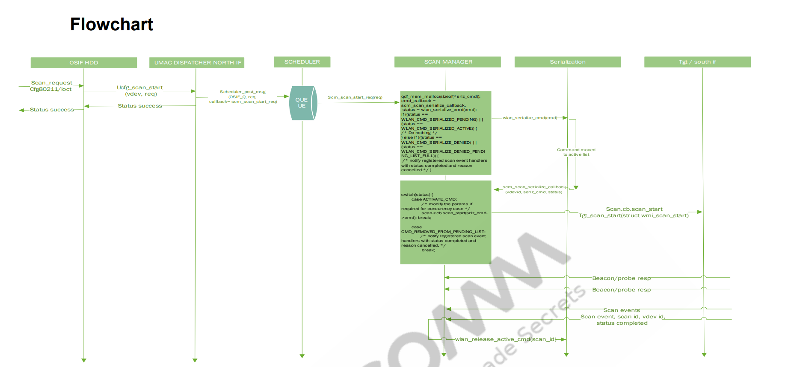
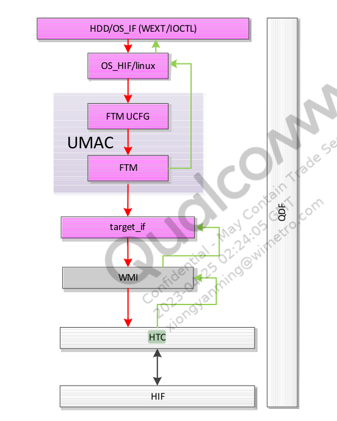
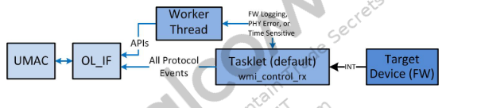
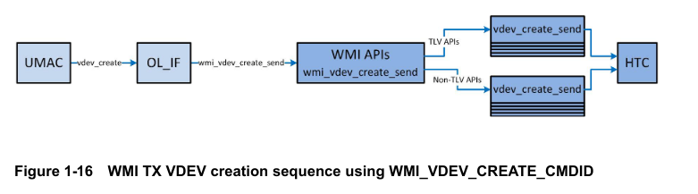

# 驱动层scan过程分析

当应用层发送NL80211_CMD_TRIGGER_SCAN nl消息到内核时候，内核收到消息后，会调用

`qca/src/linux-4.4/net/wireless/nl80211.c`文件下的nl80211_trigger_scan函数，该ops注册的地方参见[cfg80211层到mac80211层传递过程分析](#cfg80211层到mac80211层传递过程分析)

```c
static const struct genl_ops nl80211_ops[] = {

    {
		.cmd = NL80211_CMD_TRIGGER_SCAN, // 扫描
		.doit = nl80211_trigger_scan,
		.policy = nl80211_policy,
		.flags = GENL_ADMIN_PERM,
		.internal_flags = NL80211_FLAG_NEED_WDEV_UP |
				  NL80211_FLAG_NEED_RTNL,
	},

   // 下面省略了很多
};
```

## nl80211_trigger_scan

该函数将用户态的扫描请求参数封装到`struct cfg80211_scan_request`对象中，然后调用mac80211子模块提供的扫描接口发起扫描。

```c
static int nl80211_trigger_scan(struct sk_buff *skb, struct genl_info *info)
{
    struct cfg80211_registered_device *rdev = info->user_ptr[0];
    struct net_device *dev = info->user_ptr[1];
    struct cfg80211_scan_request *request;
    struct cfg80211_ssid *ssid;
    struct ieee80211_channel *channel;
    struct nlattr *attr;
    struct wiphy *wiphy;
    int err, tmp, n_ssids = 0, n_channels, i;
    enum ieee80211_band band;
    size_t ie_len;

    if (!is_valid_ie_attr(info->attrs[NL80211_ATTR_IE]))
        return -EINVAL;

    wiphy = &rdev->wiphy;

    // 设备必须提供扫描回调，由mac80211模块或者设备驱动提供
    if (!rdev->ops->scan)
        return -EOPNOTSUPP;
    // 不能重复发起扫描，rdev->scan_req会保存上一次的扫描请求(扫描结束后会清空)
    if (rdev->scan_req)
        return -EBUSY;

    // 计算要扫描的子带数目。如果用户态指定了要扫描的子带，那么以用户态为准，否则
    // 就是设备支持的全部子带，即全频段扫描
    if (info->attrs[NL80211_ATTR_SCAN_FREQUENCIES]) {
        n_channels = validate_scan_freqs(info->attrs[NL80211_ATTR_SCAN_FREQUENCIES]);
        if (!n_channels)
            return -EINVAL;
    } else {
        n_channels = 0;
        for (band = 0; band < IEEE80211_NUM_BANDS; band++)
            if (wiphy->bands[band])
                n_channels += wiphy->bands[band]->n_channels;
    }
    
	//遍历NL80211_ATTR_SCAN_SSIDS属性
    // 计算要扫描ssid个数，通过wiphy->max_scan_ssids，内核态可以限制用户态一次主动
    // 扫描可以扫描的SSID个数
    if (info->attrs[NL80211_ATTR_SCAN_SSIDS])
        nla_for_each_nested(attr, info->attrs[NL80211_ATTR_SCAN_SSIDS], tmp)
            n_ssids++;
    if (n_ssids > wiphy->max_scan_ssids)
        return -EINVAL;

    // 用户态指定的IE信息，类似的wiphy->max_scan_ie_len可以限定IE长度
    if (info->attrs[NL80211_ATTR_IE])
        ie_len = nla_len(info->attrs[NL80211_ATTR_IE]);
    else
        ie_len = 0;
    if (ie_len > wiphy->max_scan_ie_len)
        return -EINVAL;

    // 分配一块内存保存所有的扫描请求参数
    request = kzalloc(sizeof(*request) + sizeof(*ssid) * n_ssids + sizeof(channel) * n_channels
            + ie_len, GFP_KERNEL);
    if (!request)
        return -ENOMEM;

    // 让扫描请求结构中的ssid和ie指向正确的内存位置，channel默认已经指向正确
    if (n_ssids)
        request->ssids = (void *)&request->channels[n_channels];
    request->n_ssids = n_ssids;
    if (ie_len) {
        if (request->ssids)
            request->ie = (void *)(request->ssids + n_ssids);
        else
            request->ie = (void *)(request->channels + n_channels);
    }

    // 得到最终要扫描的channel，这些channel必须是设备支持的，并且没有被设置disable标记
    i = 0;
    if (info->attrs[NL80211_ATTR_SCAN_FREQUENCIES]) {
        /* user specified, bail out if channel not found */
        nla_for_each_nested(attr, info->attrs[NL80211_ATTR_SCAN_FREQUENCIES], tmp) {
            struct ieee80211_channel *chan;

            chan = ieee80211_get_channel(wiphy, nla_get_u32(attr));
            if (!chan) {
                err = -EINVAL;
                goto out_free;
            }

            /* ignore disabled channels */
            if (chan->flags & IEEE80211_CHAN_DISABLED)
                continue;

            request->channels[i] = chan;
            i++;
        }
    } else {
        /* all channels */
        for (band = 0; band < IEEE80211_NUM_BANDS; band++) {
            int j;
            if (!wiphy->bands[band])
                continue;
            for (j = 0; j < wiphy->bands[band]->n_channels; j++) {
                struct ieee80211_channel *chan;

                chan = &wiphy->bands[band]->channels[j];
                if (chan->flags & IEEE80211_CHAN_DISABLED)
                    continue;

                request->channels[i] = chan;
                i++;
            }
        }
    }
    // 没有能够扫描的channel
    if (!i) {
        err = -EINVAL;
        goto out_free;
    }
    // 记录最好要扫描的channel个数
    request->n_channels = i;

    // 保存ssid信息到扫描请求中
    i = 0;
    if (info->attrs[NL80211_ATTR_SCAN_SSIDS]) {
        nla_for_each_nested(attr, info->attrs[NL80211_ATTR_SCAN_SSIDS], tmp) {
            request->ssids[i].ssid_len = nla_len(attr);
            if (request->ssids[i].ssid_len > IEEE80211_MAX_SSID_LEN) {
                err = -EINVAL;
                goto out_free;
            }
            memcpy(request->ssids[i].ssid, nla_data(attr), nla_len(attr));
            i++;
        }
    }

    // 保存IE信息到扫描请求中
    if (info->attrs[NL80211_ATTR_IE]) {
        request->ie_len = nla_len(info->attrs[NL80211_ATTR_IE]);
        memcpy((void *)request->ie,
               nla_data(info->attrs[NL80211_ATTR_IE]),
               request->ie_len);
    }

    request->dev = dev;
    request->wiphy = &rdev->wiphy;
    // 保存扫描请求，调用rdev的扫描回调，mac80211提供的是 ieee80211_scan()
    rdev->scan_req = request;
    
    // 重点这里需要mac80211层提供，下面重点分析
    err = rdev_scan(rdev, request);
    {
        err = rdev->ops->scan(&rdev->wiphy, dev, request);// -----------------------------------------------调用mac80211 中的函数 wlan_cfg80211_scan_start
    }
    
	//扫描命令下发成功后，通过 nl80211_send_scan_start 通知上层已经成功下发扫描命令。
    if (!err) {
        nl80211_send_scan_start(rdev, dev); // 下面会分析
        dev_hold(dev);
    }  
}
/*  dev_hold 和 dev_put, 可以用来增加和递减net_device 的使用计数的.
	linux可以使用dev_get_by_name函数取得设备指针，但是使用是需要注意，使用过dev_get_by_name函数后一定要使用	 dev_put(pDev)函数释放设备引用，不然可能导致GET的设备无法正常卸载。
```

通知上层开始扫描的`nl80211_send_scan_start`函数分析

```c
void nl80211_send_scan_start(struct cfg80211_registered_device *rdev,
			     struct wireless_dev *wdev)
{
	struct sk_buff *msg;

	msg = nlmsg_new(NLMSG_DEFAULT_SIZE, GFP_KERNEL);
	if (!msg)
		return;

	if (nl80211_send_scan_msg(msg, rdev, wdev, 0, 0, 0,
				  NL80211_CMD_TRIGGER_SCAN) < 0) {
		nlmsg_free(msg);
		return;
	}
	//通知应用层发送扫描命令的结果
	genlmsg_multicast_netns(&nl80211_fam, wiphy_net(&rdev->wiphy), msg, 0,
				NL80211_MCGRP_SCAN, GFP_KERNEL);
}
```

**总结：**上述过程精简过程如下

```

//nl80211_trigger_scan()关键分析
static int nl80211_trigger_scan(struct sk_buff *skb, struct genl_info *info)
{
    struct cfg80211_registered_device *rdev = info->user_ptr[0];
    struct wireless_dev *wdev = info->user_ptr[1];
    struct wiphy *wiphy;
    wiphy = &rdev->wiphy;
 
    //调用mac80211注册的cfg80211_ops对应的函数.scan
    rdev->scan_req = request;
	err = rdev_scan(rdev, request);
    	---->ret = rdev->ops->scan(&rdev->wiphy, request);  ----对应wlan_cfg80211_scan_start函数
 
    //构造netlink消息，回复给应用层
    nl80211_send_scan_start(rdev, wdev);
    	---->msg = nlmsg_new(NLMSG_DEFAULT_SIZE, GFP_KERNEL);
    	---->nl80211_prep_scan_msg(msg, rdev, wdev, 0, 0, 0,NL80211_CMD_TRIGGER_SCAN)
    	-------->nl80211hdr_put(msg, portid, seq, flags, cmd);
    	-------->nla_put_u32(msg, NL80211_ATTR_WIPHY, rdev->wiphy_idx)
    	-------->nl80211_add_scan_req(msg, rdev);
    	-------->genlmsg_end(msg, hdr);
    	---->genlmsg_multicast_netns(&nl80211_fam, wiphy_net(&rdev->wiphy), msg, 0,
				NL80211_MCGRP_SCAN, GFP_KERNEL);
    return err;
}
```

下面分析wlan_cfg80211_scan_start函数

### wlan_cfg80211_scan_start

上述代码提到的`rdev->ops->scan`的值为`wlan_cfg80211_scan_start`，是mac80211向cfg80211注册的`cfg80211_ops` 里面的函数

```c
static struct cfg80211_ops wlan_cfg80211_ops = {
    .add_virtual_intf = wlan_cfg80211_add_virtual_intf,
    .del_virtual_intf = wlan_cfg80211_del_virtual_intf,
#if (LINUX_VERSION_CODE < KERNEL_VERSION(3, 4, 0))
    .set_beacon = NULL,
#else
    .start_ap = wlan_cfg80211_start_ap,
    .change_beacon = wlan_cfg80211_change_beacon,
    .stop_ap = wlan_cfg80211_stop_ap,
#endif
    .change_bss = wlan_cfg80211_change_bss,
    .add_key = wlan_cfg80211_add_key,
    .get_key = wlan_cfg80211_get_key,
    .del_key = wlan_cfg80211_del_key,
    .set_default_key = wlan_cfg80211_set_default_key,
    .scan = wlan_cfg80211_scan_start, // 这就是上面提到的rdev->ops->scan
#if (LINUX_VERSION_CODE >= KERNEL_VERSION(4, 5, 0))
    .abort_scan = wlan_cfg80211_scan_abort,
#endif
    .connect = wlan_cfg80211_connect,
    .disconnect = wlan_cfg80211_disconnect,
 // 这里省略了很多
};
```

- 注册的地方`wlan_cfg80211_ops`注册

  ```c
  //注册 ic_cfg80211_radio_attach 地方
  int ol_ath_pdev_attach(struct ol_ath_softc_net80211 *scn,
  		IEEE80211_REG_PARAMETERS *ieee80211_conf_parm,
  		uint8_t phy_id)
  {
  #if UMAC_SUPPORT_CFG80211
          ic->ic_cfg80211_radio_attach = ieee80211_cfg80211_radio_attach;
  #endif
  }
  
  //调用ic_cfg80211_radio_attach地方
  int
  __ol_ath_attach(void *hif_hdl, struct ol_attach_t *ol_cfg, osdev_t osdev, qdf_device_t qdf_dev)
  {
  #if UMAC_SUPPORT_CFG80211
          if (ic->ic_cfg80211_config) {
              ic->ic_cfg80211_radio_attach(osdev->device, pdev_netdev, ic);
          }
  #endif
  }
  
  // ic_cfg80211_radio_attach函数原型如下：注册 wlan_cfg80211_ops
  int ieee80211_cfg80211_radio_attach(struct device *dev, struct net_device *net_dev, struct ieee80211com *ic)
  {
  	struct wiphy *wiphy = NULL;
      wiphy = wlan_cfg80211_wiphy_alloc(&wlan_cfg80211_ops, sizeof(struct cfg80211_context));
  
  
  }
  ```

- 下面分析wlan_cfg80211_scan_start函数

#### wlan_cfg80211_scan_start

```c
int wlan_cfg80211_scan_start(struct wiphy *wiphy,
        struct cfg80211_scan_request *request)
{
    //扫描参数 params
	status = wlan_cfg80211_scan(vdev, request, &params);
}
```

1. wlan_cfg80211_scan

   ```c
   int wlan_cfg80211_scan(struct wlan_objmgr_vdev *vdev,
   		       struct cfg80211_scan_request *request,
   		       struct scan_params *params)
   {
   	/*	省略扫描参数填充部分	*/
   	qdf_status = wlan_schedule_scan_start_request(pdev, request,
   						      params->source, req);	
   }		
   ```

   

2. wlan_schedule_scan_start_request

   ```c
   /*扫描队列中的请求扫描数量必须小于8*/
   wlan_schedule_scan_start_request(struct wlan_objmgr_pdev *pdev,
   				 struct cfg80211_scan_request *req,
   				 uint8_t source,
   				 struct scan_start_request *scan_start_req)
   {
   	if (qdf_list_size(&osif_scan->scan_req_q) < WLAN_MAX_SCAN_COUNT) {
   		status = ucfg_scan_start(scan_start_req);
   }
   ```

##### ucfg_scan_start

```
status = ucfg_scan_start(scan_start_req);
        {
            static inline QDF_STATUS ucfg_scan_start(struct scan_start_request *req)
            {
                return wlan_scan_start(req); // 下面分析wlan_scan_start
            }
        }
```

###### wlan_scan_start

```c
QDF_STATUS wlan_scan_start(struct scan_start_request *req)
{
	struct scheduler_msg msg = {0};
	msg.bodyptr = req;
	msg.callback = scm_scan_start_req;// 消息的回调函数
	msg.flush_callback = scm_scan_start_flush_callback;
	status = scheduler_post_message(QDF_MODULE_ID_OS_IF,
					QDF_MODULE_ID_SCAN,
					QDF_MODULE_ID_OS_IF, &msg);
}
```

1. 调度器调度扫描，调用回调函数scm_scan_start_req

   ```c
   /*
   在UMAC DISPATCHER 层下发扫描请求后SCHEDULER MANAGER层提供的接口会根据优先级处理扫描队列中的msg，在SCHEDULER MANAGER层初始化的时候scheduler_init会根据QDF_MODULE_ID注册对应的scheduler_msg_process_fn_t回调函数
   */
   QDF_STATUS scheduler_post_msg_by_priority(uint32_t qid,
   					  struct scheduler_msg *msg,
   					  bool is_high_priority)
   {
   	/* message qid to qidx mapping */
   	qidx = sched_ctx->queue_ctx.scheduler_msg_qid_to_qidx[que_id];
   	/* scheduler_register_module(QDF_MODULE_ID qid, scheduler_msg_process_fn_t 
   callback) 判断qdi之前注册的回调函数是否存在 */
   	if (!sched_ctx->queue_ctx.scheduler_msg_process_fn[qidx]) {
   		QDF_DEBUG_PANIC("callback not registered for qid[%d]", que_id);
   		return QDF_STATUS_E_FAILURE;
   	}
   	target_mq = &(sched_ctx->queue_ctx.sch_msg_q[qidx]);   //调用的地方scm_scan_start_req
   	queue_msg = scheduler_core_msg_dup(msg);
   }
   ```

   

2. scm_scan_start_req

   ```c
   scm_scan_start_req(struct scheduler_msg *msg)
   {
   	cmd.cmd_type = WLAN_SER_CMD_SCAN;
   	cmd.cmd_id = req->scan_req.scan_id;
   	cmd.cmd_cb = scm_scan_serialize_callback; //这里很重要 下面会分析
   	cmd.umac_cmd = req;
   	cmd.source = WLAN_UMAC_COMP_SCAN;
   	ser_cmd_status = wlan_serialization_request(&cmd);// 执行命令
       {
           serialization_status = wlan_serialization_enqueue_cmd(cmd, SER_REQUEST);
       }
   }
   ```

   

3. scm_scan_serialize_callback

   ```c
   /*
   在Serialization层对下发CMD做序列化处理，将相应的command移动到active list而SCAN MANAGER层通过状态机调用lmac层提供的接口发送scan给FW
   */
   scm_scan_serialize_callback(struct wlan_serialization_command *cmd,
   	enum wlan_serialization_cb_reason reason)
   {
   	switch (reason) {
   	case WLAN_SER_CB_ACTIVATE_CMD:
   		/* command moved to active list
   		 * modify the params if required for concurency case.
   		 */
   		/* call the WMI/LMAC_IF API to send the scan to FW */
   		status = scm_activate_scan_request(req);
               {
                   status = tgt_scan_start(req);
               }
   		break;
   }
   ```

   

4. tgt_scan_start

   ```c
   //Lmac层挂接了器件层驱动的相关方法，这一层的操作对象是psoc的相关操作
   tgt_scan_start(struct scan_start_request *req)
   {
       //这里会得到scan_ops
   	scan_ops = wlan_psoc_get_scan_txops(psoc);
       {
           struct wlan_lmac_if_tx_ops *tx_ops;
           tx_ops = wlan_psoc_get_lmac_if_txops(psoc);
           return &tx_ops->scan;
       }
   	/* invoke wmi_unified_scan_start_cmd_send() */
   	QDF_ASSERT(scan_ops->scan_start);
   	if (scan_ops->scan_start)
   		return scan_ops->scan_start(pdev, req);//注意这里调用 scan_ops 里面的scan_start
     		// 即对应target_if_scan_start  后面分析该函数注册的地方
   }
   ```

   - 注册的地方

     ```c
     //那么tx_opsd->scan_ops什么时候，注册，如下：   
     /* lmac相关操作注册 */
     target_if_scan_tx_ops_register(struct wlan_lmac_if_tx_ops *tx_ops)
     {
     	struct wlan_lmac_if_scan_tx_ops *scan;
     
     	scan = &tx_ops->scan;
     	if (!scan) {
     		target_if_err("Scan txops NULL");
     		return QDF_STATUS_E_FAILURE;
     	}
     
     	scan->scan_start = target_if_scan_start;
     	scan->scan_cancel = target_if_scan_cancel;
     	scan->pno_start = target_if_pno_start;
     	scan->pno_stop = target_if_pno_stop;
     	scan->scan_reg_ev_handler = target_if_scan_register_event_handler;
     	scan->scan_unreg_ev_handler = target_if_scan_unregister_event_handler;
     	return QDF_STATUS_SUCCESS;
     }
     ```

     

   - 所以相当于调用target_if_scan_start

5. target_if_scan_start

   ```c
   //到这一层了
   target_if_scan_start(struct wlan_objmgr_pdev *pdev,
   		struct scan_start_request *req)
   {
   	wmi_unified_t pdev_wmi_handle;
   
   	pdev_wmi_handle = GET_WMI_HDL_FROM_PDEV(pdev);
   	if (!pdev_wmi_handle) {
   		target_if_err("Invalid PDEV WMI handle");
   		return QDF_STATUS_E_FAILURE;c
   	}
   	return wmi_unified_scan_start_cmd_send(pdev_wmi_handle, &req->scan_req);
   }
   ```

6. wmi_unified_scan_start_cmd_send

   ```c
   QDF_STATUS
   wmi_unified_scan_start_cmd_send(wmi_unified_t wmi_handle,
   				struct scan_req_params *param)
   {
   	if (wmi_handle->ops->send_scan_start_cmd)c
   		return wmi_handle->ops->send_scan_start_cmd(wmi_handle,
   				  param);
   }
   ```

   那么`wmi_handle->ops->send_scan_start_cmd`又是哪一个

   参见`qca-wifi-g431c69b42e38-dirty/cmn_dev/wmi/src/wmi_unified_tlv.c`的 `struct wmi_ops tlv_ops`结构体

   ```c
   struct wmi_ops tlv_ops =  {
   	.send_vdev_create_cmd = send_vdev_create_cmd_tlv,
   	.send_beacon_tmpl_send_cmd = send_beacon_tmpl_send_cmd_tlv,
   	.send_fd_tmpl_cmd = send_fd_tmpl_cmd_tlv,
   	.send_peer_assoc_cmd = send_peer_assoc_cmd_tlv,
   	.send_scan_start_cmd = send_scan_start_cmd_tlv, // 这里是扫描相关的 接下来分析
       // 下面省略了很多
   
   };
   ```

   接下来分析`send_scan_start_cmd_tlv`函数分析

7. send_scan_start_cmd_tlv

   ```
   static QDF_STATUS send_scan_start_cmd_tlv(wmi_unified_t wmi_handle,
   				struct scan_req_params *params)
   {
   	//组织tlv
   	ret = wmi_unified_cmd_send(wmi_handle, wmi_buf,
   				   len, WMI_START_SCAN_CMDID);
   }
   ```

   ```
   #define wmi_unified_cmd_send(wmi_handle, buf, buflen, cmd_id) \
   	wmi_unified_cmd_send_fl(wmi_handle, buf, buflen, \
   				cmd_id, __func__, __LINE__)
   ```

   

8. 接下来分析htc

   ```c
   QDF_STATUS wmi_unified_cmd_send_fl(wmi_unified_t wmi_handle, wmi_buf_t buf,
   				   uint32_t len, uint32_t cmd_id,
   				   const char *func, uint32_t line)
   {
       // 转为htc的pkt
   	SET_HTC_PACKET_INFO_TX(pkt,
   			       NULL,
   			       qdf_nbuf_data(buf), len + sizeof(WMI_CMD_HDR),
   			       wmi_handle->wmi_endpoint_id, htc_tag);
   
   	SET_HTC_PACKET_NET_BUF_CONTEXT(pkt, buf);
   	
   	wmi_htc_send_pkt(wmi_handle, pkt, func, line);
       {
           status = htc_send_pkt(wmi_handle->htc_handle, pkt);
           {
               __htc_send_pkt(htc_handle, htc_packet);
               pEndpoint = &target->endpoint[pPacket->Endpoint];
               netbuf = GET_HTC_PACKET_NET_BUF_CONTEXT(pPacket);
               qdf_nbuf_push_head(netbuf, sizeof(HTC_FRAME_HDR));
   
   	/* setup HTC frame header */
   	htc_hdr = (HTC_FRAME_HDR *)qdf_nbuf_get_frag_vaddr(netbuf, 0);
               // 发送htc的包
               htc_try_send(target, pEndpoint, &pPktQueue);
           }
       }
   }
   ```

   总结：

   

   


## wmi

###  rx path



### tx path




## cfg80211层到mac80211层传递过程分析

### cfg80211注册流程

#### 驱动入口函数 cfg80211_init

在`linux-ipq_ipq60xx/linux-4.4.60/net/wireless/core.c`文件完成`cfg80211_init`的注册

```c
static struct notifier_block cfg80211_netdev_notifier = {
	.notifier_call = cfg80211_netdev_notifier_call,
};

static void __net_exit cfg80211_pernet_exit(struct net *net)
{
	struct cfg80211_registered_device *rdev;

	rtnl_lock();
	list_for_each_entry(rdev, &cfg80211_rdev_list, list) {
		if (net_eq(wiphy_net(&rdev->wiphy), net))
			WARN_ON(cfg80211_switch_netns(rdev, &init_net));
	}
	rtnl_unlock();
}
//内核子系统的ops
static struct pernet_operations cfg80211_pernet_ops = {
	.exit = cfg80211_pernet_exit,
};
//入口函数
static int __init cfg80211_init(void)
{
	int err;

    // 在系统中注册网络命名空间子系统
	err = register_pernet_device(&cfg80211_pernet_ops);
    // 注册ieee80211_class类
	err = wiphy_sysfs_init();
    	{
            //将class注册到内核中，同时会在/sys/class/下创建class对应的节点
        	class_register(&ieee80211_class);
    	}
    // 注册网络通知，以接收网络事件
	err = register_netdevice_notifier(&cfg80211_netdev_notifier);
    // 注册netlink "nl80211",其操作为nl80211_ops 下面会重点分析---------------------------------------重点nl80211_init
	err = nl80211_init();
    
    // 创建sys/class/ieee80211目录
	ieee80211_debugfs_dir = debugfs_create_dir("ieee80211", NULL);
	err = regulatory_init();
    // 创建名为“cfg80211”的内核线程
	cfg80211_wq = create_singlethread_workqueue("cfg80211");
}

//subsys_initcall与module_init仅仅是__define_initcall的第二个参数不同而已,前者使用4，后者使用6,因此归纳出仅仅是谁先被执行的差异，subsys_initcall比module_init先执行
subsys_initcall(cfg80211_init);
//出口函数
static void __exit cfg80211_exit(void)
{
	debugfs_remove(ieee80211_debugfs_dir);
	nl80211_exit();
	unregister_netdevice_notifier(&cfg80211_netdev_notifier);
	wiphy_sysfs_exit();
	regulatory_exit();
	unregister_pernet_device(&cfg80211_pernet_ops);
	destroy_workqueue(cfg80211_wq);
}
module_exit(cfg80211_exit);

```

##### nl80211_init函数分析

在上面的在内核`cfg80211_init`初始化代码中，完成了对nl80211的初始化，接下来分析`nl80211_init` 内核中nl80211模块

nl80211直接使用的是Generic Netlink接口，添加了一个name为“nl80211”的family和对应的 ops方法，同时注册了多个多播组(代码位置kernel/net/wireless/nl80211.c)

```c
int nl80211_init(void)
{
	/*
	 * nl80211_fam添加到genl中的family,nl80211_ops包含了nl80211可以接受到的命令，
	 * 每种命令都有相应的nl80211		  
	 * 处理函数.wifi的scan，associate，connect等等，都是由此处理的
	 */
	err = genl_register_family_with_ops_groups(&nl80211_fam, nl80211_ops, nl80211_mcgrps);
	 /*
	 * 在netlink_register链上注册回调函数nl80211_netlink_notifier
	 * notifier机制是子系统之间通信手段，netlink_register链上的子系统会检测用户态socket的连接状况
     * 如果发生改变则通知运行回调函数
     */
	err = netlink_register_notifier(&nl80211_netlink_notifier);
}
```

在`nl80211_init()`之后，通过`nl80211_ops`结构体实现与CMD关联，参见`qca/src/linux-4.4/net/wireless/nl80211.c`文件

```c
static const struct genl_ops nl80211_ops[] = {
	{
		.cmd = NL80211_CMD_GET_WIPHY,
		.doit = nl80211_get_wiphy,
		.dumpit = nl80211_dump_wiphy,
		.done = nl80211_dump_wiphy_done,
		.policy = nl80211_policy,
		/* can be retrieved by unprivileged users */
		.internal_flags = NL80211_FLAG_NEED_WIPHY |
				  NL80211_FLAG_NEED_RTNL,
	},
	{
		.cmd = NL80211_CMD_SET_WIPHY,
		.doit = nl80211_set_wiphy,
		.policy = nl80211_policy,
		.flags = GENL_ADMIN_PERM,
		.internal_flags = NL80211_FLAG_NEED_RTNL,
	},
	{
		.cmd = NL80211_CMD_GET_INTERFACE,
		.doit = nl80211_get_interface,
		.dumpit = nl80211_dump_interface,
		.policy = nl80211_policy,
		/* can be retrieved by unprivileged users */
		.internal_flags = NL80211_FLAG_NEED_WDEV |
				  NL80211_FLAG_NEED_RTNL,
	},
    {
		.cmd = NL80211_CMD_TRIGGER_SCAN, // 扫描
		.doit = nl80211_trigger_scan,
		.policy = nl80211_policy,
		.flags = GENL_ADMIN_PERM,
		.internal_flags = NL80211_FLAG_NEED_WDEV_UP |
				  NL80211_FLAG_NEED_RTNL,
	},
    	{
		.cmd = NL80211_CMD_CONNECT,// 连接
		.doit = nl80211_connect,
		.policy = nl80211_policy,
		.flags = GENL_ADMIN_PERM,
		.internal_flags = NL80211_FLAG_NEED_NETDEV_UP |
				  NL80211_FLAG_NEED_RTNL,
	},
   // 下面省略了很多
};
```

这样应用层在发出nl消息后，驱动层在根据cmd 调用对应的ops来接收应用nl消息，并处理执行动作。

